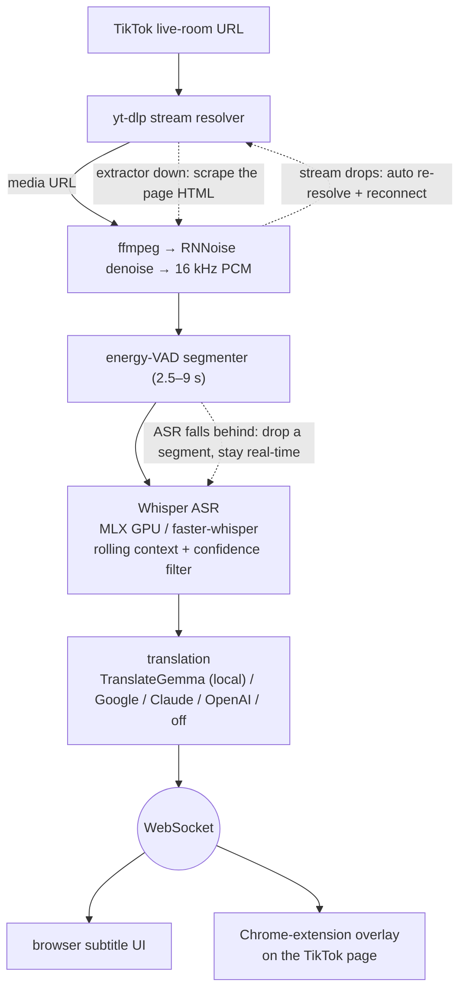
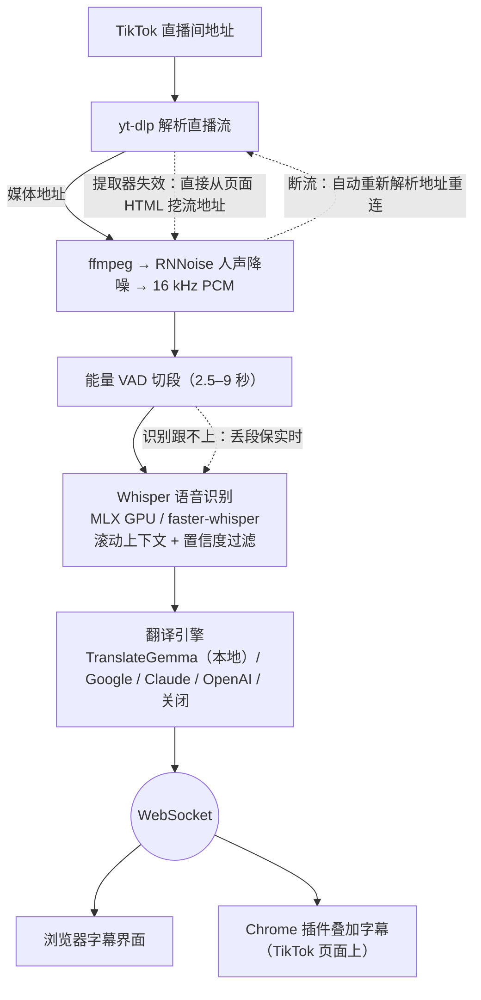

# TikTok 直播同传 · TikTok Live Translator

<p align="center"></p>

<p align="center">
  <a href="https://github.com/EM917/tiktok-live-translator/releases/latest"></a>
  <a href="https://github.com/EM917/tiktok-live-translator/actions/workflows/ci.yml"></a>
  
  
  
  <a href="LICENSE"></a>
</p>

<p align="center"></p>

**Language / 语言：[English](#english) | [中文](#chinese)**

---

<a name="english"></a>

# TikTok Live Translator (English)

Listens to a TikTok livestream, transcribes what the **streamer says** in real time, translates it, and shows bilingual subtitles in a local browser UI. Comes with a Chrome extension that overlays the subtitles directly on the TikTok live page.

**Runs entirely locally**: stream capture, speech recognition, and (optionally) translation all happen on your own machine — no API key needed, zero cost.

## Features

- 🎙️ **Real-time speech recognition** — OpenAI Whisper (dual backend: faster-whisper / MLX), auto-detects the streamer's language, supports 90+ languages
- 🌐 **Three-tier translation engine** — local TranslateGemma (recommended, offline and free) / Google's free API (default fallback) / Claude · OpenAI API
- 🎵 **Voice-focused denoising** — RNNoise neural denoising suppresses background music, tuned for streams with BGM
- ⚡ **Automatic hardware tuning** — detects your chip (Apple Silicon GPU / NVIDIA CUDA / plain CPU) and automatically picks the best model that can still run in real time — zero-config out of the box
- 📺 **Two display modes** — a local web UI (scrolling bilingual subtitle history + a large caption at the bottom), or a Chrome extension overlay on the TikTok page
- 🚨 **Real-time banned-term alerts** — three-tier matching (exact / morphological variant / fuzzy) over the **recognized original text**, independent of translation, and matching across caption boundaries; edit `banned_terms.txt`
- ⚡ **Observable latency** — a live footer readout of time-to-first-caption (P50/P95) broken down into segmentation + recognition + translation, plus an audit log recording every segment including candidates the quality filter dropped
- ✅ **Startup self-check** — every capability is *exercised*, not merely configured: denoising actually runs a sample through RNNoise, translation actually pings the engine, the audit log actually writes. Results appear on the home screen with a repair step for anything red. This exists because the denoiser once shipped broken for weeks, announced only in a log line nobody read
- 🔄 **Fault-tolerant** — auto-reconnects with a fresh stream URL when the stream drops (and can tell a network blip from the streamer actually ending); falls back to scraping the stream URL straight from the live page when yt-dlp resolution fails; drops segments automatically to stay real-time when recognition falls behind; keeps yt-dlp fresh automatically in the background

## Quick Start

### Never used a terminal? Three steps (recommended)

1. **Download**: grab **TikTok-Live-Translator-vX.Y.Z.zip** from the [latest release](https://github.com/EM917/tiktok-live-translator/releases/latest)'s Assets and unzip it anywhere (e.g. your Desktop) — "Source code (zip)" works too. The green **Code** button → **Download ZIP** also works (latest dev snapshot).
2. **Install Python** (free, one time only): grab the installer from [python.org/downloads](https://www.python.org/downloads/) and install with the default options. Forgot? No problem — the launcher will detect it and open the download page for you.
3. **Launch**:
   - **macOS**: double-click **`TikTok Live Translator.app`** in the folder. If the first launch is blocked ("cannot be opened"): on older systems right-click → Open; on **macOS 15 and later** go to **System Settings → Privacy & Security**, scroll to the bottom and click **"Open Anyway"** (one time only). Feel free to drag it to the Dock — but **don't move it out of this folder**.
   - **Windows**: double-click **`Start.bat`**. If a "publisher unknown" security warning pops up, click "Run" (this tool is fully open source — the code is right there in the folder). A black text window stays open while running — **that's the translation engine, keep it open**; subtitles appear in the separate app window.

The first launch installs everything automatically (a few minutes, with on-screen progress; the first recognition also downloads the speech model, with progress shown on the page). Every launch after that is instant. Once the window opens: **paste the live-room URL (or just the streamer's username) → pick the streamer's language → hit Start**. Stop or switch rooms anytime.

### Command line

With [Python 3.9+](https://www.python.org/downloads/) installed, two commands:

```bash
git clone https://github.com/EM917/tiktok-live-translator.git
cd tiktok-live-translator && python3 main.py
```

(On Windows use `python main.py`.) Everything else is automatic: the first run creates a virtual environment and installs all dependencies (including a bundled static ffmpeg and the denoising model). CLI flags work too:

```bash
python3 main.py "https://www.tiktok.com/@streamer_username/live" --source es
python3 main.py --demo      # preview the UI without connecting to a stream
python3 main.py --doctor    # print the hardware check and recommended config
```

> Prefer to control the install yourself? `bash setup.sh` (macOS/Linux) or `powershell -ExecutionPolicy Bypass -File setup.ps1` (Windows) does the same steps explicitly.

> **Cloned an older version before?** Don't re-clone (it fails with `destination path already exists`) — just `cd` into the folder, run `git pull`, and start it; from v0.2.0 on you can update with one click from the page itself.

### Everyday startup (after reboot / after closing it)

- **macOS**: double-click **`TikTok Live Translator.app`** (or `Start.command`);
- **Windows**: double-click **`Start.bat`**;
- CLI: `cd ~/tiktok-live-translator && python3 main.py`.

The UI opens in its **own app window** (no browser tab), remembering the room URL and target language from last time — just hit Start. Closing the window quits the app. Pass `--browser` if you prefer the browser UI.

## Automatic Hardware Tuning (how it picks a config for your machine)

Run `python main.py --doctor` anytime to see the hardware-check results. Any flag you don't explicitly set at startup is auto-filled per the table below:

| Your machine | Auto-selected | Result |
|---|---|---|
| Apple Silicon (M1 or later) | MLX GPU backend + `large-v3` | Most accurate model, runs ~5x faster than real time |
| NVIDIA GPU | CUDA + `large-v3` (float16) | Most accurate model, plenty of speed headroom |
| Plain CPU (≥8 cores & ≥8GB RAM) | CPU + `small` (int8) | Keeps up in real time, moderate accuracy |
| Low-end CPU | CPU + `base` (int8) | Prioritizes keeping subtitles from falling behind |

Benchmark reference (M3 Pro, 90 seconds of real livestream footage; RTF = recognition time / audio duration — needs to be < 1 to avoid dropping subtitles):

| Config | RTF |
|---|---|
| MLX GPU + large-v3 | **0.21** ✅ |
| CPU + large-v3-turbo | 0.99 ⚠️ borderline |
| CPU + large-v3 | 1.22 ❌ drops segments |

Any auto-selected value can be overridden with a command-line flag (see below).

## Command-Line Flags

| Flag | Description | Default |
|------|------|------|
| `--target` | Target language (`zh-CN`/`en`/`ja`/`ko`/…; can also be switched anytime in the UI) | `zh-CN` |
| `--source` | Streamer's language; auto-detected if omitted (specify it for better accuracy when known, e.g. `es`/`en`/`ja`) | auto |
| `--backend` | Recognition backend: `mlx` (Apple GPU) / `ct2` (faster-whisper) / `auto` | `auto` |
| `--model` | Whisper model: `tiny`/`base`/`small`/`medium`/`large-v3`/`large-v3-turbo` | auto by hardware |
| `--device` | `auto`/`cpu`/`cuda` | auto by hardware |
| `--compute-type` | ct2 precision (`int8`/`float16`/…) | auto by hardware |
| `--beam` | Beam search width (larger = more accurate but slower; `1` = greedy; ct2 backend only) | `5` |
| `--context` | Enable rolling context. **Off by default**: measured to trigger repetition loops that badly hurt recall | off |
| `--asr-temperature` | Decoding temperature. **Defaults to 0 (single pass)**: Whisper otherwise re-decodes a segment at up to six temperatures when quality checks fail, which measured 25s on music-heavy audio | `0` |
| `--translator` | Translation engine: `auto`/`gemma`/`google`/`claude`/`openai`/`none` | `auto` |
| `--denoise` | RNNoise voice denoising: `auto`/`on`/`off` | `auto` (on) |
| `--port` | Local UI port | `8765` |
| `--cookies` | Path to a yt-dlp cookies.txt file (may be needed for region-restricted streams) | none |
| `--demo` | Demo mode — drives only the UI | off |
| `--doctor` | Print the hardware check and recommended config, then exit | off |
| `--no-open` | Don't auto-open the browser on startup | off |

## Translation Engines

- `auto` (default) — uses `gemma` if TranslateGemma is installed in local Ollama, otherwise falls back to `google`.
- `gemma` — **Recommended**: TranslateGemma, Google's open-source translation-specialized model. Runs on your local GPU, fully offline and free, and handles colloquial speech/slang far better than Google's web API. Install:

  ```bash
  brew install ollama          # See https://ollama.com/download for Windows/Linux
  ollama pull translategemma:4b
  brew services start ollama   # or run ollama serve manually
  ```

  You can switch models via the `OLLAMA_TRANSLATE_MODEL` environment variable to `translategemma:12b`/`27b` (more accurate, slower).
- `google` — Google Translate's free web API, no key required. **Note: subtitle text is sent to Google**, and it tends to mistranslate colloquial speech more often.
- `claude` — requires the `ANTHROPIC_API_KEY` environment variable (defaults to Claude Haiku; override with `CLAUDE_TRANSLATE_MODEL`).
- `openai` — requires `OPENAI_API_KEY` (optionally `OPENAI_BASE_URL`, `OPENAI_MODEL`); compatible with any OpenAI-style API, including local LM Studio / vLLM.
- `none` — shows only the raw transcription, no translation, fully offline.

Real-world comparison (colloquial Spanish → Chinese):

| Original | Google | TranslateGemma |
|---|---|---|
| *Se mueren lo rico* (so good it's unreal) | ❌ 有钱人死 (the rich people die) | ✅ 味道非常好 (tastes amazing) |
| *tengo un sueño* (I'm sleepy) | ❌ 我做了一个梦 (I had a dream) | ✅ 现在感觉很困 (feeling very sleepy right now) |
| *Es vegano* (it's a vegan product) | ❌ 它是素食主义者 (he/she is a vegetarian) | ✅ 纯素的 (vegan) |

## Chrome Extension (overlay subtitles on the TikTok page)

1. Open `chrome://extensions` and enable "Developer mode" in the top right.
2. Click "Load unpacked" and select this project's `extension/` folder.
3. Keep the app running, open a TikTok **live-room** page (URL contains `/live`), and a floating subtitle bar appears as subtitles arrive.

The subtitle bar supports **dragging** to reposition it, **double-clicking** to collapse/expand, and hovering reveals an **×** to hide it. The extension automatically tries the ports the app may use (8765–8774), so it normally needs no configuration. The extension is just a display layer — audio capture and recognition are handled by the local app.

## Architecture



## Auto-update

On every launch the app silently checks GitHub for the latest release (network failures are silently ignored). When a new version exists, a banner appears at the top of the page:

- **git install** (cloned via `git clone`) → click "Update" to run `git pull --ff-only` and restart automatically. If you have uncommitted local changes, the update is refused to avoid overwriting them;
- **ZIP install** → the banner links to the download page instead.

The current version is shown in the page footer.

## FAQ

- **It can't get the stream but you can watch the room in your browser** — TikTok now reports live rooms as "not currently live" to **unauthenticated** requests (measured: of six rooms live at the same moment, only one resolved anonymously). The app automatically retries by borrowing the TikTok session already in your browser, so **being logged into TikTok in Chrome/Safari is all that's needed — no file to export**. Cookies stay between your machine and TikTok. If it still fails, open the room in your browser once to confirm you can watch it, then retry; you can also pin a browser with `--cookies-browser safari` or supply your own `--cookies cookies.txt`.
- **First "Start" stuck downloading the recognition model** — it's downloading from Hugging Face (large-v3 is about 3GB); progress is shown on the page, and it only happens once.
- **Translations suddenly fail across the board and captions show only the original language** — the default free Google endpoint rate-limits per IP and starts returning 429 under sustained use. The app pauses requests for two minutes and recovers automatically, with a banner on the page; **speech recognition is unaffected**. For long viewing sessions, switch to local TranslateGemma (offline, no rate limit — see "Translation Engines") or use an API key with `--translator claude` / `openai`. No network or a stopped Ollama causes the same symptom.
- **Status says "live" but no captions appear for a long time** — usually normal: while the streamer plays music or isn't talking, silent and low-confidence segments are dropped on purpose (better nothing than guessing words out of background music). If the streamer is clearly talking and nothing ever appears, try `--denoise off` (denoising occasionally over-trims some audio) or a different model size.
- **Captions stop after closing the laptop lid / switching Wi-Fi** — when the stream drops, the app re-resolves the URL and reconnects automatically (up to 5 attempts with growing backoff), so it usually recovers on its own. If you see "repeatedly interrupted and auto-reconnect failed", just hit Start once more.
- **Recognition can't keep up with the stream / terminal shows dropped audio** — switch to a smaller model (`--model small`), or use `--beam 1`; Apple Silicon users should confirm `pip install mlx-whisper` succeeded so it runs on the GPU.
- **Sluggish on a Mac with only 8GB of RAM** — Apple Silicon defaults to the most accurate `large-v3` (~3GB). If memory is tight, use `--model large-v3-turbo` (about half the size and faster) or `--model small`.
- **Singing in background music gets picked up as the streamer talking** — RNNoise suppresses instrumental music well, but can only partially suppress **sung vocals** in a song; confidence filtering catches most of these, and the occasional slip-through is normal.
- **Extension isn't showing subtitles** — confirm the app is running and that you're on a **live-room page** (URL contains `/live`) rather than a regular video page, then refresh the TikTok page.
- **The UI address isn't 8765** — that's expected: if something else occupies 8765, the app moves to the next free port (8766–8774), and the Chrome extension scans that same range, so nothing needs configuring.
- **I want to save the captions / my history disappeared** — there is no export button yet; select and copy the text from the page. The page keeps the most recent 300 lines, and after a refresh or reconnect the server replays only the last 100.
- **Can I close that black text window / how do I fully quit?** — on Windows that console window *is* the translation engine, so **closing it quits the app**; on macOS closing the app window quits it (if you launched via `Start.command`, close the Terminal window or press Ctrl-C).
- **Won't install on a work computer / not enough space** — the first install needs about 5GB (runtime environment plus the speech model) and access to PyPI and Hugging Face; corporate security policies often block this, so a personal machine is the easier route.

**The home screen shows a red row saying a feature isn't working — what do I do?**
Each red row carries the repair step right under it; follow that line. The most
common ones: an empty `banned_terms.txt` (no alerts will fire at all), and a
denoise model that downloaded incompletely (delete `models/bd.rnnn` and start
again — it re-downloads). The panel re-checks every time you click 开始翻译, so
after you fix something it turns green on the next run. A green panel is worth
trusting: it means the capability was actually executed, not merely configured.

## Privacy and Usage Boundaries

- Recognition always runs locally. Translation is fully offline when using `gemma`/`none`; with `google`/`claude`/`openai`, subtitle text is sent to the corresponding provider.
- This tool is for personal learning and language-assistance use only. Please comply with TikTok's Terms of Service and local laws — don't use it to rebroadcast or redistribute recordings of other people's content.

## Acknowledgments

- [faster-whisper](https://github.com/SYSTRAN/faster-whisper) / [mlx-whisper](https://github.com/ml-explore/mlx-examples) — speech recognition
- [yt-dlp](https://github.com/yt-dlp/yt-dlp) — livestream resolution
- [FFmpeg](https://ffmpeg.org/) — audio processing (built-in RNNoise `arnndn` filter)
- [rnnoise-models](https://github.com/GregorR/rnnoise-models) — denoising model (beguiling-drafter)
- [Ollama](https://github.com/ollama/ollama) + [TranslateGemma](https://ollama.com/library/translategemma) — local translation

## Author & License

Copyright © 2026 [Elon Mei (EM917)](https://github.com/EM917). Released under the [MIT License](LICENSE).

---

<a name="chinese"></a>

# TikTok 直播同传（中文）


监听 TikTok 直播间，把**主播说的话**实时转写并翻译成字幕，在本地浏览器 UI 中双语显示。附带一个 Chrome 插件，可以把字幕直接叠加在 TikTok 直播页面上。

**全程本地运行**：拉流、语音识别、（可选）翻译都在你自己的电脑上完成，无需任何 API Key，零费用。

## 特性

- 🎙️ **实时语音识别** —— OpenAI Whisper（faster-whisper / MLX 双后端），自动检测主播语言，支持 90+ 语言
- 🌐 **三档翻译引擎** —— 本地 TranslateGemma（推荐，离线免费）/ Google 免费接口（默认兜底）/ Claude·OpenAI API
- 🎵 **人声降噪** —— RNNoise 神经降噪抑制背景音乐，专为带 BGM 的直播间优化
- ⚡ **硬件自动配置** —— 检测你的芯片（Apple Silicon GPU / NVIDIA CUDA / 普通 CPU）自动选择能实时跑的最优模型，零配置开箱即用
- 📺 **双显示端** —— 本地网页 UI（历史双语字幕 + 底部大字幕），或 Chrome 插件叠加在 TikTok 页面上
- 🚨 **违禁词实时报警** —— 在**识别原文**上做三级匹配（精确/形态变体/模糊），完全不依赖翻译，短语被切在两段字幕之间也能命中；词表见 `banned_terms.txt`
- ⚡ **延迟可观测** —— 界面底部实时显示「首字等待 P50/P95」及其构成（切段 + 识别 + 翻译），配套审计日志逐段记录识别原文与被过滤的候选
- ✅ **启动自检** —— 每项能力都**实际跑一遍**，而不是看配置写没写：降噪真的过一遍 RNNoise，翻译真的 ping 一次引擎，审计日志真的写一次。结果显示在首页，红的那项会给出修复步骤。这个功能来自一次真实事故——降噪整整几周没生效，只在一行没人看的日志里说了句话
- 🔄 **抗故障** —— 直播流中断自动换新地址重连（能区分网络抖动与主播真下播）；yt-dlp 解析失效时自动从直播页面直接挖流地址；识别跟不上时自动丢段保实时；后台自动保持 yt-dlp 为最新版

## 快速开始

### 不会用终端？三步开始（推荐）

1. **下载**：到[最新 Release](https://github.com/EM917/tiktok-live-translator/releases/latest) 的 Assets 里下载 **TikTok-Live-Translator-vX.Y.Z.zip**，解压到任意位置（例如桌面）——下载「Source code (zip)」也一样能用。也可以点仓库页绿色 **Code** 按钮 → **Download ZIP**（取的是最新开发版）。
2. **装 Python**（免费，只装一次）：到 [python.org/downloads](https://www.python.org/downloads/) 下载安装包，按默认选项装完即可。忘了装也没关系——启动器发现没有 Python 时会自动打开下载页提示你。
3. **启动**：
   - **macOS**：双击文件夹里的 **`TikTok Live Translator.app`**。首次打开如提示「无法打开」：旧系统右键 → 打开；**macOS 15 及以后**要到 **系统设置 → 隐私与安全性**，拉到页面底部点 **「仍要打开」**（只需一次）。可以把它拖到 Dock 常驻，但**不要把它拖出这个文件夹**。
   - **Windows**：双击 **`Start.bat`**。若弹出「发布者未知」的安全警告，点「运行」即可（本工具完全开源，代码就在这个文件夹里）。运行期间会有一个黑色文字窗口——**它是翻译引擎，请保持打开**，字幕显示在另外弹出的应用窗口里。

首次启动会自动安装全部组件（需要几分钟，屏幕上有提示；首次识别还会自动下载语音模型，页面上能看到进度），之后每次秒开。窗口打开后：**粘贴直播间地址（或只输入主播用户名）→ 选主播语言 → 点「开始翻译」**，随时可以停止或换房间。

### 命令行方式

装好 [Python 3.9+](https://www.python.org/downloads/) 后两条命令：

```bash
git clone https://github.com/EM917/tiktok-live-translator.git
cd tiktok-live-translator && python3 main.py
```

（Windows 用 `python main.py`）其余全自动：首次运行自动创建虚拟环境、安装全部依赖（含内置 ffmpeg 和降噪模型）。也可以直接传参：

```bash
python3 main.py "https://www.tiktok.com/@主播用户名/live" --source es
python3 main.py --demo      # 不连直播，先看看界面效果
python3 main.py --doctor    # 看看硬件体检和推荐配置
```

> 想手动控制安装过程？`bash setup.sh`（macOS/Linux）或 `powershell -ExecutionPolicy Bypass -File setup.ps1`（Windows）做的是同样的事。

> **之前克隆过旧版本？** 不要重新 clone（会报 `destination path already exists`）——进目录执行 `git pull` 再启动即可；v0.2.0 起页面里就能一键更新，不再需要命令行。

### 日常启动（关机重启 / 关闭之后）

- **macOS**：双击 **`TikTok Live Translator.app`**（或 `Start.command`）；
- **Windows**：双击 **`Start.bat`**；
- 命令行党：`cd ~/tiktok-live-translator && python3 main.py`。

界面在**独立应用窗口**中打开（不占浏览器标签页），上次填过的直播间地址和选过的目标语言都会记住，点「开始翻译」即可；关掉窗口就是退出。想改回浏览器界面加 `--browser`。

## 硬件自动配置（它是怎么根据你的电脑选配置的）

运行 `python main.py --doctor` 随时查看体检结果。启动时未显式指定的参数按下表自动补齐：

| 你的电脑 | 自动选择 | 效果 |
|---|---|---|
| Apple Silicon（M1 及以上） | MLX GPU 后端 + `large-v3` | 最准模型，比实时快约 5 倍 |
| NVIDIA 显卡 | CUDA + `large-v3` (float16) | 最准模型，速度富余 |
| 普通 CPU（≥8 核 & ≥8GB） | CPU + `small` (int8) | 保实时，精度中等 |
| 低配 CPU | CPU + `base` (int8) | 优先保证字幕不掉队 |

实测锚点（M3 Pro，90 秒真实直播素材，RTF=识别耗时/音频时长，<1 才不丢字幕）：

| 配置 | RTF |
|---|---|
| MLX GPU + large-v3 | **0.21** ✅ |
| CPU + large-v3-turbo | 0.99 ⚠️ 临界 |
| CPU + large-v3 | 1.22 ❌ 丢段 |

任何自动选择都可以用命令行参数覆盖（见下表）。

## 命令行参数

| 参数 | 说明 | 默认 |
|------|------|------|
| `--target` | 目标语言（`zh-CN`/`en`/`ja`/`ko`/…，UI 里也能随时切换） | `zh-CN` |
| `--source` | 主播语言，不填自动检测（确定时指定更准，如 `es`/`en`/`ja`） | 自动 |
| `--backend` | 识别后端：`mlx`（Apple GPU）/`ct2`（faster-whisper）/`auto` | `auto` |
| `--model` | whisper 模型：`tiny`/`base`/`small`/`medium`/`large-v3`/`large-v3-turbo` | 按硬件自动 |
| `--device` | `auto`/`cpu`/`cuda` | 按硬件自动 |
| `--compute-type` | ct2 精度（`int8`/`float16`/…） | 按硬件自动 |
| `--beam` | beam search 宽度（越大越准越慢，`1`=贪心；仅 ct2 后端） | `5` |
| `--context` | 开启滚动上下文。**默认关闭**：实测它会诱发复读死循环，反而大幅拉低召回率 | 关 |
| `--asr-temperature` | 识别解码温度。**默认 0（只解码一次）**：Whisper 默认会在质量不达标时用更高温度重解最多 6 次，音乐段上实测单次识别可达 25 秒 | `0` |
| `--translator` | 翻译引擎：`auto`/`gemma`/`google`/`claude`/`openai`/`none` | `auto` |
| `--denoise` | RNNoise 人声降噪：`auto`/`on`/`off` | `auto`（开） |
| `--port` | 本地 UI 端口 | `8765` |
| `--cookies` | yt-dlp cookies.txt 路径（地区受限的直播间可能需要） | 无 |
| `--demo` | 演示模式，仅驱动 UI | 关 |
| `--doctor` | 打印硬件体检和推荐配置后退出 | 关 |
| `--no-open` | 启动后不自动打开浏览器 | 关 |

## 翻译引擎

- `auto`（默认）—— 本地 Ollama 里装了 TranslateGemma 就用 `gemma`，否则退回 `google`。
- `gemma` —— **推荐**：Google 开源的翻译专用模型 TranslateGemma，跑在本地 GPU 上，完全离线免费，口语/俚语翻译质量远好于谷歌网页接口。安装：

  ```bash
  brew install ollama          # Windows/Linux 见 https://ollama.com/download
  ollama pull translategemma:4b
  brew services start ollama   # 或手动运行 ollama serve
  ```

  模型可用环境变量 `OLLAMA_TRANSLATE_MODEL` 换成 `translategemma:12b`/`27b`（更准更慢）。
- `google` —— Google 翻译网页版免费接口，无需密钥。**注意：字幕文本会被发送给 Google**，且口语直译错误较多。
- `claude` —— 需要环境变量 `ANTHROPIC_API_KEY`（默认 Claude Haiku，可用 `CLAUDE_TRANSLATE_MODEL` 覆盖）。
- `openai` —— 需要 `OPENAI_API_KEY`（可选 `OPENAI_BASE_URL`、`OPENAI_MODEL`，兼容各类 OpenAI 风格接口，包括本地 LM Studio / vLLM）。
- `none` —— 只显示识别原文，不翻译，完全离线。

实测对比（西语口语 → 中文）：

| 原文 | Google | TranslateGemma |
|---|---|---|
| *Se mueren lo rico*（好吃到不行） | ❌ 有钱人死 | ✅ 味道非常好 |
| *tengo un sueño*（我好困） | ❌ 我做了一个梦 | ✅ 现在感觉很困 |
| *Es vegano*（纯素产品） | ❌ 它是素食主义者 | ✅ 纯素的 |

<a name="extension"></a>
## Chrome 插件（把字幕叠加到 TikTok 页面上）

1. 打开 `chrome://extensions`，右上角开启「开发者模式」；
2. 点「加载已解压的扩展程序」，选择本项目的 `extension/` 文件夹；
3. 保持程序在运行，打开 TikTok **直播间**页面（地址含 `/live`），字幕到达时出现悬浮字幕条。

字幕条支持**拖动**移动位置、**双击**折叠/展开、悬停出现 **×** 可隐藏。插件会自动尝试程序可能用到的端口（8765–8774），一般无需配置。插件只是显示端——音频抓取和识别由本地程序完成。

## 架构



## 自动更新

每次启动时会静默检查 GitHub 上的最新版本（网络失败一律无声跳过）。有新版本时页面顶部会出现横幅：

- **git 安装**（`git clone` 的）→ 点「一键更新」自动 `git pull --ff-only` 并重启程序。本地有未提交修改时会拒绝更新以免覆盖你的改动；
- **ZIP 安装** → 横幅提供下载页链接，手动替换即可。

界面底部会显示当前版本号。

## 常见问题

- **提示没能获取到直播流，但你在浏览器里看得到** —— TikTok 现在对**未登录**请求会把在播的直播间报成「未开播」（实测同一时刻 6 个在播房间只有 1 个能匿名解析）。程序会自动借用你浏览器里现成的 TikTok 登录状态重试，**你只要平时在 Chrome/Safari 里登录过 TikTok 就行，不用导出任何文件**。cookie 只在本机与 TikTok 之间使用。若仍失败：先在浏览器里打开一次该直播间确认能看，再重试；也可以用 `--cookies-browser safari` 指定浏览器，或 `--cookies cookies.txt` 自带凭据。
- **首次点「开始翻译」卡在下载识别模型** —— 正在从 Hugging Face 下载（large-v3 约 3GB），页面上会显示进度，只需一次。
- **翻译突然大面积失败，字幕只剩外文原文** —— 默认的 Google 免费接口按 IP 限流，长时间高频请求会被挡（返回 429）。程序会自动暂停请求 2 分钟再恢复，页面顶部也会给出提示，**语音识别不受影响**。常看长直播建议换成本地 TranslateGemma（离线、不限流，见「翻译引擎」），或配 API Key 用 `--translator claude` / `openai`。另外断网、Ollama 没启动同样会导致翻译失败。
- **状态显示「直播中」但很久不出字幕** —— 多数情况正常：主播放音乐或没说话时，静音段和低置信度片段会被直接丢弃（宁缺毋滥，免得把背景音乐瞎猜成人话）。若主播明明一直在说话却始终没字幕，可试 `--denoise off`（个别音频会被降噪削得过狠），或换一档模型。
- **合上笔记本睡眠 / 切换 WiFi 后字幕停了** —— 直播流断开后程序会自动重新解析地址并重连（最多 5 次，间隔逐次拉长），通常自己就恢复。若看到「多次中断且自动重连失败」，点一次「开始翻译」重来即可。
- **识别追不上直播 / 终端提示丢弃音频** —— 换小一档模型（`--model small`），或 `--beam 1`；Apple Silicon 用户确认 `pip install mlx-whisper` 后走 GPU。
- **Mac 只有 8GB 内存，跑起来很卡** —— Apple Silicon 默认用最准的 `large-v3`（约 3GB）。内存吃紧时用 `--model large-v3-turbo`（体积约一半、更快）或 `--model small`。
- **背景音乐里的歌声被当成主播的话** —— RNNoise 对器乐抑制好，但对歌曲里的**演唱人声**只能部分抑制；置信度过滤会兜住大部分，个别漏网属正常。
- **插件没显示字幕** —— 确认程序在运行、当前打开的是**直播间页面**（地址含 `/live`）而不是普通视频页，然后刷新 TikTok 页面。
- **界面地址不是 8765** —— 正常现象：8765 被别的软件占用时会自动往后找空闲端口（8766–8774），Chrome 插件也会自动扫描这一段，无需手动配置。
- **想把字幕保存下来 / 历史字幕不见了** —— 目前没有导出按钮，需要就在页面上选中复制；页面最多保留最近 300 条，刷新或重连后服务端只回放最近 100 条。
- **那个黑色文字窗口能关吗 / 怎么彻底退出** —— Windows 上那个黑窗口就是翻译引擎，**关掉它等于退出程序**；macOS 关掉应用窗口即退出（用 `Start.command` 启动的话，关终端窗口或按 Ctrl-C）。
- **公司电脑装不上 / 提示空间不足** —— 首次安装约需 5GB 空间（运行环境 + 语音模型），并需要访问 PyPI 和 Hugging Face；公司电脑的安全策略常会拦截，建议换台个人电脑。

**首页出现红色的「某项功能未生效」怎么办？**
每条红的下面就写着怎么修，照着做即可。最常见的两种：`banned_terms.txt` 是空的
（那样**一条报警都不会发**），以及降噪模型没下全（删掉 `models/bd.rnnn` 重新
开始，程序会重新下载）。每次点「开始翻译」都会重新自检一遍，修好了下一次就变绿。
绿色是可信的——它表示这项能力真的被跑过了，不只是配置写对了。

## 隐私与使用边界

- 识别永远在本地；翻译用 `gemma`/`none` 时全程离线，用 `google`/`claude`/`openai` 时字幕文本会发给对应服务商。
- 本工具仅供个人学习、语言辅助用途；请遵守 TikTok 服务条款与当地法律，不要用于转播、录制分发他人内容。

## 致谢

- [faster-whisper](https://github.com/SYSTRAN/faster-whisper) / [mlx-whisper](https://github.com/ml-explore/mlx-examples) —— 语音识别
- [yt-dlp](https://github.com/yt-dlp/yt-dlp) —— 直播流解析
- [FFmpeg](https://ffmpeg.org/) —— 音频处理（内置 RNNoise `arnndn` 滤镜）
- [rnnoise-models](https://github.com/GregorR/rnnoise-models) —— 降噪模型（beguiling-drafter）
- [Ollama](https://github.com/ollama/ollama) + [TranslateGemma](https://ollama.com/library/translategemma) —— 本地翻译

## 作者与许可

Copyright © 2026 [Elon Mei (EM917)](https://github.com/EM917)，以 [MIT 许可](LICENSE) 发布。
