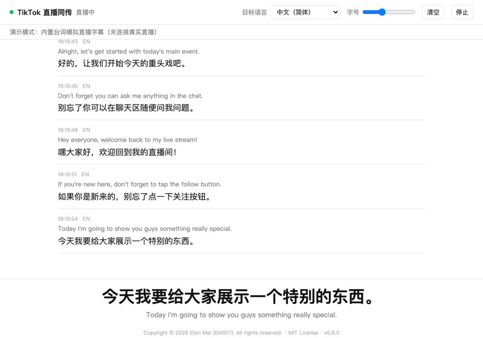
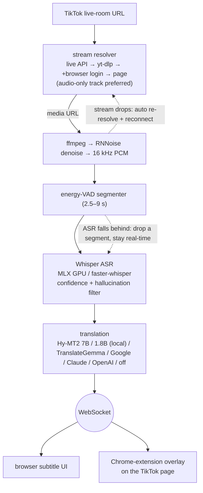
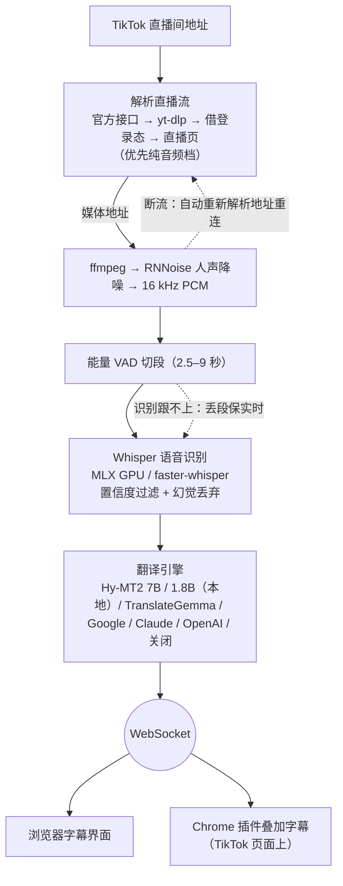

# TikTok 直播同传 · TikTok Live Translator

<p align="center"></p>

<p align="center">
  <a href="https://github.com/EM917/tiktok-live-translator/releases/latest"></a>
  <a href="https://github.com/EM917/tiktok-live-translator/actions/workflows/ci.yml"></a>
  
  
  
  <a href="LICENSE"></a>
</p>

<p align="center"></p>

**Language / 语言：[English](#english) | [中文](#chinese)**

---

<a name="english"></a>

# TikTok Live Translator (English)

Listens to a TikTok livestream, transcribes what the **streamer says** in real time, translates it, and shows bilingual subtitles in a local browser UI. Comes with a Chrome extension that overlays the subtitles directly on the TikTok live page.

**Runs entirely locally**: stream capture, speech recognition, and (optionally) translation all happen on your own machine — no API key needed, zero cost.

## Features

- 🎙️ **Real-time speech recognition** — OpenAI Whisper with a dual backend (faster-whisper / MLX), automatic language detection, 90+ languages
- 🌐 **Local-first translation** — Hy-MT2 (Apache 2.0, offline, free) in two tiers, with TranslateGemma 4B, Google's free API and Claude · OpenAI available as fallbacks. Whichever tier is installed is selected automatically
- 🚨 **Real-time banned-term alerts** — three-tier matching (exact / morphological variant / fuzzy) against the **recognised source text**, independent of translation, including phrases split across caption boundaries. Configured in `banned_terms.txt`
- 🎵 **Voice-focused denoising** — RNNoise suppresses background music, tuned for streams with continuous BGM
- ⚡ **Automatic hardware configuration** — detects the available accelerator (Apple Silicon GPU / NVIDIA CUDA / CPU) and selects the largest model that still runs in real time
- 📺 **Two display modes** — a local web interface (scrolling bilingual history with a large current caption) or a Chrome extension overlaying the TikTok page
- 📊 **Observable latency** — a live readout of time-to-first-caption (P50/P95) broken down into segmentation, recognition and translation, alongside an audit log recording each segment: accepted text, candidates rejected by the quality filter, banned-term matches, and the translation that followed
- ✅ **Startup self-check** — each capability is executed rather than inspected: denoising processes a sample through RNNoise, translation queries the engine, the audit log performs a write. Results appear on the home screen with a remediation step for anything failing
- 🔄 **Fault tolerance** — four independent stream-resolution paths (TikTok's live API → yt-dlp → yt-dlp with browser login → live page parsing), since a blocked yt-dlp extractor reports failures as "not currently live". Each resolved URL is verified before the session starts. Dropped streams reconnect with a freshly resolved URL, distinguishing a network interruption from the broadcast ending; segments are dropped automatically when recognition falls behind; yt-dlp is kept current in the background

## Disk Space

Everything runs locally, so the models live on your machine. The figures below come
from a reference installation; exact sizes vary with platform and package
versions.

| Component | Size | When |
|---|---|---|
| Runtime environment (`.venv`) | 1.4 GB | First launch |
| Speech model — `large-v3` (Apple Silicon GPU / CUDA) | 2.9 GB | First recognition |
| Speech model — `large-v3-turbo` (CPU path) | 1.5 GB | First recognition |
| Ollama application | 0.2 GB | Manual, once |
| Translation model — Hy-MT2 1.8B | 1.1 GB | Automatic on first launch after Ollama |
| Translation model — Hy-MT2 7B (optional) | 4.6 GB | Only if you pull it |
| Denoising model | 0.3 MB | First stream |

**Reserve about 6 GB** for a typical installation: runtime, `large-v3` and the
1.8B translation model. Add 4.6 GB if you also want the 7B tier. Machines on
the CPU path need roughly 4.5 GB, since `large-v3-turbo` is smaller.

Downloads are one-time. Models are shared with any other tool using the same
caches, and are not duplicated per project.

Where they are stored, if you need to reclaim space:

```
~/.cache/huggingface/hub     speech models
~/.ollama/models             translation models
<project>/.venv              runtime environment
<project>/logs               audit logs
```

Audit logs grow by roughly **0.3 MB per hour** of monitoring — about 2 MB for
an eight-hour day, or 0.1 GB a month. They are plain JSONL and safe to delete
once a session has been reviewed.

## Quick Start

### Installation without a terminal (recommended)

1. **Download**: grab **TikTok-Live-Translator-vX.Y.Z.zip** from the [latest release](https://github.com/EM917/tiktok-live-translator/releases/latest)'s Assets and unzip it anywhere (e.g. your Desktop) — "Source code (zip)" works too. The green **Code** button → **Download ZIP** also works (latest dev snapshot).
2. **Install Python** (free, one time only): grab the installer from [python.org/downloads](https://www.python.org/downloads/) and install with the default options. Forgot? No problem — the launcher will detect it and open the download page for you.
3. **Launch**:
   - **macOS**: double-click **`TikTok Live Translator.app`** in the folder. If the first launch is blocked ("cannot be opened"): on older systems right-click → Open; on **macOS 15 and later** go to **System Settings → Privacy & Security**, scroll to the bottom and click **"Open Anyway"** (one time only). Feel free to drag it to the Dock — but **don't move it out of this folder**.
   - **Windows**: double-click **`Start.bat`**. If a "publisher unknown" security warning pops up, click "Run" (this tool is fully open source — the code is right there in the folder). A black text window stays open while running — **that's the translation engine, keep it open**; subtitles appear in the separate app window.

The first launch installs everything automatically (a few minutes, with on-screen progress; the first recognition also downloads the speech model, with progress shown on the page). Every launch after that is instant. Once the window opens: **paste the live-room URL (or just the streamer's username) → pick the streamer's language → hit Start**. Stop or switch rooms anytime.

### Command line

With [Python 3.9+](https://www.python.org/downloads/) installed, two commands:

```bash
git clone https://github.com/EM917/tiktok-live-translator.git
cd tiktok-live-translator && python3 main.py
```

(On Windows use `python main.py`.) Everything else is automatic: the first run creates a virtual environment and installs all dependencies (including a bundled static ffmpeg and the denoising model). CLI flags work too:

```bash
python3 main.py "https://www.tiktok.com/@streamer_username/live" --source es
python3 main.py --demo      # preview the UI without connecting to a stream
python3 main.py --doctor    # print the hardware check and recommended config
```

> Prefer to control the install yourself? `bash setup.sh` (macOS/Linux) or `powershell -ExecutionPolicy Bypass -File setup.ps1` (Windows) does the same steps explicitly.

> **Cloned an older version before?** Don't re-clone (it fails with `destination path already exists`) — just `cd` into the folder, run `git pull`, and start it; from v0.2.0 on you can update with one click from the page itself.

### Starting the application

- **macOS**: double-click **`TikTok Live Translator.app`** (or `Start.command`);
- **Windows**: double-click **`Start.bat`**;
- CLI: `cd ~/tiktok-live-translator && python3 main.py`.

The UI opens in its **own app window** (no browser tab), remembering the room URL and target language from last time — just hit Start. Closing the window quits the app. Pass `--browser` if you prefer the browser UI.

## Automatic Hardware Configuration

`python main.py --doctor` reports the hardware detection results. Any flag not set explicitly at startup is filled in according to the table below:

| Hardware | Selected configuration | Result |
|---|---|---|
| Apple Silicon (M1 or later) | MLX GPU backend + `large-v3` | Most accurate model, runs ~5x faster than real time |
| NVIDIA GPU | CUDA + `large-v3` (float16) | Most accurate model, plenty of speed headroom |
| CPU (≥8 cores, ≥8 GB RAM) | CPU + `small` (int8) | Real-time capable, moderate accuracy |
| Lower-specification CPU | CPU + `base` (int8) | Prioritises keeping pace over accuracy |

Benchmark reference (M3 Pro, 90 seconds of recorded livestream audio; RTF = recognition time / audio duration, which must remain below 1 to avoid dropping segments):

| Config | RTF |
|---|---|
| MLX GPU + large-v3 | **0.21** ✅ |
| CPU + large-v3-turbo | 0.99 ⚠️ borderline |
| CPU + large-v3 | 1.22 ❌ drops segments |

Every selected value can be overridden with a command-line flag.

## Command-Line Flags

| Flag | Description | Default |
|------|------|------|
| `--target` | Target language (`zh-CN`/`en`/`ja`/`ko`/…; can also be switched anytime in the UI) | `zh-CN` |
| `--source` | Streamer's language; auto-detected if omitted (specify it for better accuracy when known, e.g. `es`/`en`/`ja`) | auto |
| `--backend` | Recognition backend: `mlx` (Apple GPU) / `ct2` (faster-whisper) / `auto` | `auto` |
| `--model` | Whisper model: `tiny`/`base`/`small`/`medium`/`large-v3`/`large-v3-turbo` | auto by hardware |
| `--device` | `auto`/`cpu`/`cuda` | auto by hardware |
| `--compute-type` | ct2 precision (`int8`/`float16`/…) | auto by hardware |
| `--beam` | Beam search width (larger = more accurate but slower; `1` = greedy; ct2 backend only) | `5` |
| `--context` | Enable rolling context. **Off by default**: measured to trigger repetition loops that badly hurt recall | off |
| `--asr-temperature` | Decoding temperature. **Defaults to 0 (single pass)**: Whisper otherwise re-decodes a segment at up to six temperatures when quality checks fail, which measured 25s on music-heavy audio | `0` |
| `--translator` | Translation engine: `auto`/`hymt2-7b`/`hymt2`/`gemma`/`google`/`claude`/`openai`/`none` | `auto` |
| `--denoise` | RNNoise voice denoising: `auto`/`on`/`off` | `auto` (on) |
| `--port` | Local UI port | `8765` |
| `--cookies` | Path to a yt-dlp cookies.txt file (may be needed for region-restricted streams) | none |
| `--demo` | Demo mode — drives only the UI | off |
| `--doctor` | Print the hardware check and recommended config, then exit | off |
| `--no-open` | Don't auto-open the browser on startup | off |

## Translation Engines

Installing [Ollama](https://ollama.com/download) completes the setup. On the
next launch the application starts it if required, downloads the 1.1 GB Hy-MT2
1.8B model through Ollama's API with on-screen progress, and switches to it. No
terminal commands are involved; the Whisper model is provisioned the same way.

Pulling the larger tier makes it available for strong re-translation and for an explicit `--translator hymt2-7b`. It is never selected automatically; see below.

```bash
ollama pull hf.co/tencent/Hy-MT2-7B-GGUF:Q4_K_M     # 4.6 GB, highest terminology accuracy, ~16 GB RAM
```

| Value | Engine |
|---|---|
| `auto` (default) | Selects the best engine present: `hymt2` → `gemma` → `google`. 7B is never selected automatically; see below |
| `hymt2` | Hy-MT2 1.8B (Tencent, Apache 2.0). Recommended for most machines |
| `hymt2-7b` | Hy-MT2 7B. Highest terminology accuracy; opt-in only, see below |
| `gemma` | TranslateGemma 4B. `OLLAMA_TRANSLATE_MODEL` selects `translategemma:12b`/`27b` |
| `deepl` | Key entered on the home screen (or `DEEPL_API_KEY`). A key ending in `:fx` is routed to the free endpoint automatically. Builds and maintains a native DeepL glossary from `glossary.txt`; see below. Subtitle text is sent to DeepL |
| `google` | Google Translate's free endpoint, no key required. Subtitle text is sent to Google; rate-limited per IP |
| `claude` | Key entered on the home screen (or `ANTHROPIC_API_KEY`); model overridable via `CLAUDE_TRANSLATE_MODEL` |
| `openai` | Key entered on the home screen (or `OPENAI_API_KEY`); optional `OPENAI_BASE_URL`, `OPENAI_MODEL`. Compatible with any OpenAI-style API including local LM Studio / vLLM |
| `none` | Transcription only, no translation |

The engine is chosen on the home screen, where API keys are entered too — no
terminal and no environment variables. Keys are stored in `settings.json`,
which is git-ignored, and are never sent back to the page; only the last four
characters are shown so you can tell which key is in place.

The self-check on the home screen reports which engine is in use, so a fallback
to the network engine is visible rather than silent.

Local engines handle colloquial speech substantially better. Spanish → Chinese:

| Source | Google | Local model |
|---|---|---|
| *Se mueren lo rico* (extremely good) | ❌ 有钱人死 (the rich die) | ✅ 味道非常好 |
| *tengo un sueño* (I am sleepy) | ❌ 我做了一个梦 (I had a dream) | ✅ 现在感觉很困 |
| *Es vegano* (it is vegan) | ❌ 它是素食主义者 (he is a vegetarian) | ✅ 纯素的 |

### DeepL: the native glossary decides everything

DeepL accepts no prompt, so per-sentence glossary injection does nothing for it —
only a **native glossary** held in the account applies. The application builds one
from `glossary.txt` on first use. The glossary name carries a fingerprint of the
file contents, so editing the glossary rebuilds it on the next launch with no
manual step.

Measured on the same 60 lines of real subtitles:

| | Glossary compliance | Median latency |
|---|---|---|
| DeepL, no glossary | 26.5% | 388 ms |
| DeepL + native glossary | 91.8% | 542 ms |

Nearly all of those 65 points are product names. With no glossary in place DeepL
still returns fluent Chinese, so nothing looks wrong on screen — which is why the
home-screen self-check actually builds the glossary and reports its entry count
instead of merely checking that a key is present.

The following constraints are measured, not assumed:

- **The free tier permits exactly one glossary** (creating a second returns 456).
  Only glossaries the application created are deleted — their names start with
  `tlt-`. Glossaries you created in the DeepL dashboard are left alone.
- **A glossary is a hint, not a substitution.** `las gotas → 维生素滴剂` applies,
  while `la limpieza → 排毒粉` does not fire inside `me paso a la limpieza`. The
  post-translation rule-based replacement is therefore retained.
- **Traditional Chinese gets no native glossary.** DeepL offers a single `zh`
  glossary target and `glossary.txt` is written in Simplified Chinese; attaching
  it pushes Simplified terms into Traditional output.
- **The source language must be explicit.** When transcription reports no
  language, no glossary is attached rather than guessing — a wrong guess forces
  the whole line through the wrong language.

Quota is billed on source length. The same real stream (38.4 minutes, 567 lines)
measures a 175× difference between two ways of using it:

| Usage | Burn rate | Free tier covers |
|---|---|---|
| Every subtitle through DeepL | 95,824 chars/hour | 10.4 hours |
| Alert context only | 546 chars/hour | 1832 hours |

Alert context is sparse — two passages totalling 349 characters in that session —
and it is the text that must not be mistranslated, since the operator reads it to
decide whether to act. Price anything beyond the free tier against DeepL's
current per-character rate.

**Subtitle text is sent to DeepL.** Local engines never leave the machine; this
one does. The stream being monitored belongs to someone else, and whether that is
acceptable is a business decision.

### Re-translating with the strongest model

The strongest local model is applied per sentence rather than for a period of
time. What justifies it is specific content — prices, promotional conditions,
health claims — which is episodic, and only the operator or the detector knows
which sentence that is. Measured cost: loading the model takes 1.9 s and a
complete one-shot call 2.3 s, after which it is unloaded, leaving recognition
unaffected. Keeping it resident instead would raise recognition from 1.4 s to
3.2 s and alert latency from 6.8 s to 10.6 s.

Three ways to invoke it:

- **Per caption** — hover a caption and press 重译. The line is re-translated
  and marked in the margin
- **On a banned-term match** — the matched sentence is re-translated
  automatically. The fast translation appears first so nothing is delayed; the
  accurate one replaces it about two seconds later
- **After the session** — `python3 tools/retranslate_audit.py` re-translates a
  session's audit log, appending `translation_strong` records without altering
  any existing line, and prints the segments whose translation changed

The larger model is not uniformly better. Its advantage is on terminology and
promotional conditions; on casual speech it is sometimes worse and can drop a
clause. The batch tool therefore reports what changed rather than replacing
anything silently.

### Finding translation errors without reading everything

Scanning a session's captions by eye to find mistranslations is slow and will
miss things. `tools/retranslate_audit.py` re-translates a session with the
strongest model and ranks the segments by how much the two models disagree —
the greater the disagreement, the more likely one of them is wrong. It needs no
judge and makes no semantic call of its own.

```bash
python3 tools/retranslate_audit.py
```

On its first run this surfaced `es una orden de 30` being rendered as "30
units" rather than a $30 threshold — a glossary gap nobody had noticed.

Two approaches that were measured and rejected, recorded so they are not
retried: comparing word overlap against a back-translation scores correct and
incorrect translations identically, because Spanish paraphrases legitimately
change words; and asking a local model to judge agreement fails outright —
the 1.8B model called every pair inconsistent, and the 7B model was right four
times in ten.

### Engine comparison

The relevant metric is not fluency but glossary adherence, since that determines
whether product names, prices and promotional conditions are rendered correctly.
Measured with `tools/bench_glossary.py` over 280 glossary terms taken from
recorded captions, with latency from a live Spanish selling stream on an 18 GB
M-series Mac:

| | Glossary adherence | Multi-word phrases | Translation latency |
|---|---|---|---|
| Hy-MT2 7B | 83% | 84% | 892 ms median, 1.7 s p95 |
| Hy-MT2 1.8B | 66% | 65% | 358 ms median |
| TranslateGemma 4B | 48% | 26% | 832 ms median |

The multi-word column is the significant one: prices and promotional conditions
are phrases rather than single nouns, and that is where a translation misleads
an operator.

Latency was excluded from the selection criteria. Banned-term alerts are raised
from the recognised source text and never wait for translation; the only
requirement is that translation keep pace with 9-second segments, which both
tiers do.

**Why 7B is not the default.** Its 17-point accuracy advantage made it the
default in the initial v0.10.0 build, a decision based on a 24-caption sample. A
92-caption live run gave a different result: with 7B resident, recognition held
at approximately 3.2 s against 1.4 s with the smaller models, flat from the
first quartile, indicating steady-state contention for unified memory. Since
recognition is on the alert path and translation is not, the trade ran in the
wrong direction. Where memory is available and alert latency is not the primary
metric, `--translator hymt2-7b` is a genuine improvement in terminology
accuracy.

## Chrome Extension

1. Open `chrome://extensions` and enable "Developer mode" in the top right.
2. Click "Load unpacked" and select this project's `extension/` folder.
3. Keep the app running, open a TikTok **live-room** page (URL contains `/live`), and a floating subtitle bar appears as subtitles arrive.

The subtitle bar supports **dragging** to reposition it, **double-clicking** to collapse/expand, and hovering reveals an **×** to hide it. The extension automatically tries the ports the app may use (8765–8774), so it normally needs no configuration. The extension is just a display layer — audio capture and recognition are handled by the local app.

## Architecture



## Auto-update

On every launch the app silently checks GitHub for the latest release (network failures are silently ignored). When a new version exists, a banner appears at the top of the page:

- **git install** (cloned via `git clone`) → click "Update" to run `git pull --ff-only` and restart automatically. If you have uncommitted local changes, the update is refused to avoid overwriting them;
- **ZIP install** → the banner links to the download page instead.

The current version is shown in the page footer.

## FAQ

**The self-check shows a failing row.** Each row carries its remediation step
directly beneath it. The most frequent causes are an empty `banned_terms.txt`
(no alerts will be raised at all) and an incompletely downloaded denoise model
(delete `models/bd.rnnn` and start again; it re-downloads). The panel re-checks
on every start, so a resolved issue clears on the next run. A passing row
indicates the capability was executed, not merely configured.

**The update button reports that something is blocking it.** The message names
the affected files and provides a complete command with your project path and a
Copy button. On builds older than v0.10.4 the machine cannot repair itself, as
the fix is delivered by the update that is being blocked — run
`git pull --ff-only` once in the project directory.

**Performance degrades and audio begins backing up.** Check `ollama ps`. Ollama
retains a model in VRAM for 30 minutes after last use, so switching translation
tiers previously left the earlier model resident; combined with Whisper
large-v3 this can exhaust a 16–18 GB machine and cause paging, presenting as
slower recognition and a growing backlog. Unused tiers are now unloaded at
startup. On older builds, `ollama stop <model>` releases it immediately.

**The stream cannot be resolved although the room plays in a browser.** A
blocked yt-dlp extractor reports failures as "the channel is not currently
live", which is incorrect. Since v0.10.0 four independent routes are tried:
TikTok's live API (which does not involve yt-dlp and answers anonymously),
yt-dlp, yt-dlp using the TikTok session in your browser, and the live page
itself. Being signed in to TikTok in Chrome or Safari helps but is usually not
required, and no file needs exporting; cookies remain between your machine and
TikTok. The application no longer reports the streamer as offline unless TikTok
explicitly states the room has ended. A browser can be pinned with
`--cookies-browser safari`, or credentials supplied via `--cookies cookies.txt`.

**The first start appears stuck downloading the recognition model.** The model
is being retrieved from Hugging Face (large-v3 is approximately 3 GB). Progress
is displayed on the page and this occurs only once.

**All translations fail and captions show only the source language.** The
default Google endpoint rate-limits per IP and returns 429 under sustained use.
The application pauses requests for two minutes and recovers automatically, with
a banner on the page. Speech recognition is unaffected. For extended sessions,
use a local Hy-MT2 model or an API key via `--translator claude` / `openai`. No
network connection, or a stopped Ollama, produces the same symptom.

**Status reads "live" but no captions appear for some time.** This is normally
expected: while the streamer plays music or is not speaking, silent and
low-confidence segments are discarded deliberately. If the streamer is clearly
speaking and nothing appears, try `--denoise off` or a different model size.

**Captions stop after closing the laptop lid or switching networks.** When the
stream drops, the URL is re-resolved and the connection re-established
automatically, up to 5 attempts with increasing backoff. If the interface
reports repeated interruptions and failed reconnection, press Start again.

**Recognition cannot keep pace with the stream.** Use a smaller model
(`--model small`) or `--beam 1`. On Apple Silicon, confirm the self-check
reports the `mlx` backend rather than `ct2` — the CPU path runs at
approximately real time and accumulates backlog.

**Performance is poor on a Mac with 8 GB of RAM.** Apple Silicon defaults to
`large-v3` (~3 GB). Where memory is constrained, use `--model large-v3-turbo`
or `--model small`.

**Sung vocals in background music are transcribed as speech.** RNNoise
suppresses instrumental music effectively but can only partially suppress sung
vocals. Confidence filtering removes most such segments; occasional
false positives are expected.

**The extension does not display subtitles.** Confirm the application is
running and that the page is a live room (the URL contains `/live`) rather than
a regular video page, then reload the TikTok page.

**The interface is not on port 8765.** If 8765 is occupied, the application
moves to the next free port in 8766–8774. The Chrome extension scans the same
range, so no configuration is required.

**Exporting captions.** There is no export function; select and copy the text
from the page. The page retains the most recent 300 lines, and the server
replays the last 100 after a reload or reconnection.

**Closing the console window.** On Windows that console window is the
translation engine, so closing it exits the application. On macOS, closing the
application window exits it; if launched via `Start.command`, close the Terminal
window or press Ctrl-C.

**Installation fails on a managed computer, or space is insufficient.** The
initial installation requires about 6 GB and access to PyPI, Hugging Face and
ollama.com; see "Disk Space" for the breakdown. Corporate security policies
frequently block these.

## Privacy and Usage Boundaries

- Recognition always runs locally. Translation is fully offline when using `gemma`/`none`; with `google`/`claude`/`openai`, subtitle text is sent to the corresponding provider.
- This tool is for personal learning and language-assistance use only. Please comply with TikTok's Terms of Service and local laws — don't use it to rebroadcast or redistribute recordings of other people's content.

## Acknowledgments

- [faster-whisper](https://github.com/SYSTRAN/faster-whisper) / [mlx-whisper](https://github.com/ml-explore/mlx-examples) — speech recognition
- [yt-dlp](https://github.com/yt-dlp/yt-dlp) — livestream resolution
- [FFmpeg](https://ffmpeg.org/) — audio processing (built-in RNNoise `arnndn` filter)
- [rnnoise-models](https://github.com/GregorR/rnnoise-models) — denoising model (beguiling-drafter)
- [Ollama](https://github.com/ollama/ollama) + [Hy-MT2](https://github.com/Tencent-Hunyuan/Hy-MT2) / [TranslateGemma](https://ollama.com/library/translategemma) — local translation

## Author & License

Copyright © 2026 [Elon Mei (EM917)](https://github.com/EM917). Released under the [MIT License](LICENSE).

---

<a name="chinese"></a>

# TikTok 直播同传（中文）


监听 TikTok 直播间，把**主播说的话**实时转写并翻译成字幕，在本地浏览器 UI 中双语显示。附带一个 Chrome 插件，可以把字幕直接叠加在 TikTok 直播页面上。

**全程本地运行**：拉流、语音识别与翻译均在本机完成，无需 API Key，无使用费用。

## 特性

- 🎙️ **实时语音识别** —— OpenAI Whisper 双后端（faster-whisper / MLX），自动检测主播语言，支持 90+ 语言
- 🌐 **本地优先的翻译** —— Hy-MT2（Apache 2.0，离线免费）两档可选，另有 TranslateGemma 4B、Google 免费接口、Claude·OpenAI 作为兜底。按已安装的档位自动选择
- 🚨 **违禁词实时报警** —— 在**识别原文**上做三级匹配（精确 / 形态变体 / 模糊），不依赖翻译，短语跨字幕边界同样可命中。词表见 `banned_terms.txt`
- 🎵 **人声降噪** —— RNNoise 抑制背景音乐，针对持续 BGM 的直播间调校
- ⚡ **硬件自动配置** —— 检测可用加速器（Apple Silicon GPU / NVIDIA CUDA / CPU），选择仍能实时运行的最大模型
- 📺 **双显示端** —— 本地网页界面（双语历史字幕 + 底部当前字幕大字），或 Chrome 插件叠加于 TikTok 页面
- 📊 **延迟可观测** —— 实时显示首字等待（P50/P95）及其构成（切段、识别、翻译），并配套审计日志逐段记录：采纳的文本、被质量过滤丢弃的候选、命中的违禁词，以及随后到达的译文
- ✅ **启动自检** —— 每项能力实际执行而非检查配置：降噪实跑 RNNoise，翻译实际请求引擎，审计日志实际写入。结果显示在首页，异常项附带处理步骤
- 🔄 **抗故障** —— 四条独立的流地址解析路径（TikTok 官方接口 → yt-dlp → yt-dlp 借用浏览器登录态 → 直播页解析），因为 yt-dlp 提取器被拦截时会将失败报告为「未开播」。每个解析结果在会话开始前先行验证。断流后以重新解析的地址重连，并区分网络中断与直播结束；识别落后时自动丢段保实时；后台保持 yt-dlp 为最新版

## 磁盘空间

全部在本机运行，因此模型也存在本机。以下数值来自一次实际安装的实测，具体体积会随系统与依赖版本略有出入。

| 组成 | 体积 | 何时下载 |
|---|---|---|
| 运行环境（`.venv`） | 1.4 GB | 首次启动 |
| 语音模型 `large-v3`（Apple Silicon GPU / CUDA） | 2.9 GB | 首次识别 |
| 语音模型 `large-v3-turbo`（CPU 路径） | 1.5 GB | 首次识别 |
| Ollama 程序本身 | 0.2 GB | 手动安装一次 |
| 翻译模型 Hy-MT2 1.8B | 1.1 GB | 装好 Ollama 后由程序自动下载 |
| 翻译模型 Hy-MT2 7B（可选） | 4.6 GB | 仅在你主动拉取时 |
| 降噪模型 | 0.3 MB | 首次开播 |

**建议预留约 6 GB**：运行环境 + `large-v3` + 1.8B 翻译模型，这是常规配置。
额外使用 7B 档再加 4.6 GB。走 CPU 路径的机器约需 4.5 GB，因为
`large-v3-turbo` 更小。

下载都是一次性的。模型存放在系统级缓存中，与其它使用相同缓存的工具共享，
不会按项目重复占用。

需要清理时，它们分别在：

```
~/.cache/huggingface/hub     语音模型
~/.ollama/models             翻译模型
<项目目录>/.venv              运行环境
<项目目录>/logs               审计日志
```

审计日志的增长约为**每小时 0.3 MB**——按每天监听 8 小时计约 2 MB，一个月约
0.1 GB。它是纯文本 JSONL，某场复核完毕后可以直接删除。

## 快速开始

### 无需终端的安装方式（推荐）

1. **下载**：到[最新 Release](https://github.com/EM917/tiktok-live-translator/releases/latest) 的 Assets 里下载 **TikTok-Live-Translator-vX.Y.Z.zip**，解压到任意位置（例如桌面）——下载「Source code (zip)」也一样能用。也可以点仓库页绿色 **Code** 按钮 → **Download ZIP**（取的是最新开发版）。
2. **装 Python**（免费，只装一次）：到 [python.org/downloads](https://www.python.org/downloads/) 下载安装包，按默认选项装完即可。忘了装也没关系——启动器发现没有 Python 时会自动打开下载页提示你。
3. **启动**：
   - **macOS**：双击文件夹里的 **`TikTok Live Translator.app`**。首次打开如提示「无法打开」：旧系统右键 → 打开；**macOS 15 及以后**要到 **系统设置 → 隐私与安全性**，拉到页面底部点 **「仍要打开」**（只需一次）。可以把它拖到 Dock 常驻，但**不要把它拖出这个文件夹**。
   - **Windows**：双击 **`Start.bat`**。若弹出「发布者未知」的安全警告，点「运行」即可（本工具完全开源，代码就在这个文件夹里）。运行期间会有一个黑色文字窗口——**它是翻译引擎，请保持打开**，字幕显示在另外弹出的应用窗口里。

首次启动会自动安装全部组件（需要几分钟，屏幕上有提示；首次识别还会自动下载语音模型，页面上能看到进度），之后每次秒开。窗口打开后：**粘贴直播间地址（或只输入主播用户名）→ 选主播语言 → 点「开始翻译」**，随时可以停止或换房间。

### 命令行方式

装好 [Python 3.9+](https://www.python.org/downloads/) 后两条命令：

```bash
git clone https://github.com/EM917/tiktok-live-translator.git
cd tiktok-live-translator && python3 main.py
```

（Windows 用 `python main.py`）其余全自动：首次运行自动创建虚拟环境、安装全部依赖（含内置 ffmpeg 和降噪模型）。也可以直接传参：

```bash
python3 main.py "https://www.tiktok.com/@主播用户名/live" --source es
python3 main.py --demo      # 不连直播，先看看界面效果
python3 main.py --doctor    # 看看硬件体检和推荐配置
```

> 想手动控制安装过程？`bash setup.sh`（macOS/Linux）或 `powershell -ExecutionPolicy Bypass -File setup.ps1`（Windows）做的是同样的事。

> **之前克隆过旧版本？** 不要重新 clone（会报 `destination path already exists`）——进目录执行 `git pull` 再启动即可；v0.2.0 起页面里就能一键更新，不再需要命令行。

### 启动方式

- **macOS**：双击 **`TikTok Live Translator.app`**（或 `Start.command`）；
- **Windows**：双击 **`Start.bat`**；
- 命令行党：`cd ~/tiktok-live-translator && python3 main.py`。

界面在**独立应用窗口**中打开（不占浏览器标签页），上次填过的直播间地址和选过的目标语言都会记住，点「开始翻译」即可；关掉窗口就是退出。想改回浏览器界面加 `--browser`。

## 硬件自动配置

`python main.py --doctor` 可查看硬件检测结果。启动时未显式指定的参数按下表填充：

| 硬件 | 选定配置 | 结果 |
|---|---|---|
| Apple Silicon（M1 及以上） | MLX GPU 后端 + `large-v3` | 最准模型，比实时快约 5 倍 |
| NVIDIA 显卡 | CUDA + `large-v3` (float16) | 最准模型，速度富余 |
| CPU（≥8 核，≥8 GB 内存） | CPU + `small` (int8) | 可实时运行，精度中等 |
| 低配置 CPU | CPU + `base` (int8) | 优先保证跟上进度 |

实测数据（M3 Pro，90 秒直播录音；RTF = 识别耗时 / 音频时长，需小于 1 才不丢段）：

| 配置 | RTF |
|---|---|
| MLX GPU + large-v3 | **0.21** ✅ |
| CPU + large-v3-turbo | 0.99 ⚠️ 临界实时 |
| CPU + large-v3 | 1.22 ❌ 丢段 |

上述选定值均可通过命令行参数覆盖。

## 命令行参数

| 参数 | 说明 | 默认 |
|------|------|------|
| `--target` | 目标语言（`zh-CN`/`en`/`ja`/`ko`/…，UI 里也能随时切换） | `zh-CN` |
| `--source` | 主播语言，不填自动检测（确定时指定更准，如 `es`/`en`/`ja`） | 自动 |
| `--backend` | 识别后端：`mlx`（Apple GPU）/`ct2`（faster-whisper）/`auto` | `auto` |
| `--model` | whisper 模型：`tiny`/`base`/`small`/`medium`/`large-v3`/`large-v3-turbo` | 按硬件自动 |
| `--device` | `auto`/`cpu`/`cuda` | 按硬件自动 |
| `--compute-type` | ct2 精度（`int8`/`float16`/…） | 按硬件自动 |
| `--beam` | beam search 宽度（越大越准越慢，`1`=贪心；仅 ct2 后端） | `5` |
| `--context` | 开启滚动上下文。**默认关闭**：实测它会诱发复读死循环，反而大幅拉低召回率 | 关 |
| `--asr-temperature` | 识别解码温度。**默认 0（只解码一次）**：Whisper 默认会在质量不达标时用更高温度重解最多 6 次，音乐段上实测单次识别可达 25 秒 | `0` |
| `--translator` | 翻译引擎：`auto`/`hymt2-7b`/`hymt2`/`gemma`/`google`/`claude`/`openai`/`none` | `auto` |
| `--denoise` | RNNoise 人声降噪：`auto`/`on`/`off` | `auto`（开） |
| `--port` | 本地 UI 端口 | `8765` |
| `--cookies` | yt-dlp cookies.txt 路径（地区受限的直播间可能需要） | 无 |
| `--demo` | 演示模式，仅驱动 UI | 关 |
| `--doctor` | 打印硬件体检和推荐配置后退出 | 关 |
| `--no-open` | 启动后不自动打开浏览器 | 关 |

## 翻译引擎

安装 [Ollama](https://ollama.com/download) 即完成配置。下次启动时程序会在需要时
将其启动，通过 Ollama 接口下载 1.1 GB 的 Hy-MT2 1.8B 模型（页面显示进度）并切换
至该引擎，全过程无需终端操作。Whisper 模型采用相同方式部署。

拉取更大的档位后，它可用于「重译」以及显式指定 `--translator hymt2-7b`。程序**不会**自动选用它，原因见下。

```bash
ollama pull hf.co/tencent/Hy-MT2-7B-GGUF:Q4_K_M     # 4.6 GB，术语准确率最高，建议 16 GB 以上内存
```

| 取值 | 引擎 |
|---|---|
| `auto`（默认） | 在已安装的引擎中选择：`hymt2` → `gemma` → `google`。7B 不会被自动选用，原因见下 |
| `hymt2` | Hy-MT2 1.8B（腾讯，Apache 2.0）。多数机器的推荐档位 |
| `hymt2-7b` | Hy-MT2 7B。术语准确率最高，需显式指定，原因见下 |
| `gemma` | TranslateGemma 4B。`OLLAMA_TRANSLATE_MODEL` 可切换至 `translategemma:12b`/`27b` |
| `deepl` | 密钥在首页填写（也可用 `DEEPL_API_KEY`）。以 `:fx` 结尾的免费 key 会自动走对应域名。会按 `glossary.txt` 自动建立并维护 DeepL 原生术语表，见下。**字幕文本会发送给 DeepL** |
| `google` | Google 翻译免费接口，无需密钥。字幕文本会发送至 Google，且按 IP 限流 |
| `claude` | 密钥在首页填写（也可用 `ANTHROPIC_API_KEY`），模型可由 `CLAUDE_TRANSLATE_MODEL` 覆盖 |
| `openai` | 密钥在首页填写（也可用 `OPENAI_API_KEY`），可选 `OPENAI_BASE_URL`、`OPENAI_MODEL`。兼容各类 OpenAI 风格接口，含本地 LM Studio / vLLM |
| `none` | 仅显示识别原文，不翻译 |

引擎在首页选择，API 密钥也填在那里——不需要终端，也不需要环境变量。密钥保存在
`settings.json`（已被 git 忽略），**从不回传页面**，界面上只显示尾四位，
供你确认填的是哪一个。

首页自检会显示当前使用的引擎，因此回退至网络引擎的情况可见而非静默发生。

本地引擎对口语的处理明显更好。西语 → 中文：

| 原文 | Google | 本地模型 |
|---|---|---|
| *Se mueren lo rico*（好吃到不行） | ❌ 有钱人死 | ✅ 味道非常好 |
| *tengo un sueño*（我困了） | ❌ 我做了一个梦 | ✅ 现在感觉很困 |
| *Es vegano*（纯素产品） | ❌ 它是素食主义者 | ✅ 纯素的 |

### DeepL：原生术语表决定成败

DeepL 不接受提示词，逐句注入词表对它无效——它只认账号里的**原生术语表**。程序
在首次使用时按 `glossary.txt` 自动建表，表名带词表内容的指纹，改了词表下次启动
自动重建，全程无需手工操作。

同一批 60 句真实字幕实测：

| | 词表遵从率 | 中位延迟 |
|---|---|---|
| DeepL（无术语表） | 26.5% | 388 ms |
| DeepL + 原生术语表 | 91.8% | 542 ms |

差的这 65 个百分点几乎全是商品名。表没建起来时 DeepL 依然返回通顺的中文，屏幕上
看不出异常——因此首页自检会实际把表建出来并报告条数，而不是只检查密钥是否填了。

以下约束均为实测所得：

- **免费版只允许同时存在 1 个术语表**（建第 2 个直接返回 456）。程序只删除自己
  建的表（表名以 `tlt-` 开头），你在 DeepL 后台自建的表不会被动。
- **术语表是提示而非强制**。`las gotas → 维生素滴剂` 会生效，而
  `me paso a la limpieza` 中的 `la limpieza → 排毒粉` 不触发。因此译后的规则
  替换仍然保留。
- **繁体中文不挂原生术语表**。DeepL 的术语表只有一个 `zh`，而 `glossary.txt`
  的译法是简体，挂上会把简体词塞进繁体译文。
- **源语言必须明确**。识别未给出语言时不挂术语表，不做猜测——猜错会导致整句
  按错误的语言解析。

字符额度按源文长度计。同一场真实直播（38.4 分钟、567 句）实测两种用法差 175 倍：

| 用法 | 消耗速率 | 免费额度可用时长 |
|---|---|---|
| 全部字幕都走 DeepL | 95,824 字符/小时 | 10.4 小时 |
| 仅报警上下文走 DeepL | 546 字符/小时 | 1832 小时 |

报警上下文是稀疏的——那场只有 2 段、共 349 字符，而它恰恰是最不能翻错的地方：
中控就是靠它判断要不要处理。超出免费额度的部分按 DeepL 的按量计价自行核算。

**字幕文本会发送给 DeepL。** 本地引擎全程不出网，这一条出网。本工具监听的是他人
的直播内容，是否可接受由业务侧决定。

### 用最强模型重译

最强的本地模型按**句**调用，而不是按时段。值得动用它的是具体内容——价格、
促销条件、功效宣称——这类内容是零散出现的，只有中控或检测器知道是哪一句。
实测代价：载入 1.9 秒，单次调用全程 2.3 秒，之后立即卸载，对识别没有影响。
若改为常驻，识别会从 1.4 秒升至 3.2 秒，报警延迟从 6.8 秒升至 10.6 秒。

三种触发方式：

- **单条重译** —— 鼠标移到某条字幕上，点「重译」。该条重新翻译并在左侧标记
- **命中违禁词时自动重译** —— 命中的那一句自动用强模型重来。快的那版先上屏，
  不延迟任何显示；准的那版约两秒后原地替换
- **收工后批量重译** —— `python3 tools/retranslate_audit.py` 重译一场的审计
  日志，仅**追加** `translation_strong` 记录，不改动原有任何一行，并列出译文
  发生变化的段落

更大的模型并非一律更好。它的优势在术语与促销条件；日常口语上有时反而更差，
也可能漏掉一个分句。因此批量工具输出的是「有变化的段落」，交由人复核，
而不是静默覆盖。

### 不用逐句读也能找出译错的地方

靠人肉眼扫一整场字幕找译错，慢且必然漏。`tools/retranslate_audit.py` 会用最强
模型重译一遍，并按**两个模型的分歧程度**排序——分歧越大，其中一个越可能是错的。
它不需要任何裁判，自己也不做语义判断。

```bash
python3 tools/retranslate_audit.py
```

首次运行即翻出 `es una orden de 30` 被译成「30 片」而非「满 30 美元」，
那是当时词表漏掉的一条促销条件，此前无人察觉。

另有两种做法经实测否决，记在此处以免重走：回译后比对词汇重合度，正确与错误的
译文得分完全相同（西语同义改写本来就会换词）；让本地模型判断「一致/不一致」
则直接失效——1.8B 对所有句子都判不一致，7B 十次里只对四次。

### 引擎对比方法

相关指标不是译文流畅度，而是词表遵从率——它决定商品名、价格与促销条件是否被
正确呈现。使用 `tools/bench_glossary.py` 在 280 个术语上测量，语料取自真实直播
字幕；延迟数据来自一台 18 GB M 系列 Mac 上的实盘运行：

| | 词表遵从率 | 多词短语 | 翻译延迟 |
|---|---|---|---|
| Hy-MT2 7B | 83% | 84% | 中位 892 ms，P95 1.7 s |
| Hy-MT2 1.8B | 66% | 65% | 中位 358 ms |
| TranslateGemma 4B | 48% | 26% | 中位 832 ms |

其中「多词短语」一列最为关键：价格与促销条件是短语而非单个名词，译文误导操作员
的情形集中于此。

延迟未纳入选型标准。违禁词报警基于识别原文发出，不等待翻译；对翻译的唯一要求是
跟得上 9 秒的切段，两档均满足。

**7B 不作为默认的原因。** 其 17 个百分点的准确率优势曾使其成为 v0.10.0 首个构建
的默认档位，该判断基于 24 条字幕的样本。一次 92 条字幕的实盘运行给出不同结果：
7B 常驻时识别耗时稳定在约 3.2 秒，而使用较小模型为 1.4 秒，且自第一个四分位起
即为该水平，属统一内存的稳态资源争用。识别位于报警链路上而翻译不在，因此该取舍
方向相反。内存充裕且不以报警延迟为首要指标时，`--translator hymt2-7b` 在术语
准确率上确有提升。

## Chrome 插件

1. 打开 `chrome://extensions`，右上角开启「开发者模式」；
2. 点「加载已解压的扩展程序」，选择本项目的 `extension/` 文件夹；
3. 保持程序在运行，打开 TikTok **直播间**页面（地址含 `/live`），字幕到达时出现悬浮字幕条。

字幕条支持**拖动**移动位置、**双击**折叠/展开、悬停出现 **×** 可隐藏。插件会自动尝试程序可能用到的端口（8765–8774），一般无需配置。插件只是显示端——音频抓取和识别由本地程序完成。

## 架构



## 自动更新

每次启动时会静默检查 GitHub 上的最新版本（网络失败一律无声跳过）。有新版本时页面顶部会出现横幅：

- **git 安装**（`git clone` 的）→ 点「一键更新」自动 `git pull --ff-only` 并重启程序。本地有未提交修改时会拒绝更新以免覆盖你的改动；
- **ZIP 安装** → 横幅提供下载页链接，手动替换即可。

界面底部会显示当前版本号。

## 常见问题

**自检出现异常项。** 每一行下方即为对应的处理步骤。最常见的两种情形是
`banned_terms.txt` 为空（此时不会发出任何报警），以及降噪模型未下载完整
（删除 `models/bd.rnnn` 后重新开始，程序会重新下载）。面板在每次启动时重新
检查，问题解决后下一次即恢复正常。通过的项表示该能力已被实际执行，而非仅配置正确。

**一键更新提示有内容阻断。** 提示中会列出受影响的文件，并给出包含项目路径的
完整命令及「复制」按钮。v0.10.4 之前的版本无法自行修复——修复随更新送达，而被
阻断的正是更新；在项目目录中执行一次 `git pull --ff-only` 即可。

**性能下降、音频开始积压。** 先查看 `ollama ps`。Ollama 在模型最后一次使用后
将其保留在显存中 30 分钟，因此切换翻译档位时旧模型此前会继续驻留；与 Whisper
large-v3 叠加后足以耗尽 16–18 GB 机器的内存并引发换页，表现为识别变慢与积压提示。
现在未使用的档位会在启动时卸载。旧版本可执行 `ollama stop <模型名>` 立即释放。

**浏览器中可以观看，但程序无法解析直播流。** yt-dlp 的提取器被拦截时会将失败
报告为「主播未开播」，该结论不成立。自 v0.10.0 起依次尝试四条独立路径：TikTok
官方直播接口（不经过 yt-dlp，匿名可用）、yt-dlp、yt-dlp 借用浏览器中的 TikTok
登录态、直播页解析。在 Chrome 或 Safari 中登录 TikTok 有帮助但通常并非必需，
也无需导出任何文件；cookie 仅在本机与 TikTok 之间使用。程序不再在 TikTok 未
明确说明房间已结束时判定主播下播。可用 `--cookies-browser safari` 指定浏览器，
或通过 `--cookies cookies.txt` 提供凭据。

**首次启动长时间停留在下载识别模型。** 模型正从 Hugging Face 下载
（large-v3 约 3 GB），进度显示在页面上，仅首次需要。

**全部翻译失败，字幕只剩原文。** 默认的 Google 接口按 IP 限流，持续使用会返回
429。程序会暂停请求两分钟后自动恢复，并在页面给出提示；语音识别不受影响。长时间
使用建议改用本地 Hy-MT2 模型，或通过 `--translator claude` / `openai` 使用 API
密钥。断网或 Ollama 未运行会产生相同现象。

**状态显示「直播中」但长时间没有字幕。** 通常属正常情况：主播播放音乐或未讲话
期间，静音与低置信度片段会被主动丢弃。若主播明确在讲话且始终无输出，可尝试
`--denoise off` 或更换模型尺寸。

**合上笔记本或切换网络后字幕中断。** 直播流中断时程序会重新解析地址并自动重连
（最多 5 次，间隔逐次拉长）。若界面提示多次中断且自动重连失败，再次点击「开始翻译」即可。

**识别跟不上直播流。** 改用较小的模型（`--model small`）或 `--beam 1`。Apple
Silicon 机器请确认自检显示的后端为 `mlx` 而非 `ct2`——CPU 路径仅勉强达到实时，
长时间运行会产生积压。

**8 GB 内存的 Mac 上运行迟缓。** Apple Silicon 默认使用 `large-v3`（约 3 GB）。
内存受限时可改用 `--model large-v3-turbo` 或 `--model small`。

**背景音乐中的人声被识别为主播讲话。** RNNoise 对器乐的抑制效果良好，但对歌曲中
的**人声**只能部分抑制。置信度过滤可滤除大部分此类片段，偶有漏网属预期范围。

**插件不显示字幕。** 确认程序正在运行，且当前页面为直播间（URL 含 `/live`）
而非普通视频页，然后刷新 TikTok 页面。

**界面地址不是 8765。** 8765 被占用时程序会顺延至 8766–8774 中的空闲端口，
Chrome 插件扫描同一范围，无需配置。

**导出字幕。** 暂无导出功能，可在页面上选中并复制。页面保留最近 300 行，刷新或
重连后服务端仅重放最后 100 行。

**关闭黑色命令行窗口。** Windows 上该窗口即翻译程序本身，关闭它等同于退出程序；
macOS 上关闭程序窗口即可退出，若通过 `Start.command` 启动则关闭终端窗口或按
Ctrl-C。

**公司电脑无法安装或空间不足。** 首次安装约需 6 GB，并需访问 PyPI、Hugging Face
与 ollama.com，各部分体积见「磁盘空间」一节。企业安全策略常会阻断上述访问。

## 隐私与使用边界

- 识别永远在本地；翻译用 `gemma`/`none` 时全程离线，用 `google`/`claude`/`openai` 时字幕文本会发给对应服务商。
- 本工具仅供个人学习、语言辅助用途；请遵守 TikTok 服务条款与当地法律，不要用于转播、录制分发他人内容。

## 致谢

- [faster-whisper](https://github.com/SYSTRAN/faster-whisper) / [mlx-whisper](https://github.com/ml-explore/mlx-examples) —— 语音识别
- [yt-dlp](https://github.com/yt-dlp/yt-dlp) —— 直播流解析
- [FFmpeg](https://ffmpeg.org/) —— 音频处理（内置 RNNoise `arnndn` 滤镜）
- [rnnoise-models](https://github.com/GregorR/rnnoise-models) —— 降噪模型（beguiling-drafter）
- [Ollama](https://github.com/ollama/ollama) + [Hy-MT2](https://github.com/Tencent-Hunyuan/Hy-MT2) / [TranslateGemma](https://ollama.com/library/translategemma) —— 本地翻译

## 作者与许可

Copyright © 2026 [Elon Mei (EM917)](https://github.com/EM917)，以 [MIT 许可](LICENSE) 发布。
