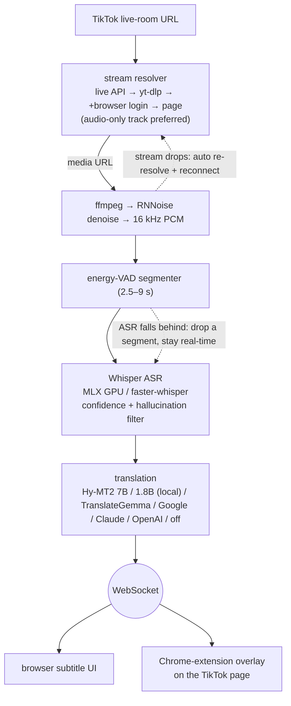

# TikTok 直播同传 · TikTok Live Translator

<p align="center"></p>

<p align="center">
  <a href="https://github.com/EM917/tiktok-live-translator/releases/latest"></a>
  <a href="https://github.com/EM917/tiktok-live-translator/actions/workflows/ci.yml"></a>
  
  
  
  <a href="LICENSE"></a>
</p>

<p align="center"></p>

**Language / 语言：English | [中文](README.zh-CN.md)**

---

# TikTok Live Translator

Real-time bilingual subtitles for TikTok livestreams, built for **compliance monitoring of Spanish-language live commerce**. It transcribes what the **streamer says**, raises an alert the moment a prohibited claim is spoken, and shows the translation alongside so an operator can read the context and decide whether to act. A Chrome extension can overlay the subtitles directly on the TikTok live page.

The alert path is what the design optimises for. Banned-term matching runs on the **recognised source text**, never on the translation, so an alert is never delayed by a translation engine; audio is buffered rather than discarded, because a late alert beats a missed one. Two numbers decide whether it is working: **recall** — a missed violation costs far more than a false alarm — and **time from utterance to alert**.

It also works as a plain live-subtitle translator: leave `banned_terms.txt` empty and the alert layer stays out of the way.

**Runs entirely locally**: stream capture, speech recognition, and (optionally) translation all happen on your own machine — no API key needed, zero cost.

## Features

- 🚨 **Real-time banned-term alerts** — three-tier matching (exact / morphological variant / fuzzy) against the **recognised source text**, independent of translation, including phrases split across caption boundaries. Configured in `banned_terms.txt`
- 🎙️ **Real-time speech recognition** — OpenAI Whisper with a dual backend (faster-whisper / MLX), automatic language detection, 90+ languages
- 🌐 **Local-first translation** — Hy-MT2 (Apache 2.0, offline, free) in two tiers, with TranslateGemma 4B, Google's free API and Claude · OpenAI available as fallbacks. Whichever tier is installed is selected automatically
- 🎵 **Voice-focused denoising** — RNNoise suppresses background music, tuned for streams with continuous BGM
- ⚡ **Automatic hardware configuration** — detects the available accelerator (Apple Silicon GPU / NVIDIA CUDA / CPU) and selects the largest model that still runs in real time
- 📺 **Two display modes** — a local web interface (scrolling bilingual history with a large current caption) or a Chrome extension overlaying the TikTok page
- 📊 **Observable latency** — a live readout of time-to-first-caption (P50/P95) broken down into segmentation, recognition and translation, alongside an audit log recording each segment: accepted text, candidates rejected by the quality filter, banned-term matches, and the translation that followed
- ✅ **Startup self-check** — each capability is executed rather than inspected: denoising processes a sample through RNNoise, translation queries the engine, the audit log performs a write. Results appear on the home screen with a remediation step for anything failing
- 🔄 **Fault tolerance** — six independent stream-resolution paths (TikTok's live API → the system WebKit engine loading the live page in the background (macOS; the way in when TikTok only hands a room's stream URL to a real browser, measured at 2 s) → yt-dlp → yt-dlp with browser login → live page parsing → your logged-in Chrome, via the extension, taking the stream URL the player actually uses), since a blocked yt-dlp extractor reports failures as "not currently live". Each resolved URL is verified before the session starts. Dropped streams reconnect with a freshly resolved URL, distinguishing a network interruption from the broadcast ending; segments are dropped automatically when recognition falls behind; yt-dlp is kept current in the background. For some rooms TikTok only hands the stream URL to a logged-in browser; when that happens the app automatically opens the live room in Chrome and waits for the extension to send the URL back — this needs the extension installed and Chrome logged into TikTok
- 💬 **Viewer comment translation** — the app fetches comments itself via TikTokLive from the live room's comment stream (WebSocket signing goes through the third-party Euler Stream service, the only step in this project that doesn't run locally; needs Python 3.10+, and the component installs itself automatically on first stream start; usually works logged out, and retries once using the browser's TikTok login when TikTok requires one); the Chrome extension's own scraping still works as a fallback. Translations are posted under each comment, with the local web UI showing the same feed in its own panel — translation and display only, never part of the alert pipeline. Disable with `--no-comments`

## Disk Space

Everything runs locally, so the models live on your machine. The figures below come
from a reference installation; exact sizes vary with platform and package
versions.

| Component | Size | When |
|---|---|---|
| Runtime environment (`.venv`) | 1.4 GB | First launch |
| Speech model — `large-v3` (Apple Silicon GPU / CUDA) | 2.9 GB | First recognition |
| Speech model — `large-v3-turbo` (CPU path) | 1.5 GB | First recognition |
| Ollama application | 0.2 GB | Manual, once |
| Translation model — Hy-MT2 1.8B | 1.1 GB | Automatic on first launch after Ollama |
| Translation model — Hy-MT2 7B (optional) | 4.6 GB | Only if you pull it |
| Denoising model | 0.3 MB | First stream |

**Reserve about 6 GB** for a typical installation: runtime, `large-v3` and the
1.8B translation model. Add 4.6 GB if you also want the 7B tier. Machines on
the CPU path need roughly 4.5 GB, since `large-v3-turbo` is smaller.

Downloads are one-time. Models are shared with any other tool using the same
caches, and are not duplicated per project.

Where they are stored, if you need to reclaim space:

```
~/.cache/huggingface/hub     speech models
~/.ollama/models             translation models
<project>/.venv              runtime environment
<project>/logs               audit logs
```

Audit logs grow by roughly **0.3 MB per hour** of monitoring — about 2 MB for
an eight-hour day, or 0.1 GB a month. They are plain JSONL and safe to delete
once a session has been reviewed.

## Quick Start

### Installation without a terminal (recommended)

1. **Download**: grab **TikTok-Live-Translator-vX.Y.Z.zip** from the [latest release](https://github.com/EM917/tiktok-live-translator/releases/latest)'s Assets and unzip it anywhere (e.g. your Desktop) — "Source code (zip)" works too. The green **Code** button → **Download ZIP** also works (latest dev snapshot).
2. **Install Python** (free, one time only): grab the installer from [python.org/downloads](https://www.python.org/downloads/) and install with the default options. Forgot? No problem — the launcher will detect it and open the download page for you.
3. **Launch**:
   - **macOS**: double-click **`TikTok Live Translator.app`** in the folder. If the first launch is blocked ("cannot be opened"): on older systems right-click → Open; on **macOS 15 and later** go to **System Settings → Privacy & Security**, scroll to the bottom and click **"Open Anyway"** (one time only). Feel free to drag it to the Dock — but **don't move it out of this folder**.
   - **Windows**: double-click **`Start.bat`**. If a "publisher unknown" security warning pops up, click "Run" (this tool is fully open source — the code is right there in the folder). A black text window stays open while running — **that's the translation engine, keep it open**; subtitles appear in the separate app window.

The first launch installs everything automatically (a few minutes, with on-screen progress; the first recognition also downloads the speech model, with progress shown on the page). Every launch after that is instant. Once the window opens: **paste the live-room URL (or just the streamer's username) → pick the streamer's language → hit Start**. Stop or switch rooms anytime.

### Command line

With [Python 3.9+](https://www.python.org/downloads/) installed, two commands:

```bash
git clone https://github.com/EM917/tiktok-live-translator.git
cd tiktok-live-translator && python3 main.py
```

(On Windows use `python main.py`.) Everything else is automatic: the first run creates a virtual environment and installs all dependencies (including a bundled static ffmpeg and the denoising model). CLI flags work too:

```bash
python3 main.py "https://www.tiktok.com/@streamer_username/live" --source es
python3 main.py --demo      # preview the UI without connecting to a stream
python3 main.py --doctor    # print the hardware check and recommended config
```

> Prefer to control the install yourself? `bash setup.sh` (macOS/Linux) or `powershell -ExecutionPolicy Bypass -File setup.ps1` (Windows) does the same steps explicitly.

> **Cloned an older version before?** Don't re-clone (it fails with `destination path already exists`) — just `cd` into the folder, run `git pull`, and start it; from v0.2.0 on you can update with one click from the page itself.

### Starting the application

- **macOS**: double-click **`TikTok Live Translator.app`** (or `Start.command`);
- **Windows**: double-click **`Start.bat`**;
- CLI: `cd ~/tiktok-live-translator && python3 main.py`.

The UI opens in its **own app window** (no browser tab), remembering the room URL and target language from last time — just hit Start. Closing the window quits the app. Pass `--browser` if you prefer the browser UI.

## Automatic Hardware Configuration

`python main.py --doctor` reports the hardware detection results. Any flag not set explicitly at startup is filled in according to the table below:

| Hardware | Selected configuration | Result |
|---|---|---|
| Apple Silicon (M1 or later) | MLX GPU backend + `large-v3` | Most accurate model, runs ~5x faster than real time |
| NVIDIA GPU | CUDA + `large-v3` (float16) | Most accurate model, plenty of speed headroom |
| CPU (≥8 cores, ≥8 GB RAM) | CPU + `small` (int8) | Real-time capable, moderate accuracy |
| Lower-specification CPU | CPU + `base` (int8) | Prioritises keeping pace over accuracy |

Benchmark reference (M3 Pro, 90 seconds of recorded livestream audio; RTF = recognition time / audio duration, which must remain below 1 to avoid dropping segments):

| Config | RTF |
|---|---|
| MLX GPU + large-v3 | **0.21** ✅ |
| CPU + large-v3-turbo | 0.99 ⚠️ borderline |
| CPU + large-v3 | 1.22 ❌ drops segments |

Every selected value can be overridden with a command-line flag.

## Command-Line Flags

| Flag | Description | Default |
|------|------|------|
| `--target` | Target language (`zh-CN`/`en`/`ja`/`ko`/…; can also be switched anytime in the UI) | `zh-CN` |
| `--source` | Streamer's language; auto-detected if omitted (specify it for better accuracy when known, e.g. `es`/`en`/`ja`) | auto |
| `--backend` | Recognition backend: `mlx` (Apple GPU) / `ct2` (faster-whisper) / `auto` | `auto` |
| `--model` | Whisper model: `tiny`/`base`/`small`/`medium`/`large-v3`/`large-v3-turbo` | auto by hardware |
| `--device` | `auto`/`cpu`/`cuda` | auto by hardware |
| `--compute-type` | ct2 precision (`int8`/`float16`/…) | auto by hardware |
| `--beam` | Beam search width (larger = more accurate but slower; `1` = greedy; ct2 backend only) | `5` |
| `--context` | Enable rolling context. **Off by default**: measured to trigger repetition loops that badly hurt recall | off |
| `--asr-temperature` | Decoding temperature. **Defaults to 0 (single pass)**: Whisper otherwise re-decodes a segment at up to six temperatures when quality checks fail, which measured 25s on music-heavy audio | `0` |
| `--translator` | Translation engine: `auto`/`hymt2-7b`/`hymt2`/`gemma`/`google`/`claude`/`openai`/`none` | `auto` |
| `--denoise` | RNNoise voice denoising: `auto`/`on`/`off` | `auto` (on) |
| `--port` | Local UI port | `8765` |
| `--cookies` | Path to a yt-dlp cookies.txt file (may be needed for region-restricted streams) | none |
| `--demo` | Demo mode — drives only the UI | off |
| `--doctor` | Print the hardware check and recommended config, then exit | off |
| `--no-open` | Don't auto-open the browser on startup | off |

## Translation Engines

Installing [Ollama](https://ollama.com/download) completes the setup. On the
next launch the application starts it if required, downloads the 1.1 GB Hy-MT2
1.8B model through Ollama's API with on-screen progress, and switches to it. No
terminal commands are involved; the Whisper model is provisioned the same way.

Pulling the larger tier makes it available for strong re-translation and for an explicit `--translator hymt2-7b`. It is never selected automatically; see below.

```bash
ollama pull hf.co/tencent/Hy-MT2-7B-GGUF:Q4_K_M     # 4.6 GB, highest terminology accuracy, ~16 GB RAM
```

| Value | Engine |
|---|---|
| `auto` (default) | Selects the best engine present: `hymt2` → `gemma` → `google`. 7B is never selected automatically; see below |
| `hymt2` | Hy-MT2 1.8B (Tencent, Apache 2.0). Recommended for most machines |
| `hymt2-7b` | Hy-MT2 7B. Highest terminology accuracy; opt-in only, see below |
| `gemma` | TranslateGemma 4B. `OLLAMA_TRANSLATE_MODEL` selects `translategemma:12b`/`27b` |
| `deepl` | Key entered on the home screen (or `DEEPL_API_KEY`). A key ending in `:fx` is routed to the free endpoint automatically. Builds and maintains a native DeepL glossary from `glossary.txt`; see below. Subtitle text is sent to DeepL |
| `google` | Google Translate's free endpoint, no key required. Subtitle text is sent to Google; rate-limited per IP |
| `claude` | Key entered on the home screen (or `ANTHROPIC_API_KEY`); model overridable via `CLAUDE_TRANSLATE_MODEL` |
| `openai` | Key entered on the home screen (or `OPENAI_API_KEY`); optional `OPENAI_BASE_URL`, `OPENAI_MODEL`. Compatible with any OpenAI-style API including local LM Studio / vLLM |
| `none` | Transcription only, no translation |

The engine is chosen on the home screen, where API keys are entered too — no
terminal and no environment variables. Keys are stored in `settings.json`,
which is git-ignored, and are never sent back to the page; only the last four
characters are shown so you can tell which key is in place.

The self-check on the home screen reports which engine is in use, so a fallback
to the network engine is visible rather than silent.

Local engines handle colloquial speech substantially better. Spanish → Chinese:

| Source | Google | Local model |
|---|---|---|
| *Se mueren lo rico* (extremely good) | ❌ 有钱人死 (the rich die) | ✅ 味道非常好 |
| *tengo un sueño* (I am sleepy) | ❌ 我做了一个梦 (I had a dream) | ✅ 现在感觉很困 |
| *Es vegano* (it is vegan) | ❌ 它是素食主义者 (he is a vegetarian) | ✅ 纯素的 |

### DeepL: the native glossary decides everything

DeepL accepts no prompt, so per-sentence glossary injection does nothing for it —
only a **native glossary** held in the account applies. The application builds one
from `glossary.txt` on first use. The glossary name carries a fingerprint of the
file contents, so editing the glossary rebuilds it on the next launch with no
manual step.

Measured on the same 60 lines of real subtitles:

| | Glossary compliance | Median latency |
|---|---|---|
| DeepL, no glossary | 26.5% | 388 ms |
| DeepL + native glossary | 91.8% | 542 ms |

Nearly all of those 65 points are product names. With no glossary in place DeepL
still returns fluent Chinese, so nothing looks wrong on screen — which is why the
home-screen self-check actually builds the glossary and reports its entry count
instead of merely checking that a key is present.

The following constraints are measured, not assumed:

- **The free tier permits exactly one glossary** (creating a second returns 456).
  Only glossaries the application created are deleted — their names start with
  `tlt-`. Glossaries you created in the DeepL dashboard are left alone.
- **A glossary is a hint, not a substitution.** `las gotas → 维生素滴剂` applies,
  while `la limpieza → 排毒粉` does not fire inside `me paso a la limpieza`. The
  post-translation rule-based replacement is therefore retained.
- **Traditional Chinese gets no native glossary.** DeepL offers a single `zh`
  glossary target and `glossary.txt` is written in Simplified Chinese; attaching
  it pushes Simplified terms into Traditional output.
- **The source language must be explicit.** When transcription reports no
  language, no glossary is attached rather than guessing — a wrong guess forces
  the whole line through the wrong language.

Quota is billed on source length, and the burn rate depends heavily on how
densely the streamer talks — two measured sessions differ by 2.3×:

| Usage | Burn rate | 1,000,000 characters covers |
|---|---|---|
| Every subtitle — dense session (38.4 min, 567 lines) | 95,824 chars/hour | ~10 hours |
| Every subtitle — sparser session (4.4 h, 2,041 lines) | 41,363 chars/hour | ~24 hours |
| Alert context only | 546 chars/hour | ~1,800 hours |

Alert context is sparse — two passages totalling 349 characters in the first
session — and it is the text that must not be mistranslated, since the operator
reads it to decide whether to act. Routing only that through DeepL is the
difference between hours and months of coverage.

Read your own remaining budget from the home screen, which reports the
`used / limit` your key returns, rather than from this table; DeepL's allowance
size and renewal terms are theirs to change, so check their current pricing
before planning around a number here.

**Subtitle text is sent to DeepL.** Local engines never leave the machine; this
one does. The stream being monitored belongs to someone else, and whether that is
acceptable is a business decision.

### Re-translating with the strongest model

The strongest local model is applied per sentence rather than for a period of
time. What justifies it is specific content — prices, promotional conditions,
health claims — which is episodic, and only the operator or the detector knows
which sentence that is. Measured cost: loading the model takes 1.9 s and a
complete one-shot call 2.3 s, after which it is unloaded, leaving recognition
unaffected. Keeping it resident instead would raise recognition from 1.4 s to
3.2 s and alert latency from 6.8 s to 10.6 s.

Three ways to invoke it:

- **Per caption** — hover a caption and press 重译. The line is re-translated
  and marked in the margin
- **On a banned-term match** — the matched sentence is re-translated
  automatically. The fast translation appears first so nothing is delayed; the
  accurate one replaces it about two seconds later
- **After the session** — `python3 tools/retranslate_audit.py` re-translates a
  session's audit log, appending `translation_strong` records without altering
  any existing line, and prints the segments whose translation changed

How much better it actually is, measured: 259 captions from a live session,
each engine's output graded blind by an independent panel. The strong tier beats
the default on both axes — meaning-changing errors 12.0% against 17.4% and
first-pass readability 96.1% against 83.4%. Only the readability gap survives
correction for the number of comparisons made (p<0.0001); the accuracy gap does
not. So the honest claim is that re-translation is *easier to read*, not
demonstrably *more correct*. The batch tool still reports what changed rather
than replacing anything silently.

### Finding translation errors without reading everything

Scanning a session's captions by eye to find mistranslations is slow and will
miss things. `tools/retranslate_audit.py` re-translates a session with the
strongest model and ranks the segments by how much the two models disagree —
the greater the disagreement, the more likely one of them is wrong. It needs no
judge and makes no semantic call of its own.

```bash
python3 tools/retranslate_audit.py
```

On its first run this surfaced `es una orden de 30` being rendered as "30
units" rather than a $30 threshold — a glossary gap nobody had noticed.

Two approaches that were measured and rejected, recorded so they are not
retried: comparing word overlap against a back-translation scores correct and
incorrect translations identically, because Spanish paraphrases legitimately
change words; and asking a local model to judge agreement fails outright —
the 1.8B model called every pair inconsistent, and the 7B model was right four
times in ten.

### Engine comparison

The relevant metric is not fluency but glossary adherence, since that determines
whether product names, prices and promotional conditions are rendered correctly.
Measured with `tools/bench_glossary.py` over 280 glossary terms taken from
recorded captions, with latency from a live Spanish selling stream on an 18 GB
M-series Mac:

| | Glossary adherence | Multi-word phrases | Translation latency |
|---|---|---|---|
| Hy-MT2 7B | 83% | 84% | 892 ms median, 1.7 s p95 |
| Hy-MT2 1.8B | 66% | 65% | 358 ms median |
| TranslateGemma 4B | 48% | 26% | 832 ms median |

The multi-word column is the significant one: prices and promotional conditions
are phrases rather than single nouns, and that is where a translation misleads
an operator.

Latency was excluded from the selection criteria. Banned-term alerts are raised
from the recognised source text and never wait for translation; the only
requirement is that translation keep pace with 9-second segments, which both
tiers do.

**Does the paid engine actually win?** Not measurably, on this material. 259
captions from one live session, all four engines graded blind by the same panel:

| | Hy-MT2 1.8B | Hy-MT2 7B | TranslateGemma 12B | DeepL |
|---|---|---|---|---|
| Meaning-changing errors | 17.4% | 12.0% | 11.6% | 10.0% |
| Understood on first pass | 83.4% | **96.1%** | 87.6% | 91.9% |

Twelve pairwise tests were run on these captions, so a single p<0.05 means
little. After correcting for that, exactly three results hold, all on
readability: 7B beats 12B, 7B beats 1.8B, and DeepL beats 1.8B. **No difference
in meaning-changing errors between any two engines survives correction** —
including 7B against DeepL, where the paired difference is +1.9% with a 95%
interval of [-3.1%, +7.0%]. That interval is the honest summary: this test
cannot tell them apart, and it also cannot rule out DeepL being several points
better. "No difference measured" is not "equivalent".

Two cautions before generalising. Grading the same 259 captions with a second
panel moved every absolute percentage and agreed on only about 60% of the
meaning-changing errors, so treat the paired comparisons as the result and the
percentages as decoration. And this is one streamer's material.

**Why 7B is not the default.** Its 17-point accuracy advantage made it the
default in the initial v0.10.0 build, a decision based on a 24-caption sample. A
92-caption live run gave a different result: with 7B resident, recognition held
at approximately 3.2 s against 1.4 s with the smaller models, flat from the
first quartile, indicating steady-state contention for unified memory. Since
recognition is on the alert path and translation is not, the trade ran in the
wrong direction. Where memory is available and alert latency is not the primary
metric, `--translator hymt2-7b` is a genuine improvement in terminology
accuracy.

## Validating your term list against a recorded session

A term list that never fires looks identical to a clean stream. It is worth
proving which of the two you have, because the failure is silent — and it is a
failure of the list, not of the matcher.

`banned_terms.txt` ships as a starting point derived from one company's
category guide. Two things make it miss on a stream it was not written for: a
streamer phrases a claim differently from the list (`eliminar grasa` is listed,
but "eliminando el exceso **de** grasa" inserts words between the anchors and
misses), and the list has a *pending business review* section of real phrases
deliberately left commented out.

Replay a recorded session against your list before trusting it:

```bash
python3 tools/replay_alerts.py                   # re-run a session's audit log through the current list
python3 tools/collision_audit.py --term <word>   # check a new term for false-positive collisions
```

A worked example, from a 4.4-hour supplement stream (2,041 segments):

| Term list | Segments alerted |
|---|---|
| As shipped, 40 active entries | **0** |
| With the 7 commented-out *pending review* entries enabled | 62 |

The stream contained `derretir toda la manteca` ("melt away all the fat"),
`acelerar el metabolismo`, and `desinflamarse y quitar la barriga` — the exact
family the guide bans "all variants" of. The matcher was working the whole time
(its fuzzy tier caught the ASR misspelling `derritir`); the entries that would
have fired were switched off.

A separate pass over the same transcript flagged 126 utterances as worth
alerting on, of which 99 match neither the active nor the pending entries —
appetite suppression, body shape, organ fat, fatty liver, cholesterol, and one
cancer claim. Treat output like that as **candidate terms for human review**,
never as an automatic list update: what counts as a violation is a business
judgement, and a list padded with false positives buries the operator in noise.

## Chrome Extension

1. Open `chrome://extensions` and enable "Developer mode" in the top right.
2. Click "Load unpacked" and select this project's `extension/` folder.
3. Keep the app running, open a TikTok **live-room** page (URL contains `/live`), and a floating subtitle bar appears as subtitles arrive.

The subtitle bar supports **dragging** to reposition it, **double-clicking** to collapse/expand, and hovering reveals an **×** to hide it. The extension automatically tries the ports the app may use (8765–8774), so it normally needs no configuration. The extension is just a display layer — audio capture and recognition are handled by the local app.

The extension's options page has a "Translate viewer comments" toggle (on by default): when enabled, it posts translations of the live page's viewer comments under each comment, and the local web UI shows the same feed. This requires the browser to be logged into TikTok — logged out, TikTok stops pushing comment-section data after about 20 seconds.

As of v0.4.0 the extension takes on a second job alongside viewer comments: for rooms the app cannot resolve on its own, it watches the live page's own network requests for the stream URL the player is actually using and sends it back to the app. This needs the added `webRequest` permission and the TikTok CDN host permissions declared in the manifest — if you installed the extension before this version, open `chrome://extensions` and click **Reload** on it to pick up the new manifest and background script.

## Architecture

<p align="center">
  
</p>

**[Open the explorable version ↗](https://em917.github.io/tiktok-live-translator/architecture/audio-chain.en.html)** — search nodes, focus a component to see its authored upstream and downstream, trace a directed route, play the guided chapters.

Read from the source at [`c409181`](https://github.com/EM917/tiktok-live-translator/tree/c409181f6fd0f92f4f1a0558eb2889fc1cb820b4). The typed source and regeneration steps are in [`docs/architecture/`](docs/architecture/).

<details>
<summary>The same topology as Mermaid — editable without any tooling</summary>



</details>

## Auto-update

On every launch the app silently checks GitHub for the latest release (network failures are silently ignored). When a new version exists, a banner appears at the top of the page:

- **git install** (cloned via `git clone`) → click "Update" to run `git pull --ff-only` and restart automatically. If you have uncommitted local changes, the update is refused to avoid overwriting them;
- **ZIP install** → the banner links to the download page instead.

The current version is shown in the page footer.

## FAQ

**The self-check shows a failing row.** Each row carries its remediation step
directly beneath it. The most frequent causes are an empty `banned_terms.txt`
(no alerts will be raised at all) and an incompletely downloaded denoise model
(delete `models/bd.rnnn` and start again; it re-downloads). The panel re-checks
on every start, so a resolved issue clears on the next run. A passing row
indicates the capability was executed, not merely configured.

**The update button reports that something is blocking it.** The message names
the affected files and provides a complete command with your project path and a
Copy button. On builds older than v0.10.4 the machine cannot repair itself, as
the fix is delivered by the update that is being blocked — run
`git pull --ff-only` once in the project directory.

**Performance degrades and audio begins backing up.** Check `ollama ps`. Ollama
retains a model in VRAM for 30 minutes after last use, so switching translation
tiers previously left the earlier model resident; combined with Whisper
large-v3 this can exhaust a 16–18 GB machine and cause paging, presenting as
slower recognition and a growing backlog. Unused tiers are now unloaded at
startup. On older builds, `ollama stop <model>` releases it immediately.

**The stream cannot be resolved although the room plays in a browser.** A
blocked yt-dlp extractor reports failures as "the channel is not currently
live", which is incorrect. Since v0.10.0 four independent routes are tried:
TikTok's live API (which does not involve yt-dlp and answers anonymously),
yt-dlp, yt-dlp using the TikTok session in your browser, and the live page
itself. Being signed in to TikTok in Chrome or Safari helps but is usually not
required, and no file needs exporting; cookies remain between your machine and
TikTok. The application no longer reports the streamer as offline unless TikTok
explicitly states the room has ended. A browser can be pinned with
`--cookies-browser safari`, or credentials supplied via `--cookies cookies.txt`.

**The first start appears stuck downloading the recognition model.** The model
is being retrieved from Hugging Face (large-v3 is approximately 3 GB). Progress
is displayed on the page and this occurs only once.

**All translations fail and captions show only the source language.** The
default Google endpoint rate-limits per IP and returns 429 under sustained use.
The application pauses requests for two minutes and recovers automatically, with
a banner on the page. Speech recognition is unaffected. For extended sessions,
use a local Hy-MT2 model or an API key via `--translator claude` / `openai`. No
network connection, or a stopped Ollama, produces the same symptom.

**Status reads "live" but no captions appear for some time.** This is normally
expected: while the streamer plays music or is not speaking, silent and
low-confidence segments are discarded deliberately. If the streamer is clearly
speaking and nothing appears, try `--denoise off` or a different model size.

**Captions stop after closing the laptop lid or switching networks.** When the
stream drops, the URL is re-resolved and the connection re-established
automatically, up to 5 attempts with increasing backoff. If the interface
reports repeated interruptions and failed reconnection, press Start again.

**Recognition cannot keep pace with the stream.** Use a smaller model
(`--model small`) or `--beam 1`. On Apple Silicon, confirm the self-check
reports the `mlx` backend rather than `ct2` — the CPU path runs at
approximately real time and accumulates backlog.

**Performance is poor on a Mac with 8 GB of RAM.** Apple Silicon defaults to
`large-v3` (~3 GB). Where memory is constrained, use `--model large-v3-turbo`
or `--model small`.

**Sung vocals in background music are transcribed as speech.** RNNoise
suppresses instrumental music effectively but can only partially suppress sung
vocals. Confidence filtering removes most such segments; occasional
false positives are expected.

**The extension does not display subtitles.** Confirm the application is
running and that the page is a live room (the URL contains `/live`) rather than
a regular video page, then reload the TikTok page.

**The interface is not on port 8765.** If 8765 is occupied, the application
moves to the next free port in 8766–8774. The Chrome extension scans the same
range, so no configuration is required.

**Exporting captions.** There is no export function; select and copy the text
from the page. The page retains the most recent 300 lines, and the server
replays the last 100 after a reload or reconnection.

**Closing the console window.** On Windows that console window is the
translation engine, so closing it exits the application. On macOS, closing the
application window exits it; if launched via `Start.command`, close the Terminal
window or press Ctrl-C.

**Installation fails on a managed computer, or space is insufficient.** The
initial installation requires about 6 GB and access to PyPI, Hugging Face and
ollama.com; see "Disk Space" for the breakdown. Corporate security policies
frequently block these.

## Privacy and Usage Boundaries

- Recognition always runs locally. Translation is fully offline when using `gemma`/`none`; with `google`/`claude`/`openai`, subtitle text is sent to the corresponding provider.
- This tool is for personal learning and language-assistance use only. Please comply with TikTok's Terms of Service and local laws — don't use it to rebroadcast or redistribute recordings of other people's content.

## Acknowledgments

- [faster-whisper](https://github.com/SYSTRAN/faster-whisper) / [mlx-whisper](https://github.com/ml-explore/mlx-examples) — speech recognition
- [yt-dlp](https://github.com/yt-dlp/yt-dlp) — livestream resolution
- [FFmpeg](https://ffmpeg.org/) — audio processing (built-in RNNoise `arnndn` filter)
- [rnnoise-models](https://github.com/GregorR/rnnoise-models) — denoising model (beguiling-drafter)
- [Ollama](https://github.com/ollama/ollama) + [Hy-MT2](https://github.com/Tencent-Hunyuan/Hy-MT2) / [TranslateGemma](https://ollama.com/library/translategemma) — local translation

## Author & License

Copyright © 2026 [Elon Mei (EM917)](https://github.com/EM917). Released under the [MIT License](LICENSE).
