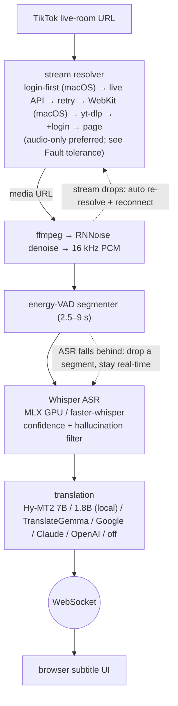

# TikTok 直播同传 · TikTok Live Translator

<p align="center"></p>

<p align="center">
  <a href="https://github.com/EM917/tiktok-live-translator/releases/latest"></a>
  <a href="https://github.com/EM917/tiktok-live-translator/actions/workflows/ci.yml"></a>
  
  
  
  <a href="LICENSE"></a>
</p>

<p align="center"></p>

**Language / 语言：English | [中文](README.zh-CN.md)**

---

Real-time bilingual captions for TikTok live streams, built for Spanish-language
live selling. Paste a live link and the app transcribes what the streamer says,
shows each line as soon as it is recognised, and fills in the translation
beneath it a moment later. Viewer comments are translated alongside, and
colleagues can follow on their phones.

A caption never waits for its translation: the original goes on screen first.
When recognition falls behind, audio waits in a queue and the window says so.
Speech recognition always runs on your computer, and with a local model so does
translation — no API key and no fees.

The interface is in English or Chinese. A new install follows the system
language, and Settings → App Language switches it; see
[Interface Language](#interface-language).

## Features

- 🎙️ **Live captions, original first** — OpenAI Whisper with two backends (faster-whisper / MLX), 90+ languages, limited to Spanish + English by default. Each line appears as soon as it is recognised and its translation fills in beneath it; the latest line is also shown large at the bottom of the window
- 🌐 **Local-first translation** — Hy-MT2 (Apache 2.0, offline, free) in two sizes through Ollama, with TranslateGemma, DeepL (with a native glossary), Google's free endpoint and Claude · OpenAI-compatible APIs as alternatives. By default the best installed local model is used. See [Translation Engines](#translation-engines)
- 🏷️ **Glossaries per brand and streamer** — a global glossary, one per streamer and one per brand (picked in the Brand menu for the session) steer how product names are recognised and translated, with every engine. See [Glossaries](#glossaries)
- 💬 **Viewer comment translation** — the app fetches comments itself via TikTokLive from the live stream's comment feed (WebSocket signing goes through the third-party Euler Stream service rather than your computer; needs Python 3.10+, and the component installs itself on the first start; usually works signed out, and retries once with the browser's TikTok sign-in when TikTok asks for one). Translations appear in the Comments panel — translation and display only, never part of the alert path. Comments are translated only while the active engine is a local model (Hy-MT2 1.8B or TranslateGemma); with a remote engine or the 7B model the panel shows the original text. The comment WebSocket can go half-open — the panel still shows Connected but no comments ever arrive — so the app reconnects automatically after 15 minutes of silence while connected, and records it in the session audit. Disable with `--no-comments`
- 🔁 **Switch Streamer during a session** — Switch Streamer in the top bar moves to another streamer without clicking Stop first: pick from Recent Streams or paste a live link, choose the brand, then click again to confirm. The spoken language carries over, and a divider in the caption history marks where the new streamer begins
- 📱 **Phone Viewing** — colleagues on the same Wi-Fi scan a QR code and follow captions and alerts on their phones, each page in its phone's own language; view only, no control; off by default. See [the FAQ](#phone-viewing)
- 🌍 **English and Chinese interface** — follows the system language on a new install, switchable in Settings. See [Interface Language](#interface-language)
- ✅ **Startup Check** — each capability is executed rather than inspected: noise reduction processes a sample through RNNoise, translation queries the engine, the audit log performs a write. A failing check opens its row on the home page with a remediation step, and stays in a banner at the top of the window, idle or live, until a later check passes
- 🔄 **Fault tolerance** — up to seven ways to find the stream URL, reconnects that tell a network drop from the end of the stream, and audio queued rather than lost when recognition falls behind. See [Fault tolerance](#fault-tolerance)
- 🎵 **Voice-focused noise reduction** — RNNoise suppresses background music, tuned for streams with continuous BGM
- ⚡ **Automatic hardware configuration** — detects the available accelerator (Apple Silicon GPU / NVIDIA CUDA / CPU) and selects the largest model that still runs in real time
- 📊 **Observable latency** — a live readout at the bottom of the window: the longest a spoken word waits before it is recognised and checked (median and P95), split into segmentation and recognition, plus the time the translation adds. An audit log records each segment: accepted text, candidates rejected by the quality filter, banned-term matches, and the translation that followed
- 🚨 **Banned-term alerts, off by default** — for compliance monitoring of live selling: three-tier matching (exact / variant / similar) against the recognised source text, independent of translation and across caption boundaries. The switch is in Settings → Banned-Term Alerts. See [Banned-Term Alerts](#banned-term-alerts)

## Screenshots

<table>
  <tr>
    <td width="50%"><br><sub>Home: paste a live link and click Start. Settings stays below, collapsed.</sub></td>
    <td width="50%"><br><sub>Live: the original first, the translation beneath it, comments alongside.</sub></td>
  </tr>
  <tr>
    <td width="50%"><br><sub>Switch Streamer: pick the next streamer, then click again to confirm.</sub></td>
    <td width="50%"><br><sub>Phone Viewing: a QR code and link for phones on the same Wi-Fi.</sub></td>
  </tr>
  <tr>
    <td width="50%" align="center"><br><sub>A phone on Phone Viewing: view only, in the phone's own language.</sub></td>
    <td width="50%"><br><sub>Settings → App Language: System, 中文 or English.</sub></td>
  </tr>
</table>

<sub>The screenshots and the demo above show made-up streams and are generated by <code>tools/readme_shots.py</code>.</sub>

## Disk Space

Everything runs locally, so the models live on your machine. The figures below come
from a reference installation; exact sizes vary with platform and package
versions.

| Component | Size | When |
|---|---|---|
| Runtime environment (`.venv`) | 1.4 GB | First launch |
| Speech model — `large-v3` (Apple Silicon GPU / CUDA) | 2.9 GB | First recognition |
| Speech model — `large-v3-turbo` (CPU path) | 1.5 GB | First recognition |
| Ollama application | 0.2 GB | Manual, once |
| Translation model — Hy-MT2 1.8B | 1.1 GB | Automatic on first launch after Ollama |
| Translation model — Hy-MT2 7B (optional) | 4.6 GB | Only if you pull it |
| Denoising model | 0.3 MB | First stream |

**Reserve about 6 GB** for a typical installation: runtime, `large-v3` and the
1.8B translation model. Add 4.6 GB if you also want the 7B tier. Machines on
the CPU path need roughly 4.5 GB, since `large-v3-turbo` is smaller.

Downloads are one-time. Models are shared with any other tool using the same
caches, and are not duplicated per project.

Where they are stored, if you need to reclaim space:

```
~/.cache/huggingface/hub     speech models
~/.ollama/models             translation models
<project>/.venv              runtime environment
<project>/logs               audit logs
```

Audit logs grow by roughly **0.3 MB per hour** of monitoring — about 2 MB for
an eight-hour day, or 0.1 GB a month. They are plain JSONL and safe to delete
once a session has been reviewed.

## Quick Start

### Installation without a terminal (recommended)

1. **Download**: grab **TikTok-Live-Translator-vX.Y.Z.zip** from the [latest release](https://github.com/EM917/tiktok-live-translator/releases/latest)'s Assets and unzip it anywhere (e.g. your Desktop) — "Source code (zip)" works too. The green **Code** button → **Download ZIP** also works (latest dev snapshot).
2. **Install Python** (free, one time only): grab the installer from [python.org/downloads](https://www.python.org/downloads/) and install with the default options. Forgot? No problem — the launcher will detect it and open the download page for you.
3. **Launch**:
   - **macOS**: double-click **`TikTok Live Translator.app`** in the folder. If the first launch is blocked ("cannot be opened"): on older systems right-click → Open; on **macOS 15 and later** go to **System Settings → Privacy & Security**, scroll to the bottom and click **"Open Anyway"** (one time only). Feel free to drag it to the Dock — but **don't move it out of this folder**.
   - **Windows**: double-click **`Start.bat`**. If a "publisher unknown" security warning pops up, click "Run" (this tool is fully open source — the code is right there in the folder). A black text window stays open while running — **that's the translation engine, keep it open**; subtitles appear in the separate app window.

The interface window itself is rendered by the system's built-in browser engine
(WKWebView on macOS, WebView2 on Windows), not a bundled one. On macOS the
highest-requirement CSS feature currently used is `:focus-visible`, which needs
**Safari 15.4 / macOS 12.3 (Monterey) or later**, based on reading the CSS this
project ships rather than testing on that exact OS build — Apple has
historically also shipped point releases of Safari to the two prior major
macOS versions, so some older systems may already have it too. Below that, the
app still runs and shows captions; only the keyboard-focus outline on a few
controls falls back to the system default. WebView2 on Windows auto-updates independently of Windows
itself, so there is no practical minimum version there — see the "publisher
unknown" note above if Windows Defender SmartScreen has not seen WebView2 on
this machine before.

The first launch installs everything automatically (a few minutes, with on-screen progress; the first recognition also downloads the speech model, with progress shown on the page). Every launch after that is instant. Once the window opens: **paste the live-room URL (or just the streamer's username) → pick the streamer's language → hit Start**. Stop or switch rooms anytime.

### Command line

With [Python 3.9+](https://www.python.org/downloads/) installed, two commands:

```bash
git clone https://github.com/EM917/tiktok-live-translator.git
cd tiktok-live-translator && python3 main.py
```

(On Windows use `python main.py`.) Everything else is automatic: the first run creates a virtual environment and installs all dependencies (including a bundled static ffmpeg and the denoising model). CLI flags work too:

```bash
python3 main.py "https://www.tiktok.com/@streamer_username/live" --source es
python3 main.py --demo      # preview the UI without connecting to a stream
python3 main.py --doctor    # print the hardware check and recommended config
```

> Prefer to control the install yourself? `bash setup.sh` (macOS/Linux) or `powershell -ExecutionPolicy Bypass -File setup.ps1` (Windows) does the same steps explicitly.

> **Cloned an older version before?** Don't re-clone (it fails with `destination path already exists`) — just `cd` into the folder, run `git pull`, and start it; from v0.2.0 on you can update with one click from the page itself.

### Starting the application

- **macOS**: double-click **`TikTok Live Translator.app`** (or `Start.command`);
- **Windows**: double-click **`Start.bat`**;
- CLI: `cd ~/tiktok-live-translator && python3 main.py`.

The UI opens in its **own app window** (no browser tab), remembering the room URL and target language from last time — just hit Start. Rooms you opened recently are listed under the input box by streamer name; one click starts them. Closing the window quits the app. Pass `--browser` if you prefer the browser UI.

## Automatic Hardware Configuration

`python main.py --doctor` reports the hardware detection results. Any flag not set explicitly at startup is filled in according to the table below:

| Hardware | Selected configuration | Result |
|---|---|---|
| Apple Silicon (M1 or later) | MLX GPU backend + `large-v3` | Most accurate model, runs ~5x faster than real time |
| NVIDIA GPU | CUDA + `large-v3` (float16) | Most accurate model, plenty of speed headroom |
| CPU (≥8 cores, ≥8 GB RAM) | CPU + `small` (int8) | Real-time capable, moderate accuracy |
| Lower-specification CPU | CPU + `base` (int8) | Prioritises keeping pace over accuracy |

Benchmark reference (M3 Pro, 90 seconds of recorded livestream audio; RTF = recognition time / audio duration, which must remain below 1 to avoid dropping segments):

| Config | RTF |
|---|---|
| MLX GPU + large-v3 | **0.21** ✅ |
| CPU + large-v3-turbo | 0.99 ⚠️ borderline |
| CPU + large-v3 | 1.22 ❌ drops segments |

Every selected value can be overridden with a command-line flag.

## Command-Line Flags

| Flag | Description | Default |
|------|------|------|
| `--target` | Target language (`zh-CN`/`en`/`ja`/`ko`/…; can also be switched anytime in the UI) | `zh-CN` |
| `--source` | Streamer's language(s): a single code (`es`/`en`/`ja`/…), or a comma list to auto-detect within just those (e.g. `es,en`, max 4, first = primary; a detected language outside the list triggers one forced re-run) | `es,en` |
| `--backend` | Recognition backend: `mlx` (Apple GPU) / `ct2` (faster-whisper) / `auto` | `auto` |
| `--model` | Whisper model: `tiny`/`base`/`small`/`medium`/`large-v3`/`large-v3-turbo` | auto by hardware |
| `--device` | `auto`/`cpu`/`cuda` | auto by hardware |
| `--compute-type` | ct2 precision (`int8`/`float16`/…) | auto by hardware |
| `--beam` | Beam search width (larger = more accurate but slower; `1` = greedy; ct2 backend only) | `5` |
| `--context` | Enable rolling context. **Off by default**: measured to trigger repetition loops that badly hurt recall | off |
| `--asr-temperature` | Decoding temperature. **Defaults to 0 (single pass)**: Whisper otherwise re-decodes a segment at up to six temperatures when quality checks fail, which measured 25s on music-heavy audio | `0` |
| `--translator` | Translation engine: `auto`/`hymt2-7b`/`hymt2`/`gemma`/`google`/`claude`/`openai`/`none` | `auto` |
| `--denoise` | RNNoise voice denoising: `auto`/`on`/`off` | `auto` (on) |
| `--port` | Local UI port | `8765` |
| `--cookies` | Path to a yt-dlp cookies.txt file (use it when yt-dlp reports that the stream needs a login) | none |
| `--demo` | Demo mode — drives only the UI | off |
| `--doctor` | Print the hardware check and recommended config, then exit | off |
| `--no-open` | Don't auto-open the browser on startup | off |

## Translation Engines

Installing [Ollama](https://ollama.com/download) completes the setup. On the
next launch the application starts it if required, downloads the 1.1 GB Hy-MT2
1.8B model through Ollama's API with on-screen progress, and switches to it. No
terminal commands are involved; the Whisper model is provisioned the same way.

Pulling the larger tier makes it available for strong re-translation and for an
explicit `--translator hymt2-7b`. It is never selected automatically; see
[Choosing an engine](#choosing-an-engine).

```bash
ollama pull hf.co/tencent/Hy-MT2-7B-GGUF:Q4_K_M     # 4.6 GB, ~16 GB RAM
```

| Value | Engine |
|---|---|
| `auto` (default) | Selects the best engine present: `hymt2` → `gemma` → `google`. 7B is never selected automatically |
| `hymt2` | Hy-MT2 1.8B (Tencent, Apache 2.0). Recommended for most machines |
| `hymt2-7b` | Hy-MT2 7B, the larger local tier. Opt-in only; see [Choosing an engine](#choosing-an-engine) |
| `gemma` | TranslateGemma 4B. `OLLAMA_TRANSLATE_MODEL` selects `translategemma:12b`/`27b`. Not in the Translation Engine menu; pass `--translator gemma` |
| `deepl` | Key entered in Settings → Translation Engine (or `DEEPL_API_KEY`). A key ending in `:fx` is routed to the free endpoint automatically. Builds and maintains a native DeepL glossary from your [glossaries](#glossaries); see below. Subtitle text is sent to DeepL |
| `google` | Google Translate's free endpoint, no key required. Subtitle text is sent to Google; rate-limited per IP |
| `claude` | Key entered in Settings → Translation Engine (or `ANTHROPIC_API_KEY`); model overridable via `CLAUDE_TRANSLATE_MODEL` |
| `openai` | Key entered in Settings → Translation Engine (or `OPENAI_API_KEY`); optional `OPENAI_BASE_URL`, `OPENAI_MODEL`. Compatible with any OpenAI-style API including local LM Studio / vLLM |
| `none` | Transcription only, no translation |

The engine is chosen in Settings → Translation Engine on the home page, where API
keys are entered too — no terminal and no environment variables. Keys are stored
in `settings.json`, which is git-ignored, and are never sent back to the page;
only the last four characters are shown so you can tell which key is in place.

When the chosen engine cannot be used and the app falls back to another, the
Translation Engine row says Fallback and opens by itself, so a switch to a
network engine is visible rather than silent.

Three lines from real streams where Google's free endpoint took colloquial
Spanish literally and the local model did not (Spanish → Chinese):

| Source | Google | Local model |
|---|---|---|
| *Se mueren lo rico* (extremely good) | ❌ 有钱人死 (the rich die) | ✅ 味道非常好 |
| *tengo un sueño* (I am sleepy) | ❌ 我做了一个梦 (I had a dream) | ✅ 现在感觉很困 |
| *Es vegano* (it is vegan) | ❌ 它是素食主义者 (he is a vegetarian) | ✅ 纯素的 |

### Choosing an engine

Hy-MT2 1.8B is the default: it keeps pace with the stream without slowing
recognition, and every caption waits for recognition before it appears.

Four engines — Hy-MT2 1.8B and 7B, TranslateGemma 12B and DeepL — were graded
blind on 259 captions from one live session. After correcting for the twelve
pairwise comparisons, the differences that held were all in readability: 7B
read more easily than 12B and than 1.8B, and DeepL more easily than 1.8B. No
engine, DeepL included, made measurably fewer meaning-changing errors than
another. That means no difference was measured, not that they are equivalent.

7B is never selected automatically. In a 92-caption live run with 7B resident,
recognition took about 3.2 s per segment against 1.4 s with the smaller models.
It is still used for [strong re-translation](#re-translating-with-the-strongest-model),
which loads it for one line and unloads it straight after.

The measurements, tables and caveats are in
[docs/engine-benchmarks.md](docs/engine-benchmarks.md).

### Glossaries

Product names are where a general-purpose model goes wrong most often, and a
short list of them fixes that for every engine. The glossary is one set of
entries used in three places: the first entries are given to speech
recognition as a hint, entries that occur in a line are passed to the
translation model with that line (DeepL uses a native glossary instead; see
below), and a rule-based pass replaces whatever the model still rendered
differently.

It is merged from three files, most specific first:

- `profiles/<streamer-username>.txt` — one streamer's own wording and
  translations, loaded automatically from the live link
- `brands/<brand-id>.txt` — one brand's products, loaded only when the Brand
  menu on the home page (or in Switch Streamer) selects it; for a stream that
  sells a single brand. The menu remembers each streamer's last choice, the
  folder button next to it opens `brands/`, and the menu rescans that folder
  when clicked, with no restart. The file format is in
  [`brands/README.md`](brands/README.md) (in Chinese)
- `glossary.txt` — the global list (`--glossary` points elsewhere)

Where the same wording appears in more than one file, the streamer's profile
wins over the brand list, which wins over the global list. Edits take effect
after Stop → Start. These files hold your own product data and stay on your
computer: git ignores `glossary.txt`, `profiles/*.txt` and `brands/*.txt`, so
editing them never blocks an update.

### DeepL: the native glossary decides everything

DeepL accepts no prompt, so per-sentence glossary injection does nothing for it —
only a **native glossary** held in the account applies. The application builds one
from the glossary in effect for the session (the global, brand and streamer lists
merged). The glossary name carries a fingerprint of its contents, so an edit, or
a different streamer or brand, rebuilds it with no manual step.

Measured on the same 60 lines of real subtitles:

| | Glossary compliance | Median latency |
|---|---|---|
| DeepL, no glossary | 26.5% | 388 ms |
| DeepL + native glossary | 91.8% | 542 ms |

Nearly all of those 65 points are product names. With no glossary in place DeepL
still returns fluent Chinese, so nothing looks wrong on screen — which is why the
Startup Check actually builds the glossary and reports its entry count instead of
merely checking that a key is present.

The following constraints are measured, not assumed:

- **The free tier permits exactly one glossary** (creating a second returns 456).
  Only glossaries the application created are deleted — their names start with
  `tlt-`. Glossaries you created in the DeepL dashboard are left alone.
- **A glossary is a hint, not a substitution.** `las gotas → 维生素滴剂` applies,
  while `la limpieza → 排毒粉` does not fire inside `me paso a la limpieza`. The
  post-translation rule-based replacement is therefore retained.
- **Traditional Chinese gets no native glossary.** DeepL offers a single `zh`
  glossary target and `glossary.txt` is written in Simplified Chinese; attaching
  it pushes Simplified terms into Traditional output.
- **The source language must be explicit.** When transcription reports no
  language, no glossary is attached rather than guessing — a wrong guess forces
  the whole line through the wrong language.

Quota is billed on source length, and the burn rate depends heavily on how
densely the streamer talks — two measured sessions differ by 2.3×:

| Usage | Burn rate | 1,000,000 characters covers |
|---|---|---|
| Every subtitle — dense session (38.4 min, 567 lines) | 95,824 chars/hour | ~10 hours |
| Every subtitle — sparser session (4.4 h, 2,041 lines) | 41,363 chars/hour | ~24 hours |
| Alert context only | 546 chars/hour | ~1,800 hours |

Alert context is sparse — two passages totalling 349 characters in the first
session — and it is the text that must not be mistranslated, since the operator
reads it to decide whether to act. Routing only that through DeepL is the
difference between hours and months of coverage.

Read your own remaining budget in Settings → Translation Engine, which shows how
much of the free quota your key has used (from the `used / limit` DeepL returns),
rather than from this table; DeepL's allowance size and renewal terms are theirs
to change, so check their current pricing before planning around a number here.

**Subtitle text is sent to DeepL.** Local engines never leave the machine; this
one does. The stream being monitored belongs to someone else, and whether that is
acceptable is a business decision.

### Re-translating with the strongest model

The strongest local model installed (Hy-MT2 7B if you pulled it, otherwise
1.8B) is applied per sentence rather than for a period of time. What justifies
it is specific content — prices, promotional conditions, health claims — which
is episodic, and only the operator or the detector knows which sentence that
is. Measured cost: loading the model takes 1.9 s and a complete one-shot call
2.3 s, after which it is unloaded, leaving recognition unaffected. Keeping it
resident instead would raise recognition from 1.4 s to 3.2 s and alert latency
from 6.8 s to 10.6 s.

Three ways to invoke it:

- **Per caption** — hover a caption and click Retranslate. The line is
  re-translated and marked in the margin. Phones on
  [Phone Viewing](#phone-viewing) have the same button
- **On a banned-term match** — with [alerts](#banned-term-alerts) on, the
  matched sentence is re-translated automatically. The fast translation appears
  first so nothing is delayed; the accurate one replaces it about two seconds
  later
- **After the session** — `python3 tools/retranslate_audit.py` re-translates a
  session's audit log, appending `translation_strong` records without altering
  any existing line, and prints the segments whose translation changed rather
  than replacing anything silently

Measured on the same 259 captions, the re-translation reads more easily — that
difference survived the correction — but it was not shown to be more correct.
Details are in
[docs/engine-benchmarks.md](docs/engine-benchmarks.md#re-translating-with-the-strongest-model).

### Finding translation errors without reading everything

Scanning a session's captions by eye to find mistranslations is slow and will
miss things. `tools/retranslate_audit.py` re-translates a session with the
strongest model and ranks the segments by how much the two models disagree —
the greater the disagreement, the more likely one of them is wrong. It needs no
judge and makes no semantic call of its own.

```bash
python3 tools/retranslate_audit.py
```

On its first run this surfaced `es una orden de 30` being rendered as "30
units" rather than a $30 threshold — a glossary gap nobody had noticed.

Two approaches that were measured and rejected, recorded so they are not
retried: comparing word overlap against a back-translation scores correct and
incorrect translations identically, because Spanish paraphrases legitimately
change words; and asking a local model to judge agreement fails outright —
the 1.8B model called every pair inconsistent, and the 7B model was right four
times in ten.

## Fault tolerance

- <a id="fault-tolerance"></a>🔄 **Fault tolerance** — a chain of up to seven stream-resolution layers, tried in order and each isolated so a bug in one cannot take down the rest: **login-first live page** (macOS; uses a TikTok login already in the browser) → **official live API** (independent of yt-dlp, and the only layer that returns a pure-audio track) → **login-first retry** (only when the first login fetch read a usable login but the page carried no address, and the live API did not report the room as ended) → **system WebKit engine loading the live page** (macOS; the way in when TikTok only hands a room's stream URL to a real browser, measured at 2 s) → **yt-dlp, anonymous** → **yt-dlp with a browser's login** → **live-page fallback** (also tries the login first, anonymous last) — because a blocked yt-dlp extractor reports failures as "not currently live". Unless a browser is named (`--cookies-browser` or `cookies_browser_only`), the login-first step reads Safari only — other browsers are read only by the later login-borrowing layers, after the anonymous ones have failed — and once Safari shows a login no other browser's data is read. The login-first retry waits a 3 s gap, or the 8 s gap below when an anonymous request went out in between, then makes the identical fetch once more before the slower layers, and resolution stops there if it finds an address. Measured: some rooms serve their stream URL only to logged-in viewers, and a logged-in request made within 3 s of an anonymous one came back without it, so the app leaves 8 s between them (2026-09-17, on a reconnect where every earlier resolution for that room the same day had taken 0.6–1.4 s: the login page carried no address at 0.5 s, WebKit then timed out after 25 s and both yt-dlp calls reported the room as not live, and the same login fetch returned the address at 31 s, for 37.6 s in total; why the first fetch carried no address is not known). An `http://` TikTok link is resolved as `https://`, so the login is never sent in clear text. The comment connection starts after the first resolution returns, because it opens with an anonymous request for the same page. Reading Safari's cookies requires Full Disk Access for the app (see the "浏览器登录态" self-check row); without a readable login monitoring still starts, resolution stays anonymous, and a persistent notice states what to do. Each resolved URL is verified before the session starts. Dropped streams reconnect with a freshly resolved URL, distinguishing a network interruption from the broadcast ending; segments are dropped automatically when recognition falls behind; yt-dlp is kept current in the background. When none of this yields an address, the app retries a few times 20 s apart and then says so plainly; for such rooms you can paste **the live-room link and a .flv address from your browser together** (separated by a space) — the link drives comments and the glossary, the .flv address is taken as given and used as the audio source, skipping every layer above. Measured: these signed addresses stay valid for about two weeks, so one capture covers a whole broadcast. While monitoring, the machine is kept from going to sleep on its own, and a gap where the program did not run at all is recorded and shown on screen. On reconnect the network is probed first, so an outage does not spend the reconnect budget, and a room that is not reported as ended is waited on for up to 10 minutes

## Banned-Term Alerts

**Banned-term alerting is off by default.** The switch lives under
**Settings → Banned-term alerts**, a collapsible row on the home screen (not
the start panel — the feature is kept but no longer prominent; see
[`CLAUDE.md`](CLAUDE.md)). Inside that row, an "Alert on hit" toggle is
unchecked by default. With it off, detection still runs and every hit is still
written to the audit (tagged `suppressed: "alerts_off"`) — it just does not pop
an alert, fire a system notification, or spend a strong-model re-translation.
Turning hits into visible alerts requires explicitly enabling this toggle;
your last choice is remembered and reused on the next start.

## Validating your term list against a recorded session

A term list that never fires looks identical to a clean stream. It is worth
proving which of the two you have, because the failure is silent — and it is a
failure of the list, not of the matcher.

`banned_terms.txt` ships as a starting point derived from one company's
category guide. Two things make it miss on a stream it was not written for: a
streamer phrases a claim differently from the list (`eliminar grasa` is listed,
but "eliminando el exceso **de** grasa" inserts words between the anchors and
misses), and the list has a *pending business review* section of real phrases
deliberately left commented out.

Replay a recorded session against your list before trusting it:

```bash
python3 tools/replay_alerts.py                   # re-run a session's audit log through the current list
python3 tools/collision_audit.py --term <word>   # check a new term for false-positive collisions
```

A worked example, from a 4.4-hour supplement stream (2,041 segments):

| Term list | Segments alerted |
|---|---|
| As shipped, 40 active entries | **0** |
| With the 7 commented-out *pending review* entries enabled | 62 |

The stream contained `derretir toda la manteca` ("melt away all the fat"),
`acelerar el metabolismo`, and `desinflamarse y quitar la barriga` — the exact
family the guide bans "all variants" of. The matcher was working the whole time
(its fuzzy tier caught the ASR misspelling `derritir`); the entries that would
have fired were switched off.

A separate pass over the same transcript flagged 126 utterances as worth
alerting on, of which 99 match neither the active nor the pending entries —
appetite suppression, body shape, organ fat, fatty liver, cholesterol, and one
cancer claim. Treat output like that as **candidate terms for human review**,
never as an automatic list update: what counts as a violation is a business
judgement, and a list padded with false positives buries the operator in noise.

## Architecture

<p align="center">
  
</p>

**[Open the explorable version ↗](https://em917.github.io/tiktok-live-translator/architecture/audio-chain.en.html)** — search nodes, focus a component to see its authored upstream and downstream, trace a directed route, play the guided chapters.

Read from the source at [`c409181`](https://github.com/EM917/tiktok-live-translator/tree/c409181f6fd0f92f4f1a0558eb2889fc1cb820b4). The typed source and regeneration steps are in [`docs/architecture/`](docs/architecture/).

<details>
<summary>The same topology as Mermaid — editable without any tooling</summary>


```mermaid
flowchart TD
    URL["TikTok live-room URL"] --> RESOLVE["stream resolver<br/>login-first (macOS) → live API → retry → WebKit (macOS) → yt-dlp → +login → page<br/>(audio-only preferred; see Fault tolerance)"]
    RESOLVE -->|"media URL"| FF["ffmpeg → RNNoise denoise → 16 kHz PCM"]
    FF --> VAD["energy-VAD segmenter (2.5–9 s)"]
    VAD --> ASR["Whisper ASR<br/>MLX GPU / faster-whisper<br/>confidence + hallucination filter"]
    ASR --> TR["translation<br/>Hy-MT2 7B / 1.8B (local) / TranslateGemma / Google / Claude / OpenAI / off"]
    TR --> WS(("WebSocket"))
    WS --> UI["browser subtitle UI"]
    FF -.->|"stream drops: auto re-resolve + reconnect"| RESOLVE
    VAD -.->|"ASR falls behind: drop a segment, stay real-time"| ASR
```

</details>

## Auto-update

On every launch the app silently checks GitHub for the latest release (network failures are silently ignored). When a new version exists, a banner appears at the top of the page:

- **git install** (cloned via `git clone`) → click "Update" to run `git pull --ff-only` and restart automatically. If you have uncommitted local changes, the update is refused to avoid overwriting them;
- **ZIP install** → the banner links to the download page instead.

The current version is shown in the page footer.

## FAQ

**The self-check shows a failing row.** Each row carries its remediation step
directly beneath it. The most frequent causes are an empty `banned_terms.txt`
(no alerts will be raised at all) and an incompletely downloaded denoise model
(delete `models/bd.rnnn` and start again; it re-downloads). The panel re-checks
on every start, so a resolved issue clears on the next run. A passing row
indicates the capability was executed, not merely configured.

**The update button reports that something is blocking it.** The message names
the affected files and provides a complete command with your project path and a
Copy button. On builds older than v0.10.4 the machine cannot repair itself, as
the fix is delivered by the update that is being blocked — run
`git pull --ff-only` once in the project directory.

**Performance degrades and audio begins backing up.** Check `ollama ps`. Ollama
retains a model in VRAM for 30 minutes after last use, so switching translation
tiers previously left the earlier model resident; combined with Whisper
large-v3 this can exhaust a 16–18 GB machine and cause paging, presenting as
slower recognition and a growing backlog. Unused tiers are now unloaded at
startup. On older builds, `ollama stop <model>` releases it immediately.

**The stream cannot be resolved although the room plays in a browser.** A
blocked yt-dlp extractor reports failures as "the channel is not currently
live", which is incorrect — see [Fault tolerance](#fault-tolerance) above for
the full chain of layers the app tries instead, in order, with their measured
timings. Being signed in to TikTok in Chrome or Safari helps but is usually not
required, and no file needs exporting; cookies remain between your machine and
TikTok. The application no longer reports the streamer as offline unless TikTok
explicitly states the room has ended. A browser can be pinned with
`--cookies-browser safari`, or credentials supplied via `--cookies cookies.txt`.
To restrict the app to one browser persistently, set
`"cookies_browser_only": "safari"` in `settings.json`; an explicit
`--cookies-browser` takes precedence over it.

**The "浏览器登录态" self-check row says the system refused the read.** macOS does
not let other apps read a browser's data directory unless the reading app has
Full Disk Access. The entry to add is **not** this .app: the app is a launcher
script that hands over to a Python interpreter, and macOS records the permission
against the interpreter file's path (measured 2026-09-17 on macOS 27: the TCC
log shows `identifier_type=Path` with a `python3.x` path and never mentions the
bundle). The self-check row and the error message print the exact path(s) for
your machine. Open System Settings → Privacy & Security → Full Disk Access,
press "+", press ⌘⇧G in the file picker, paste the path, press Return, click
Open, and switch the new entry on; repeat for each path shown. The list shows
the entry as `python3.x`, not under the app's name. Add Terminal too if you
launch with Start.command. Then quit the app completely and reopen it. The path
changes when Python is upgraded or the environment is rebuilt; the row then
shows the new one. This only matters for rooms whose stream address TikTok
serves to signed-in viewers. The self-check looks only at whether the cookie
store can be read and at login cookie names, across every browser profile; it
never decrypts and never raises a Keychain prompt. Failed resolutions record one
of these codes in the audit log: `blocked_by_system`, `no_browser_data`,
`no_tiktok_cookie`, `not_logged_in`, `cannot_decrypt`, `keychain_wait`.
`cannot_decrypt` means the store holds TikTok cookie names but their values did
not come out of decryption; start again and, if a Keychain dialog asks for
"Chrome Safe Storage", enter the Mac login password and choose Always Allow.

**"TikTok did not hand this room's stream address to the app (code 4003110)".**
That code is TikTok's generic refusal; the response carries no reason, and the
app does not invent one. Before concluding anything, run the built-in check:

```bash
python3 tools/diagnose_room.py @streamer
```

It first aggregates your own `logs/session-*.jsonl` by streamer with zero
requests — whether this room has ever produced captions on this machine, and
which rooms did — then probes the target and a recently-working control room
through the same API in the same minute (four requests in total, no browser).
The verdict distinguishes "this room is refused while others answer" from "this
machine gets nothing" and never labels a cause. In the meantime, paste the room
link together with the `.flv` address from your browser (see
[Fault tolerance](#fault-tolerance) above); one capture stays valid for about
two weeks.

**The first start appears stuck downloading the recognition model.** The model
is being retrieved from Hugging Face (large-v3 is approximately 3 GB). Progress
is displayed on the page and this occurs only once.

**All translations fail and captions show only the source language.** The
default Google endpoint rate-limits per IP and returns 429 under sustained use.
The application pauses requests for two minutes and recovers automatically, with
a banner on the page. Speech recognition is unaffected. For extended sessions,
use a local Hy-MT2 model or an API key via `--translator claude` / `openai`. No
network connection, or a stopped Ollama, produces the same symptom.

**Status reads "live" but no captions appear for some time.** This is normally
expected: while the streamer plays music or is not speaking, silent and
low-confidence segments are discarded deliberately. If the streamer is clearly
speaking and nothing appears, try `--denoise off` or a different model size.

**Captions stop after closing the laptop lid or switching networks.** When the
stream drops, the URL is re-resolved and the connection re-established
automatically, up to 5 attempts with increasing backoff. If the interface
reports repeated interruptions and failed reconnection, press Start again.

**Recognition cannot keep pace with the stream.** Use a smaller model
(`--model small`) or `--beam 1`. On Apple Silicon, confirm the self-check
reports the `mlx` backend rather than `ct2` — the CPU path runs at
approximately real time and accumulates backlog.

**Performance is poor on a Mac with 8 GB of RAM.** Apple Silicon defaults to
`large-v3` (~3 GB). Where memory is constrained, use `--model large-v3-turbo`
or `--model small`.

**Limiting the memory MLX keeps for buffer reuse (Apple Silicon).** Measured on
2026-09-17 on an 18 GB M3 Pro (macOS 27, mlx 0.32.1, Whisper large-v3, fp16,
process up 28 minutes): `footprint` reported the monitor at 7.5 GB, of which
6948 MB was "IOAccelerator (graphics)", that is, Metal buffers, and everything
else was under 0.5 GB; the model weights are about 3.1 GB. These buffers are
wired unified memory and can be neither compressed nor swapped. The machine was
10 GB into swap at the time, which coincided with the on-demand 7B translation
model taking 42–60 s to load. MLX keeps freed buffers in a cache for reuse, and without a limit that cache
grows with the number of distinct segment lengths. The application sets the
limit to 256 MB by default. The value comes from a measurement made the same
day with monitoring stopped (`tools/bench_mlx_cache.py`, the same audio paired
segment by segment): against no limit, recognition time changed by −0.5% with
a 95% confidence interval of −2.2% to +1.0%, the same size as the difference
between two no-limit runs, while graphics memory fell from 4305 MB to 3220 MB.
Keeping no cache at all made recognition about 6% slower. Change it with the
environment variable `TLT_MLX_CACHE_MB`, or with `"mlx_cache_limit_mb"` in
`settings.json` (the environment variable takes precedence); the value is a
non-negative integer in MB, `0` keeps no cache, and `off` sets no limit. The
setting applies to the `mlx` backend only and is read when the recognition
model loads, so restart the application after changing it. The value in effect
is written to the session log's `asr_config` record, and `asr_memory` records
(one when the model is ready, then one every 5 minutes) carry MLX's active,
cache and peak memory figures.

**Sung vocals in background music are transcribed as speech.** RNNoise
suppresses instrumental music effectively but can only partially suppress sung
vocals. Confidence filtering removes most such segments; occasional
false positives are expected.

**The interface is not on port 8765.** If 8765 is occupied, the application
moves to the next free port in 8766–8774 and says so in the terminal. That's
the control page only; the phone viewer uses a separate port that never
drifts — see the next entry.

<a id="phone-viewing"></a>**Can colleagues watch from their phones?** Yes. Click "手机同看" (Phone
viewer) in the top bar — present whether idle or live — and click "打开"
(Open) in the panel that opens; a phone on the same Wi-Fi as this computer can
scan the QR code or type in the address shown in the panel, and can only view
captions and alerts — it cannot control the app in any way (no start/stop,
engine switch, or settings changes). Up to 12 phones can watch at once. The
link carries a key and should be treated like a password: whoever has it can
see captions and alerts; clicking "Get a new link" disconnects every phone
currently watching, and they need to rescan. When a phone can't connect, the
only thing the app knows is that no connection came in; try, in order:
confirming the phone is on the same Wi-Fi; typing in another address from the
panel's list; opening the same link in a browser on this computer to confirm
the service itself is running. The address is plain `http://` on the LAN, not
a secure context, so there are no system notifications and no screen
wake-lock, and the alert sound may stop once the page is backgrounded or the
phone is locked. v1 only works within the same local network — not across
networks. Each caption also has a "重译" (retranslate) button that asks the
control computer's strongest local model to redo that one line; it's
rate-limited per phone (a few seconds between taps, a handful per minute) so
one phone tapping repeatedly can't queue up work or slow down the control
computer. Each alert has a ✕ to hide it, plus a "清除已看过的报警" button to
hide everything currently shown — both act only on that one phone: the control
computer's alert panel and the audit log are unaffected, and nothing is sent
to the server.

**Exporting captions.** There is no export function; select and copy the text
from the page. The page retains the most recent 300 lines, and the server
replays the last 100 after a reload or reconnection.

**Closing the console window.** On Windows that console window is the
translation engine, so closing it exits the application. On macOS, closing the
application window exits it; if launched via `Start.command`, close the Terminal
window or press Ctrl-C.

**Installation fails on a managed computer, or space is insufficient.** The
initial installation requires about 6 GB and access to PyPI, Hugging Face and
ollama.com; see "Disk Space" for the breakdown. Corporate security policies
frequently block these.

## Privacy and Usage Boundaries

- Recognition always runs locally. Translation is fully offline when using `gemma`/`none`; with `google`/`claude`/`openai`, subtitle text is sent to the corresponding provider.
- This tool is for personal learning and language-assistance use only. Please comply with TikTok's Terms of Service and local laws — don't use it to rebroadcast or redistribute recordings of other people's content.
- The phone viewer binds `0.0.0.0` only while it's turned on, and stops as soon as it's turned off; the control page always stays on `127.0.0.1` only. What a phone receives is filtered through an allowlist — it never sees settings, file paths, cookies, or the stream address. The share link's key lives in the local `settings.json` (already gitignored); no data leaves the local network.

## Acknowledgments

- [faster-whisper](https://github.com/SYSTRAN/faster-whisper) / [mlx-whisper](https://github.com/ml-explore/mlx-examples) — speech recognition
- [yt-dlp](https://github.com/yt-dlp/yt-dlp) — livestream resolution
- [FFmpeg](https://ffmpeg.org/) — audio processing (built-in RNNoise `arnndn` filter)
- [rnnoise-models](https://github.com/GregorR/rnnoise-models) — denoising model (beguiling-drafter)
- [Ollama](https://github.com/ollama/ollama) + [Hy-MT2](https://github.com/Tencent-Hunyuan/Hy-MT2) / [TranslateGemma](https://ollama.com/library/translategemma) — local translation

## Author & License

Copyright © 2026 [Elon Mei (EM917)](https://github.com/EM917). Released under the [MIT License](LICENSE).
