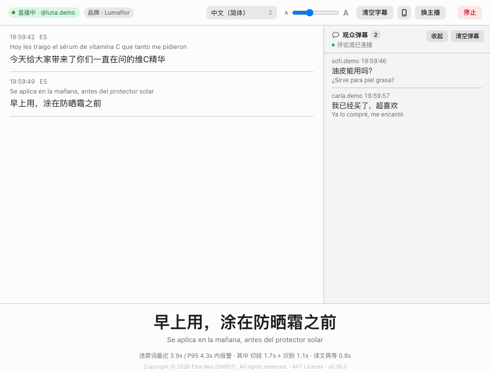
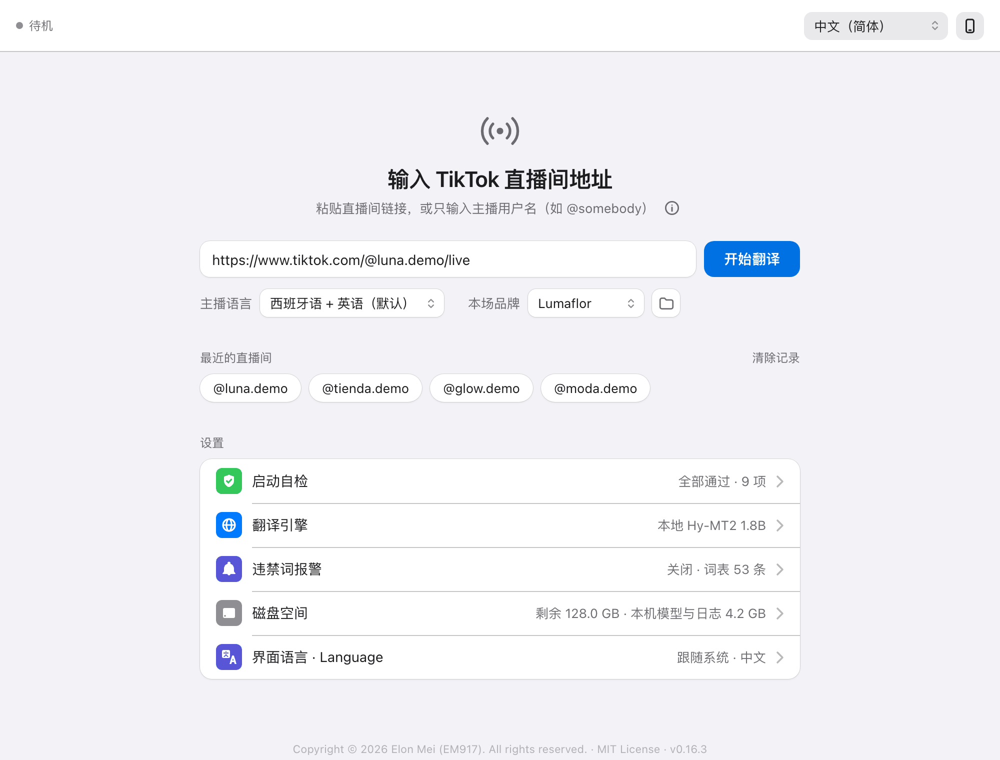
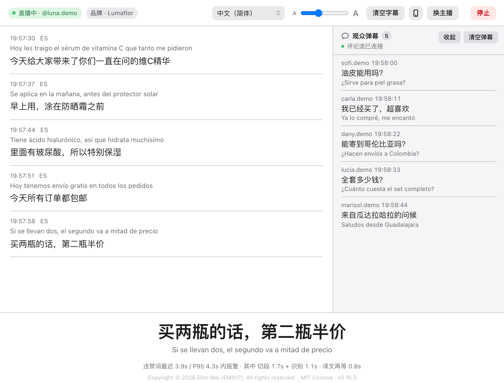
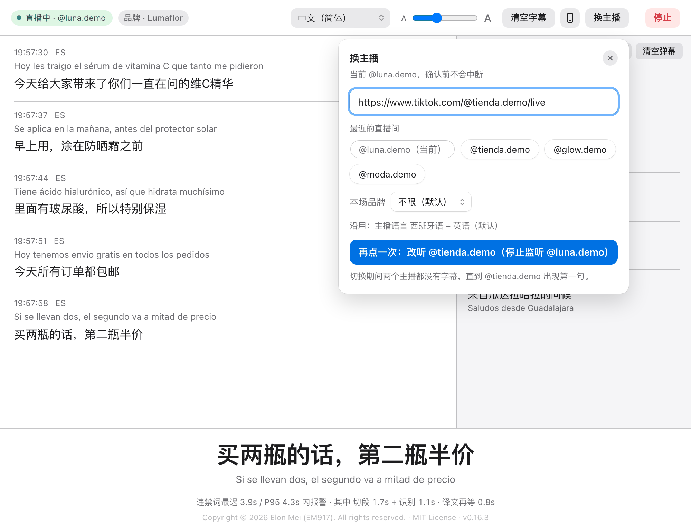
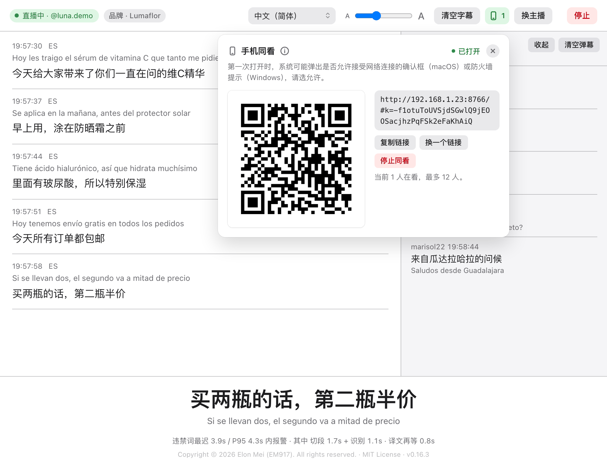
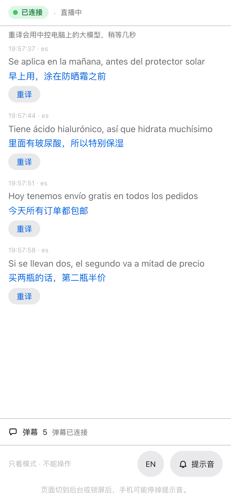
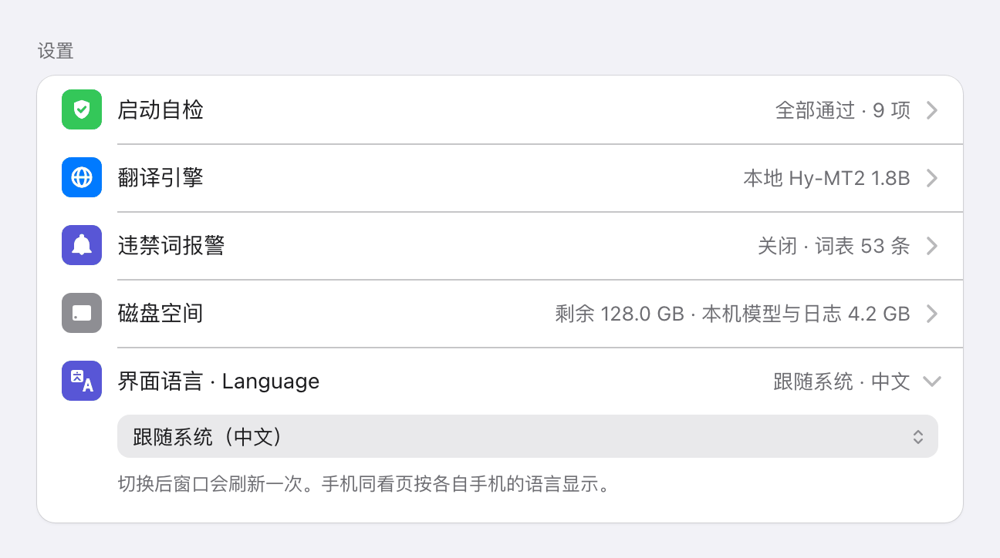
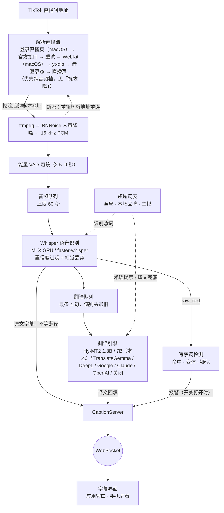

# TikTok 直播同传 · TikTok Live Translator

<p align="center"></p>

<p align="center">
  <a href="https://github.com/EM917/tiktok-live-translator/releases/latest"></a>
  <a href="https://github.com/EM917/tiktok-live-translator/actions/workflows/ci.yml"></a>
  
  
  
  <a href="LICENSE"></a>
</p>

<p align="center"></p>

**Language / 语言：[English](README.md) | 中文**

---

TikTok 直播的实时双语字幕工具，为西语带货直播而做。粘贴直播间地址，程序就把主播说的话
实时转写：每句识别出来立刻上屏，译文稍后在它下方补上。观众弹幕同时翻译。

给不懂西语、又要跟西语带货直播的团队用：中控在电脑上看，同事用手机跟着看。上手见
[快速开始](#快速开始)。

字幕从不等译文：原文先上屏。识别跟不上时音频在队列里排着，窗口上会说明。语音识别
永远在本机完成，用本地模型时翻译也在本机——不需要 API Key，没有使用费用。

界面有中文和英文两种。新装的程序跟随系统语言，「设置 → 界面语言 · Language」可以切换，
见[界面语言](#界面语言)。

## 特性

- 🎙️ **实时字幕，原文先出** —— OpenAI Whisper 双后端（faster-whisper / MLX），支持 90+ 语言，默认只在西语和英语之间识别。每句识别出来立刻上屏，译文随后补在它下方；最新一句还会以大字显示在窗口底部
- 🌐 **本地优先的翻译** —— Hy-MT2（Apache 2.0，离线免费）经 Ollama 提供两档，另可选 TranslateGemma、DeepL（带原生术语表）、Google 免费接口、Claude API 和任意 OpenAI 兼容接口。默认用 Hy-MT2 1.8B，其次 TranslateGemma，两个都没装时用 Google 免费接口；7B 不会被自动选用。见[翻译引擎](#翻译引擎)
- 🏷️ **按品牌、按主播的词表** —— 全局词表、主播词表、品牌词表（在「本场品牌」下拉里按场选择）共同决定商品名怎么识别、怎么翻译，对所有引擎都生效。见[词表](#词表)
- 💬 **观众弹幕翻译** —— 评论通过 TikTokLive 从直播间获取，当前引擎是本地模型（Hy-MT2 1.8B 或 TranslateGemma）时翻译；用远程引擎或 7B 时「观众弹幕」面板只显示原文。可用 `--no-comments` 关闭，见[常见问题](#viewer-comments)
- 🔁 **直播中换主播** —— 点顶栏「换主播」，不用先点「停止」就能改听另一个主播：从「最近的直播间」里选或粘贴直播间地址，选好本场品牌，再点一次确认。主播语言沿用当前设置，字幕历史里会插一条分隔线标出新主播从哪里开始
- 📱 **手机同看** —— 同一 Wi-Fi 下的同事扫二维码，就能在手机上看字幕和报警，页面按各自手机的语言显示；只看，不能操作；默认关闭。见[常见问题](#phone-viewing)
- 🌍 **中英文界面** —— 新装跟随系统语言，也可以在「设置」里切换。见[界面语言](#界面语言)
- ✅ **启动自检** —— 每项能力实际执行而非检查配置：降噪实跑 RNNoise，翻译实际请求引擎，审计日志实际写入。有项目未生效时，首页上那一行自动展开并附处理步骤，页面顶部还会出现一条提示，待机和直播中都在，直到之后的自检通过
- 🔄 **抗故障** —— 最多七种办法找流地址；重连时分得清断网和下播；识别跟不上时音频排队而不是丢掉。见[抗故障](#fault-tolerance)
- 🎵 **人声降噪** —— RNNoise 抑制背景音乐，针对持续 BGM 的直播间调校
- ⚡ **硬件自动配置** —— 检测可用加速器（Apple Silicon GPU / NVIDIA CUDA / CPU），选择仍能实时运行的最大模型
- 📊 **延迟可观测** —— 窗口底部实时显示：一个词说出口后最多要等多久才被识别并检查完（中位数与 P95），拆成切段与识别两部分，另加译文再等多久。审计日志逐段记录：采纳的文本、被质量过滤丢弃的候选、命中的违禁词，以及随后到达的译文
- 🚨 **违禁词报警（默认关闭）** —— 用于带货直播的合规监听：在识别出的原文上做三级匹配（命中 / 变体 / 疑似），不依赖翻译，短语跨字幕边界同样可命中。开关在「设置 → 违禁词报警」。见[违禁词报警](#违禁词报警)

## 界面截图

<table>
  <tr>
    <td width="50%"><br><sub>首页：粘贴直播间地址，点「开始翻译」。「设置」在下方，每项一行，点开才展开。</sub></td>
    <td width="50%"><br><sub>直播中：原文先出，译文在下，弹幕在旁。</sub></td>
  </tr>
  <tr>
    <td width="50%"><br><sub>换主播：选好下一个主播，再点一次确认。</sub></td>
    <td width="50%"><br><sub>手机同看：同一 Wi-Fi 下的手机扫码或打开链接观看。</sub></td>
  </tr>
  <tr>
    <td width="50%" align="center"><br><sub>手机页：只看，按手机自己的语言显示。</sub></td>
    <td width="50%"><br><sub>设置 → 界面语言 · Language：跟随系统、中文或 English。</sub></td>
  </tr>
</table>

<sub>上面的截图和演示动图都是虚构的直播，由 <code>tools/readme_shots.py</code> 生成。</sub>

## 磁盘空间

全部在本机运行，因此模型也存在本机。以下数值来自一次实际安装的实测，具体体积会随系统与依赖版本略有出入。

| 组成 | 体积 | 何时下载 |
|---|---|---|
| 运行环境（`.venv`） | 1.4 GB | 首次启动 |
| 语音模型 `large-v3`（Apple Silicon GPU / CUDA） | 2.9 GB | 首次识别 |
| 语音模型 `large-v3-turbo`（CPU 路径） | 1.5 GB | 首次识别 |
| Ollama 程序本身 | 0.2 GB | 手动安装一次 |
| 翻译模型 Hy-MT2 1.8B | 1.1 GB | 装好 Ollama 后由程序自动下载 |
| 翻译模型 Hy-MT2 7B（可选） | 4.6 GB | 仅在你主动拉取时 |
| 降噪模型 | 0.3 MB | 首次开播 |

**建议预留约 6 GB**：运行环境 + `large-v3` + 1.8B 翻译模型，这是常规配置。
额外使用 7B 档再加 4.6 GB。走 CPU 路径的机器约需 4.5 GB，因为
`large-v3-turbo` 更小。

下载都是一次性的。模型存放在系统级缓存中，与其它使用相同缓存的工具共享，
不会按项目重复占用。

需要清理时，它们分别在：

```
~/.cache/huggingface/hub     语音模型
~/.ollama/models             翻译模型
<项目目录>/.venv              运行环境
<项目目录>/logs               审计日志
```

审计日志的增长约为**每小时 0.3 MB**——按每天监听 8 小时计约 2 MB，一个月约
0.1 GB。它是纯文本 JSONL，某场复核完毕后可以直接删除。

## 快速开始

### 无需终端的安装方式（推荐）

1. **下载**：到[最新 Release](https://github.com/EM917/tiktok-live-translator/releases/latest) 的 Assets 里下载 **TikTok-Live-Translator-vX.Y.Z.zip**，解压到任意位置（例如桌面）——下载「Source code (zip)」也一样能用。也可以点仓库页绿色 **Code** 按钮 → **Download ZIP**（取的是最新开发版）。
2. **装 Python**（免费，只装一次）：到 [python.org/downloads](https://www.python.org/downloads/) 下载安装包，按默认选项装完即可。忘了装也没关系——启动器发现没有 Python 时会自动打开下载页提示你。
3. **启动**：
   - **macOS**：双击文件夹里的 **`TikTok Live Translator.app`**。首次打开如提示「无法打开」：旧系统右键 → 打开；**macOS 15 及以后**要到 **系统设置 → 隐私与安全性**，拉到页面底部点 **「仍要打开」**（只需一次）。可以把它拖到 Dock 常驻，但**不要把它拖出这个文件夹**。
   - **Windows**：双击 **`Start.bat`**。若弹出「发布者未知」的安全警告，点「运行」即可（本工具完全开源，代码就在这个文件夹里）。运行期间会有一个黑色文字窗口——**它就是程序本身，请保持打开**，字幕显示在另外弹出的应用窗口里。

界面窗口本身是系统自带的浏览器内核渲染的（macOS 上是 WKWebView，Windows 上是
WebView2），不是随程序打包的独立内核。macOS 上目前用到的 CSS 特性里，要求最高
的是 `:focus-visible`，需要 **Safari 15.4 / macOS 12.3（Monterey）或更新**——
这是根据代码里实际用到的特性推算的，不是在那个具体系统版本上实测过；苹果历史上
也给前两个大版本的 macOS 补发过对应的 Safari 点版本，所以部分更旧的系统可能也
已经够用。低于这个版本时程序仍能正常运行、正常显示字幕，只是个别控件的键盘焦点
描边会退回系统默认样式。Windows 上的 WebView2 独立于系统自动更新，没有实际意义
上的最低版本要求；如果这台机器是第一次遇到 WebView2，参考上面「发布者未知」那条。

首次启动会自动安装全部组件（需要几分钟，屏幕上有提示；首次识别还会自动下载语音模型，页面上能看到进度），之后每次秒开。窗口打开后：**粘贴直播间地址（或只输入主播用户名）→ 确认「主播语言」（默认西班牙语 + 英语）和顶栏里要译成的语言 → 点「开始翻译」**。直播中点**「换主播」**可以改听另一个主播；点**「停止」**回到首页，这一场的字幕留在下方「上一场字幕」里。

### 命令行方式

装好 [Python 3.9+](https://www.python.org/downloads/) 后两条命令：

```bash
git clone https://github.com/EM917/tiktok-live-translator.git
cd tiktok-live-translator && python3 main.py
```

（Windows 用 `python main.py`）其余全自动：首次运行自动创建虚拟环境、安装全部依赖（含内置 ffmpeg 和降噪模型）。也可以直接传参：

```bash
python3 main.py "https://www.tiktok.com/@主播用户名/live" --source es
python3 main.py --demo      # 不连直播，预览界面
python3 main.py --doctor    # 打印硬件检测结果和推荐配置
python3 main.py --ui-lang zh   # 只这一次用中文界面
```

> 想手动控制安装过程？`bash setup.sh`（macOS/Linux）或 `powershell -ExecutionPolicy Bypass -File setup.ps1`（Windows）做的是同样的事。

> **之前克隆过旧版本？** 不要重新 clone（会报 `destination path already exists`）——进目录执行 `git pull` 再启动即可；v0.2.0 起页面里就能一键更新，不再需要命令行。

### 启动方式

- **macOS**：双击 **`TikTok Live Translator.app`**（或 `Start.command`）；
- **Windows**：双击 **`Start.bat`**；
- 命令行：`cd ~/tiktok-live-translator && python3 main.py`。

界面在**独立应用窗口**中打开（不占浏览器标签页），上次填过的直播间地址、选过的主播语言和目标语言都会记住，点「开始翻译」即可；输入框下方的**「最近的直播间」**列着最近打开过的主播，点一下就直接开始。关掉窗口就是退出，直播中会先问一句。想改回浏览器界面加 `--browser`。

## 界面语言

界面——应用窗口、它的对话框和系统通知，以及手机页——有中文和英文两种。

- 新装的程序跟随系统语言：macOS 上先看「系统设置」里给本程序单独选的语言，再看系统
  首选语言；Windows 上看显示语言。系统语言是中文（简体、繁体都算）就用中文界面，其余
  用英文，检测不出时用中文。
- 英文界面上线之前就已经在用的安装，升级后仍是中文界面。
- 要切换，在首页打开「设置 → 界面语言 · Language」，选「跟随系统」「中文」或
  「English」，窗口会刷新一次。直播中「设置」整块隐藏，所以要在两场之间切。
- `python3 main.py --ui-lang zh`（或 `en`）只对这一次启动生效，什么都不保存。
- 新装且界面是英文时，字幕默认译成英文，直到你在顶栏改选别的语言。
- 手机同看页按各自手机的语言显示，页面底部可以切换。
- Dock、菜单栏和 ⌘Tab 里的程序名跟 macOS 系统语言走（中文系统上叫 TikTok 直播同传），
  文件名始终是 `TikTok Live Translator.app`。
- 终端输出、日志和审计日志永远是中文，`Start.command`、`Start.bat` 在终端窗口里打印的
  说明也是。启动器的出错对话框在程序读到界面语言设置之前弹出，中文、英文两段并列。
  主播名、词表、字幕和弹幕是数据，界面语言不会改动它们。

维护者说明见 [docs/i18n.md](docs/i18n.md)。

## 硬件自动配置

`python main.py --doctor` 可查看硬件检测结果。启动时未显式指定的参数按下表填充：

| 硬件 | 选定配置 | 结果 |
|---|---|---|
| Apple Silicon（M1 及以上） | MLX GPU 后端 + `large-v3` | 最准模型，比实时快约 5 倍 |
| NVIDIA 显卡 | CUDA + `large-v3` (float16) | 最准模型，速度富余 |
| CPU（≥8 核，≥8 GB 内存） | CPU + `small` (int8) | 可实时运行，精度中等 |
| 低配置 CPU | CPU + `base` (int8) | 优先保证跟上进度 |

实测数据（M3 Pro，90 秒直播录音；RTF = 识别耗时 / 音频时长，需小于 1 才不丢段）：

| 配置 | RTF |
|---|---|
| MLX GPU + large-v3 | **0.21** ✅ |
| CPU + large-v3-turbo | 0.99 ⚠️ 临界实时 |
| CPU + large-v3 | 1.22 ❌ 丢段 |

上述选定值均可通过命令行参数覆盖。

## 命令行参数

| 参数 | 说明 | 默认 |
|------|------|------|
| `--target` | 目标语言（`zh-CN`/`en`/`ja`/`ko`/…，顶栏里也能随时切换） | 界面上次的选择；没有则 `zh-CN`（新装且界面是英文时为 `en`） |
| `--source` | 主播语言：单个语言码（如 `es`/`en`/`ja`），或逗号列表只在这些语言里自动检测（如 `es,en`，最多 4 个，第一个是主语言；检测到列表外的语言会强制重转一遍） | 界面上次的选择；没有则 `es,en` |
| `--backend` | 识别后端：`mlx`（Apple GPU）/`ct2`（faster-whisper）/`auto` | `auto` |
| `--model` | whisper 模型：`tiny`/`base`/`small`/`medium`/`large-v3`/`large-v3-turbo` | 按硬件自动 |
| `--device` | `auto`/`cpu`/`cuda` | 按硬件自动 |
| `--compute-type` | ct2 精度（`int8`/`float16`/…） | 按硬件自动 |
| `--beam` | beam search 宽度（越大越准越慢，`1`=贪心；仅 ct2 后端） | `5` |
| `--context` | 开启滚动上下文。**默认关闭**：实测它会诱发复读死循环，反而大幅拉低召回率 | 关 |
| `--asr-temperature` | 识别解码温度。**默认 0（只解码一次）**：Whisper 默认会在质量不达标时用更高温度重解最多 6 次，音乐段上实测单次识别可达 25 秒 | `0` |
| `--translator` | 翻译引擎：`auto`/`hymt2`/`hymt2-7b`/`gemma`/`deepl`/`google`/`claude`/`openai`/`none`，见[翻译引擎](#翻译引擎) | 界面上次的选择；没有则 `auto` |
| `--denoise` | RNNoise 人声降噪：`auto`/`on`/`off` | `auto`（开） |
| `--port` | 本地 UI 端口 | `8765` |
| `--cookies` | yt-dlp cookies.txt 路径（yt-dlp 报告直播间要登录才能看时用） | 无 |
| `--glossary` | 领域词表文件，见[词表](#词表) | 项目目录下的 `glossary.txt`，首次运行时由 `glossary.example.txt` 生成 |
| `--banned-terms` | 违禁词表文件，见[违禁词报警](#违禁词报警) | 项目目录下的 `banned_terms.txt`，首次运行时由 `banned_terms.example.txt` 生成 |
| `--demo` | 演示模式，仅驱动 UI | 关 |
| `--doctor` | 打印硬件体检和推荐配置后退出 | 关 |
| `--no-open` | 启动后不自动打开应用窗口或浏览器 | 关 |
| `--ui-lang` | 只对这一次启动生效的界面语言：`zh`/`en`，不保存，见[界面语言](#界面语言) | 按「界面语言」设置 |

## 翻译引擎

安装 [Ollama](https://ollama.com/download) 即完成配置。下次启动时程序会在需要时
将其启动，通过 Ollama 接口下载 1.1 GB 的 Hy-MT2 1.8B 模型（页面显示进度）并切换
至该引擎，全过程无需终端操作。Whisper 模型采用相同方式部署。

拉取更大的档位后，它可用于「重译」以及显式指定 `--translator hymt2-7b`。程序**不会**
自动选用它，见[怎么选引擎](#怎么选引擎)。

```bash
ollama pull hf.co/tencent/Hy-MT2-7B-GGUF:Q4_K_M     # 4.6 GB，建议 16 GB 以上内存
```

| 取值 | 引擎 |
|---|---|
| `auto`（默认） | 在已安装的引擎中选择：`hymt2` → `gemma` → `google`。7B 不会被自动选用 |
| `hymt2` | Hy-MT2 1.8B（腾讯，Apache 2.0）。多数机器的推荐档位 |
| `hymt2-7b` | Hy-MT2 7B，较大的本地档位。需显式指定，见[怎么选引擎](#怎么选引擎) |
| `gemma` | TranslateGemma 4B。`OLLAMA_TRANSLATE_MODEL` 可切换至 `translategemma:12b`/`27b`。「翻译引擎」菜单里没有这一项，用 `--translator gemma` 指定 |
| `deepl` | 密钥在「设置 → 翻译引擎」填写（也可用 `DEEPL_API_KEY`）。以 `:fx` 结尾的免费 key 会自动走对应域名。会按[词表](#词表)自动建立并维护 DeepL 原生术语表，见下。**字幕文本会发送给 DeepL** |
| `google` | Google 翻译免费接口，无需密钥。字幕文本会发送至 Google，且按 IP 限流 |
| `claude` | 密钥在「设置 → 翻译引擎」填写（也可用 `ANTHROPIC_API_KEY`），模型可由 `CLAUDE_TRANSLATE_MODEL` 覆盖 |
| `openai` | 密钥在「设置 → 翻译引擎」填写（也可用 `OPENAI_API_KEY`），可选 `OPENAI_BASE_URL`、`OPENAI_MODEL`。兼容各类 OpenAI 风格接口，含本地 LM Studio / vLLM |
| `none` | 仅显示识别原文，不翻译 |

引擎在首页「设置 → 翻译引擎」里选择，API 密钥也填在那里——不需要终端，也不需要
环境变量。密钥保存在 `settings.json`（已被 git 忽略），**从不回传页面**，界面上只显示
尾四位，供你确认填的是哪一个。

选定的引擎用不了、程序回退到别的引擎时，「翻译引擎」这一行会标出「已回退」并自动
展开，因此回退至网络引擎的情况可见而非静默发生。

真实直播里的三句口语，Google 免费接口按字面直译，本地模型没有（西语 → 中文）：

| 原文 | Google | 本地模型 |
|---|---|---|
| *Se mueren lo rico*（好吃到不行） | ❌ 有钱人死 | ✅ 味道非常好 |
| *tengo un sueño*（我困了） | ❌ 我做了一个梦 | ✅ 现在感觉很困 |
| *Es vegano*（纯素产品） | ❌ 它是素食主义者 | ✅ 纯素的 |

### 怎么选引擎

默认用 Hy-MT2 1.8B：它跟得上直播，又不拖慢识别——每一条字幕都要等识别出来才上屏。

Hy-MT2 1.8B、7B、TranslateGemma 12B、DeepL 四个引擎在一场直播的 259 条字幕上交由
评委匿名评分。按 12 组两两比较做多重比较校正后，成立的差异全在可读性上：7B 比 12B、
比 1.8B 好读，DeepL 比 1.8B 好读。**「改变意思的错误」上，没有哪个引擎（包括 DeepL）
测得出比另一个少**——这是「没测出差异」，不是「等价」。

7B 不会被自动选用。一次 92 条字幕的真实直播里，7B 常驻时识别每段约 3.2 秒，用较小
模型时是 1.4 秒。它仍用于[强模型重译](#用最强模型重译)：只为那一句载入，用完立即卸载。

测量方法、完整表格与注意事项见
[docs/engine-benchmarks.zh-CN.md](docs/engine-benchmarks.zh-CN.md)。

### 词表

通用模型最容易译错的是商品名，一张不长的词表是最直接的办法。词表是一份数据、三处
生效：前几条作为提示交给语音识别；一句里出现的词条随这一句交给本地翻译模型（DeepL
改用原生术语表，见下；Google 免费接口、Claude 和 OpenAI 兼容接口不接受提示，对它们
只有译后兜底）；译文里仍原样留着没翻的词条，由译后的规则替换兜底。

它由三份文件合并而成，越具体的越优先：

- `profiles/<主播用户名>.txt` —— 某个主播专属的写法与译法，按直播间地址自动加载
- `brands/<品牌 id>.txt` —— 某个品牌的商品，只在首页（或「换主播」面板）的「本场品牌」
  下拉选中它时加载，给整场只卖这一个牌子的直播用。下拉按主播记住上次的选择；旁边的
  文件夹按钮打开 `brands/`，点一下下拉就会重新扫描这个文件夹，无需重启。文件格式见
  [`brands/README.md`](brands/README.md)
- `glossary.txt` —— 全局词表（`--glossary` 可指向别的文件）

同一个写法在多份文件里都有时，主播 profile 优先于品牌，品牌优先于全局表。改完「停止」
再「开始翻译」即生效。这些文件是你自己的商品数据，只留在本机：`glossary.txt`、
`profiles/*.txt`、`brands/*.txt` 都已被 git 忽略，改了也不会挡住一键更新。

### DeepL：原生术语表决定成败

DeepL 不接受提示词，逐句注入词表对它无效——它只认账号里的**原生术语表**。程序
按本场生效的词表（全局、品牌、主播三份合并后）自动建表，表名带内容指纹，改了词表、
或换了主播或品牌，都会自动重建，全程无需手工操作。

同一批 60 句真实字幕实测：

| | 词表遵从率 | 中位延迟 |
|---|---|---|
| DeepL（无术语表） | 26.5% | 388 ms |
| DeepL + 原生术语表 | 91.8% | 542 ms |

差的这 65 个百分点几乎全是商品名。表没建起来时 DeepL 依然返回通顺的中文，屏幕上
看不出异常——因此启动自检会实际把表建出来并报告条数，而不是只检查密钥是否填了。

以下约束均为实测所得：

- **免费版只允许同时存在 1 个术语表**（建第 2 个直接返回 456）。程序只删除自己
  建的表（表名以 `tlt-` 开头），你在 DeepL 后台自建的表不会被动。
- **术语表是提示而非强制**。`las gotas → 维生素滴剂` 会生效，而
  `me paso a la limpieza` 中的 `la limpieza → 排毒粉` 不触发。因此译后的规则
  替换仍然保留。
- **繁体中文不挂原生术语表**。DeepL 的术语表只有一个 `zh`，而 `glossary.txt`
  的译法是简体，挂上会把简体词塞进繁体译文。
- **源语言必须明确**。识别未给出语言时不挂术语表，不做猜测——猜错会导致整句
  按错误的语言解析。

字符额度按源文长度计。消耗速率**随主播语速差别很大**，实测两场相差 2.3 倍：

| 场次（全部字幕都走 DeepL） | 消耗速率 | 100 万字符可用时长 |
|---|---|---|
| 密集场（38.4 分钟、567 句） | 95,824 字符/小时 | 约 10 小时 |
| 稀疏场（4.4 小时、2041 句） | 41,363 字符/小时 | 约 24 小时 |

自己还剩多少额度请看「设置 → 翻译引擎」——那里显示的是按你的 key 实际返回的
`used / limit` 算出的免费额度用量；以它为准，不要以本表数字为准。额度大小与续期规则
由 DeepL 决定，规划前请以他们的当前条款为准。

**字幕文本会发送给 DeepL。** 本地引擎全程不出网，这一条出网。本工具监听的是他人
的直播内容，是否可接受由业务侧决定。

### 用最强模型重译

本机装着的最强本地模型（拉取过 7B 就是 7B，否则是 1.8B）按**句**调用，而不是按
时段。值得动用它的是具体内容——价格、促销条件、功效宣称——这类内容是零散出现的，
只有中控或检测器知道是哪一句。实测代价：载入 1.9 秒，单次调用全程 2.3 秒，之后立即
卸载，对识别没有影响。若改为常驻，识别会从 1.4 秒升至 3.2 秒，报警延迟从 6.8 秒升至
10.6 秒。

三种触发方式：

- **单条重译** —— 鼠标移到某条字幕上，点「重译」。该条重新翻译并在左侧标记。
  [手机同看](#phone-viewing)的手机上也有同样的按钮
- **命中违禁词时自动重译** —— [报警](#违禁词报警)开着时，命中的那一句自动用强模型
  重来。快的那版先上屏，不延迟任何显示；准的那版约两秒后原地替换
- **收工后批量重译** —— `python3 tools/retranslate_audit.py` 重译一场的审计
  日志，仅**追加** `translation_strong` 记录，不改动原有任何一行，并列出译文
  发生变化的段落交由人复核，而不是静默覆盖

在同样这 259 条字幕上，用 7B 重译比 1.8B 更**好读**（这一差异经得起多重比较校正），
但没有证明它**更准**。详见
[docs/engine-benchmarks.zh-CN.md](docs/engine-benchmarks.zh-CN.md#用最强模型重译)。

### 不用逐句读也能找出译错的地方

逐句人工查看一整场字幕找译错，慢且必然漏。`tools/retranslate_audit.py` 会用最强
模型重译一遍，并按**两个模型的分歧程度**排序——分歧越大，其中一个越可能是错的。
它不需要任何裁判，自己也不做语义判断。

```bash
python3 tools/retranslate_audit.py
```

首次运行即翻出 `es una orden de 30` 被译成「30 片」而非「满 30 美元」，
那是当时词表漏掉的一条促销条件，此前无人察觉。

另有两种做法经实测否决，记在此处以免重走：回译后比对词汇重合度，正确与错误的
译文得分完全相同（西语同义改写本来就会换词）；让本地模型判断「一致/不一致」
则直接失效——1.8B 对所有句子都判不一致，7B 十次里只对四次。

## 抗故障

<a id="fault-tolerance"></a>一场直播会在三处悄悄出问题：找流地址、保住直播流、跟上直播流。
三处都有专门的处理。

### 找流地址

最多七层解析，按顺序依次尝试，每层各自隔离，一层出错不会拖累其它层。哪一层先拿到地址，
解析就在哪一层结束；每个地址在会话开始前都先验证一遍。各层都优先取 TikTok 给的纯音频档。

1. **登录直播页**（macOS）—— 借用浏览器里已有的 TikTok 登录
2. **官方接口** —— 不经过 yt-dlp
3. **登录直播页重试** —— 只在第一次带登录抓页读到了可用登录、却没拿到地址，且官方接口
   没确认下播时才走
4. **系统 WebKit 引擎加载直播页**（macOS）—— 实测 2 秒；前面几层都没拿到流地址的
   直播间，靠它拿到过
5. **yt-dlp 匿名**
6. **yt-dlp 借用浏览器登录态**
7. **直播页兜底** —— 同样先带登录抓，匿名的那次放最后

在浏览器里能正常播放的直播，yt-dlp 有时会回答「未开播」，所以单凭它的回答不会结束
一场监听：只有 TikTok 自己说直播已结束，程序才判定下播。

登录态怎么用：

- 未指定浏览器（`--cookies-browser`，或 `settings.json` 里的 `cookies_browser_only`）时，
  登录直播页这一步只读取 Safari——其它浏览器只在匿名路径均未取到地址之后、由后面的
  借登录层读取；Safari 中有登录时不再读取其它浏览器的数据。
- 登录直播页重试会先等 3 秒，或者中间发过匿名请求时按下面的 8 秒规则等完差额，再重新发
  同一次带登录请求，排在较慢的几层之前。实测：部分直播间只向已登录观众提供流地址，且
  紧跟在匿名请求之后 3 秒内的登录请求取不到地址，程序因此在两者之间留出 8 秒。
  2026-09-17 的一次重连实录：同一房间当天更早的每一次解析都是 0.6–1.4 秒就拿到地址，
  这一次登录直播页在 0.5 秒读到页面却没有地址，WebKit 超时 25 秒，两次 yt-dlp 都报
  未开播，同一种带登录抓页方式在 31 秒时才拿到地址，全程共 37.6 秒；第一次为什么没有
  地址不知道。
- `http://` 开头的 TikTok 链接按 `https://` 解析，登录信息不经明文传输。
- 评论连接在第一次解析返回之后才开始：它的第一个请求是对同一页面的匿名请求。
- 读取 Safari 的 cookie 需要为本程序授予「完全磁盘访问权限」（见常见问题里的
  [「浏览器登录态」](#browser-login)）。读不到登录时监听照常开始、按匿名方式解析，
  并在界面上持续提示处理步骤。

官方接口不给流地址（代码 4003110）、后面各层也都没拿到时，程序会隔 20 秒共试三次，
仍不行就在界面上说明；其它失败直接报告。浏览器里能播、程序却拿不到地址时，可以把
**直播间链接和浏览器里的 .flv 地址一起粘进输入框**（空格隔开）：前者管弹幕与词表，
后者原样当作音频源，直接跳过上面的整条解析链路。实测这种签名地址有效期约两周，取一次
够用整场。另见常见问题里的[代码 4003110](#code-4003110)。

### 保住直播流

- 断流后以重新解析的地址重连，并区分网络中断与直播结束。重新解析之前先确认本机连得上
  TikTok；连不上时只等待、不消耗重连次数，最多等 30 分钟。
- TikTok 没说「已结束」的直播，最多等主播回来 10 分钟。
- 连续 6 次连接都一点音频也没拿到才放弃（粘贴的流地址是 2 次）；中间只要有一次播出了
  音频，计数就清零。粘贴的流地址播过 30 秒以上之后不再出数据，就直接结束这一场，不再重连。
- 评论连接可能「半开」：「观众弹幕」面板上仍显示已连接，却不再有任何弹幕。连接着满 15 分钟
  一条弹幕都没收到，程序就重连它，并记进本场审计。
- 后台保持 yt-dlp 为最新版。
- 监听期间阻止系统自行进入睡眠；程序整段没有运行时会记录并在界面上说明。

### 跟上直播流

- 识别跟不上时，音频在队列里排着：落后 10 秒出现提示，落后 30 秒标为「检测已降级」，
  只有落后超过 60 秒的音频才会被丢弃，丢了多少段显示在界面上并写进审计日志。
- 翻译从不拖慢识别：翻译队列最多排 4 句，满了丢最旧的；被跳过翻译的那句仍显示原文。

## 违禁词报警

为带货直播的合规监听，程序可以在主播说出违禁词表里的内容时报警。匹配跑在识别出的原文上，
不经过译文，所以报警不等翻译引擎。它分三级——命中（与词条一致）；变体（单复数、阴阳性、
指小词）；疑似（五个字母及以上的词听错一两个字母）——不分大小写和重音，短语被切在两段
字幕之间也能命中。

**违禁词报警默认是关的。** 开关在首页「设置」分组里的**「违禁词报警」**一行，默认收起，
这一行的摘要写着报警开没开、词表里有几条生效。点开它，打开**「命中时弹出报警」**；
这个选择会记住，下次开播沿用。

- 关着时检测照常进行、命中照常写入审计（多带一个 `suppressed: "alerts_off"` 标记），
  只是不弹出任何东西，也不占用强模型重译。
- 开着时，命中会在窗口顶部弹出红色的「疑似违禁词」面板，点「清空警报」之前不会自己消失。
  直播中顶栏还会显示「报警开」；窗口在后台时标题上会数出没看过的报警；命中的那一句会
  [用最强模型重译](#用最强模型重译)；[手机同看](#phone-viewing)的手机上也看得到报警。
- 系统通知只在 `settings.json` 里写了 `"alert_os_notify": true` 时才发，而且不带词条、
  不带声音。
- 违禁词表本身有问题——为空、读不出来、或者没有一条能匹配上——启动自检的「违禁词表」一行会
  标为未生效并自动展开，页面顶部的提示也会一直在，直到自检通过。

违禁词表是程序文件夹里的 `banned_terms.txt`，一行一个词或短语，以 `re:` 开头的是正则。
保存后点「停止」再「开始翻译」即生效。它在首次运行时由 `banned_terms.example.txt` 生成，
之后的更新都不会改你这一份：更新后可以对比两份，看出厂词表多了什么。

### 用录播验证你的违禁词表

一份从不触发的违禁词表，和一场干净的直播，看起来一模一样。值得确认你手上是哪一种——
因为这种失效是**静默的**，而且失效的是词表，不是匹配器。

出厂违禁词表是按某家公司保健品、体重管理类目的指南整理的**起点**。主播的说法和词条对不上时
它就会漏：词表里有 `eliminar grasa`，但「eliminar **toda la** grasa」在两个锚点之间插了词，
就匹配不到。下面那个案例里，「eliminando el exceso de grasa」正是这样漏掉的，所以
2026-09-02 起 `exceso de grasa` 单列成了一条。

信任它之前，先拿录播重放一遍：

```bash
python3 tools/replay_alerts.py                   # 用当前违禁词表重跑某场的审计日志
python3 tools/collision_audit.py --term <词>     # 新词入表前先查误报碰撞
```

**一个历史案例（2026 年 8 月底）。** 当时出厂违禁词表有 40 条启用词条，另有一整节
**「待业务确认」的真实话术被刻意注释掉**，共 7 条。拿一场 4.4 小时的保健品直播（2041 段）
重放：

| 当时的词表状态 | 触发段数 |
|---|---|
| 出厂状态，40 条启用词条 | **0** |
| 打开那 7 条被注释的「待业务确认」词条 | 62 |

这场里说了 `derretir toda la manteca`（融掉所有脂肪）、`acelerar el metabolismo`、
`desinflamarse y quitar la barriga`——正是指南写明「所有变体都禁止」的那一类。
匹配器全程都是好的（模糊档也匹配到了 ASR 拼错的 `derritir`），是该触发的词条
被关着。

对同一份转写另做的一轮审查标出了 126 处值得报警的表述，其中 **99 处两份词表都不
覆盖**——抑制食欲、体型宣称、器官脂肪、脂肪肝、胆固醇，以及一处癌症宣称。

2026-09-02，那 7 条「待业务确认」词条正式启用，同时加入这轮审查里证据最确凿的 6 条
（脂肪肝、癌症宣称、多余脂肪、平坦小腹、食欲、嘴馋），每条都跑过碰撞审计和 36 场录播
回放。此后出厂词表里不再有「待业务确认」一节；在那之前生成的 `banned_terms.txt`
里，这些词条仍是注释状态。

这类审查的产出请当作**待人工确认的候选词条**，不要直接进词表：什么算违规是业务判断，
而塞满误报的词表会把中控淹没在噪声里。

## 架构

<p align="center">
  
</p>

**[打开可探索版本 ↗](https://em917.github.io/tiktok-live-translator/architecture/audio-chain.zh.html)** —— 搜索节点、聚焦某个组件看它的上下游、追踪有向路径、播放引导章节。

图按 [`430fe06`](https://github.com/EM917/tiktok-live-translator/tree/430fe06c139bb3cadc423221b6f4091702a4d51b) 的源码画出，每个组件都核对过实际位置。Typed 源与重新生成的方法见 [`docs/architecture/`](docs/architecture/)。

<details>
<summary>同一份拓扑的 Mermaid 版本——不装任何工具也能改</summary>



</details>

## 自动更新

每次启动时会静默检查 GitHub 上的最新版本（网络失败一律无声跳过）。有新版本时页面顶部会出现横幅：

- **git 安装**（`git clone` 的）→ 点「一键更新」自动 `git pull --ff-only` 并重启程序。本地有未提交修改时会拒绝更新以免覆盖你的改动；
- **ZIP 安装** → 横幅提供下载页链接，手动替换即可。

界面底部会显示当前版本号。

## 常见问题

**启动自检有一行未生效。** 每一行下方即为对应的处理步骤；未生效的项还会在页面顶部
留一条提示，待机和直播中都在，直到之后的自检通过。最常见的两种情形是
`banned_terms.txt` 为空（此时不会发出任何报警），以及降噪模型未下载完整
（删除 `models/bd.rnnn` 后重新开始，程序会重新下载）。每次启动都会重新自检，
问题解决后下一次即恢复正常。通过的项表示该能力已被实际执行，而非仅配置正确。

**一键更新提示有内容阻断。** 提示中会列出受影响的文件，并给出包含项目路径的
完整命令及「复制」按钮。v0.10.4 之前的版本无法自行修复——修复随更新送达，而被
阻断的正是更新；在项目目录中执行一次 `git pull --ff-only` 即可。

**性能下降、音频开始积压。** 先查看 `ollama ps`。Ollama 在模型最后一次使用后
将其保留在显存中 30 分钟，因此切换翻译档位时旧模型此前会继续驻留；与 Whisper
large-v3 叠加后足以耗尽 16–18 GB 机器的内存并引发换页，表现为识别变慢与积压提示。
现在未使用的档位会在启动时卸载。旧版本可执行 `ollama stop <模型名>` 立即释放。

**浏览器中可以观看，但程序拿不到流地址。** 这种直播 yt-dlp 有时会回答「未开播」，
所以程序不会到此为止：它按[抗故障](#fault-tolerance)里列的各层依次尝试，只有 TikTok
自己说直播已结束才判定下播。在 Safari 或 Chrome 中登录 TikTok 对部分直播间有帮助，
但通常并非必需，也无需导出任何文件；cookie 仅在本机与 TikTok 之间使用。可用
`--cookies-browser safari` 指定浏览器，或通过 `--cookies cookies.txt` 提供 cookie。
如需长期只读取某一个浏览器，在 `settings.json` 中设置
`"cookies_browser_only": "safari"`；显式给出的 `--cookies-browser` 优先于该设置。

<a id="browser-login"></a>**启动自检的「浏览器登录态」一行显示「系统拒绝读取」。** macOS 不允许其它程序读取浏览器的
数据目录，除非该程序有「完全磁盘访问权限」。要加进去的**不是这个 .app**：.app 只是一段
启动脚本，随后交给 Python 解释器运行，系统把权限登记在解释器文件的路径上（2026-09-17
在 macOS 27 上实测：TCC 日志里是 `identifier_type=Path` 加一个 `python3.x` 的路径，
从未出现过本程序的 bundle）。自检这一行和报错信息里会给出本机要加的路径。到「系统设置」→
「隐私与安全性」→「完全磁盘访问权限」，点「+」，在选文件的窗口里按 ⌘⇧G，粘贴路径后回车、
点「打开」，再把它的开关打开；给出几个路径就各做一遍。列表里显示的名字是 `python3.x`，
不是本程序的名字。用 Start.command 启动的话把「终端」也加进去。然后完全退出程序再打开。
升级 Python 或重建运行环境后路径会变，届时这一行会给出新的路径。这一项只影响 TikTok
要求登录才给流地址的直播间；自检只看 cookie 库能否读取和登录 cookie 的名字（每个浏览器
个人资料都看），不解密、不弹钥匙串对话框。解析失败时审计里记的是代码：`blocked_by_system`、
`no_browser_data`、`no_tiktok_cookie`、`not_logged_in`、`cannot_decrypt`、`keychain_wait`。
`cannot_decrypt` 指库里有 TikTok 的 cookie 名字、解密后却没有对应的值：再点一次「开始翻译」，
屏幕上如果出现「钥匙串」对话框（要访问「Chrome Safe Storage」），输入这台电脑的登录密码后点
「始终允许」。

<a id="code-4003110"></a>**提示「TikTok 不把这个直播间的流地址给程序（代码 4003110）」。** 这是 TikTok 的
通用拒绝码，返回体里没有原因，程序也不替它编一个。下结论之前先跑内置的检查：

```bash
python3 tools/diagnose_room.py @主播名 --history-only   # 只看本机日志，不发请求
python3 tools/diagnose_room.py @主播名                  # 再做同一分钟的配对检查
```

它先用零请求按主播聚合你自己的 `logs/session-*.jsonl`——这个直播间在本机到底
出过字幕没有、出过的是哪些——再在同一分钟里用同一条接口探目标房间和一个最近
成功过的对照房间（共 4 次请求，不开浏览器）。结论只区分「只有这个房间被拒」和
「本机什么都拿不到」，不贴原因标签。期间可以把直播间链接和浏览器里的 `.flv`
地址一起粘进来（见上文[「抗故障」](#fault-tolerance)），一次约两周有效。

**首次启动长时间停留在下载识别模型。** 模型正从 Hugging Face 下载
（large-v3 约 3 GB），进度显示在页面上，仅首次需要。

**全部翻译失败，字幕只剩原文。** Google 免费接口（没装本地模型时 `auto` 用的就是它）
按 IP 限流，持续使用会返回 429。程序会暂停请求两分钟后自动恢复，并在页面给出提示；
语音识别不受影响。长时间使用建议装上本地 Hy-MT2 模型，或在「设置 → 翻译引擎」里换一个
引擎。断网或 Ollama 未运行会产生相同现象。

**状态显示「直播中」但长时间没有字幕。** 通常属正常情况：主播播放音乐或未讲话
期间，静音与低置信度片段会被主动丢弃。若主播明确在讲话且始终无输出，可尝试
`--denoise off` 或更换模型尺寸。

**合上笔记本或切换网络后字幕中断。** 直播流中断时程序会重新解析流地址并自动重连，
每次间隔逐次拉长（2 秒，然后 4、8、16 秒，最长 30 秒）。本机连不上 TikTok 期间只等待、
不消耗重连次数，最多等 30 分钟。只有连续 6 次重连都一点音频也没拿到才放弃（粘贴的
流地址是 2 次）；中间只要有一次播出了音频，计数就清零，所以网络时好时坏也会一直重连
下去。若界面提示直播流多次中断且自动重连失败，再点一次「开始翻译」即可。详见
[保住直播流](#保住直播流)。

**直播中换一个主播。** 点顶栏的「换主播」，粘贴新主播的直播间地址或 @用户名，或者从
「最近的直播间」里选（当前主播标着「当前」，不能选），再选好本场品牌。这时按钮会变成
「再点一次：改听 @新主播（停止监听 @当前主播）」，6 秒内点它确认。当前这一场随即停止，
用同样的主播语言开始新的一场，并重新读取各词表和违禁词表。新主播开口之前两边都没有
字幕，字幕历史里会插一条分隔线标出切换的位置。「停止」则不同：它结束监听、回到首页。

**识别跟不上直播流。** 改用较小的模型（`--model small`）或 `--beam 1`。Apple
Silicon 机器请确认自检显示的后端为 `mlx` 而非 `ct2`——CPU 路径仅勉强达到实时，
长时间运行会产生积压。

**8 GB 内存的 Mac 上运行迟缓。** Apple Silicon 默认使用 `large-v3`（约 3 GB）。
内存受限时可改用 `--model large-v3-turbo` 或 `--model small`。

**限制 MLX 为复用而保留的缓冲内存（Apple Silicon）。** 2026-09-17 在一台 18 GB 的
M3 Pro 上实测（macOS 27、mlx 0.32.1、Whisper large-v3、fp16、进程已运行 28 分钟）：
`footprint` 显示监听进程占用 7.5 GB，其中 6948 MB 为 "IOAccelerator (graphics)"，
即 Metal 缓冲，其余部分合计不到 0.5 GB；模型权重约 3.1 GB。这类缓冲属于 wired
统一内存，既不能压缩也不能换出。当时整机已使用 10 GB 交换空间，同一时段按需加载的
7B 翻译模型加载耗时 42–60 秒。MLX 会把释放的缓冲留在缓存中以便复用，不设上限时缓存随音频段长度的种类增多而增长。
程序默认把该缓存的上限设为 256 MB。这个数值来自同一天停播后的实测
（`tools/bench_mlx_cache.py`，同一段音频逐段配对）：相对不设上限，识别耗时变化
−0.5%，95% 置信区间 −2.2% 至 +1.0%，与两次不设上限的对照之间的波动相当；显卡缓冲
由 4305 MB 降至 3220 MB。完全不保留缓存时识别耗时增加约 6%。可通过环境变量
`TLT_MLX_CACHE_MB`，或 `settings.json` 中的 `"mlx_cache_limit_mb"` 改动（环境变量
优先）；取值为非负整数，单位 MB，`0` 表示不保留缓存，`off` 表示不设上限。
该设置仅对 `mlx` 后端生效，在识别模型加载时读取，修改后需重新
启动程序。实际生效的数值记录在会话日志的 `asr_config` 中；`asr_memory` 记录（模型
就绪时一条，此后每 5 分钟一条）给出 MLX 的在用、缓存与峰值内存读数。

**背景音乐中的人声被识别为主播讲话。** RNNoise 对器乐的抑制效果良好，但对歌曲中
的**人声**只能部分抑制。置信度过滤可滤除大部分此类片段，偶有漏网属预期范围。

**界面地址不是 8765。** 8765 被占用时程序会顺延至 8766–8774 中的空闲端口，
并在终端里说明。这条只讲控制面：手机同看用自己的端口，端口空着时重启后沿用同一个，
贴出去的二维码不会失效，见下一条。

<a id="phone-viewing"></a>**同事能用手机看吗？** 可以。点顶栏的手机图标（窗口宽于 1100 像素时旁边写着「手机同看」；
待机、直播中都在），在弹出的面板里点「开始同看」。第一次打开时 macOS 或 Windows 防火墙
可能会询问是否允许传入的网络连接，选「允许」。手机连上和这台电脑同一个 Wi-Fi，
扫二维码或手工输入面板上的地址即可；手机端只能看字幕和报警，
不能操作本程序——开始、停止、切引擎、改设置都不行。手机页按那台手机自己的语言显示，
页面底部可以切换。最多同时 12 台手机在看。
链接里带着一把钥匙，当密码看待：发给谁，谁就能看到字幕和报警；点「换一个链接」
会让当前在看的手机全部断开，需要重新扫码。手机打不开时，程序这边只知道没有
连接进来，可以依次试：确认手机连的是同一个 Wi-Fi；换面板列表里另一个地址手工
输入；在本机浏览器打开同一个链接，确认服务本身在跑。局域网上的地址是 `http://`，
不是安全上下文，所以没有系统通知、没有屏幕常亮，页面切到后台或手机锁屏后，
提示音可能会停掉。v1 只支持同一个局域网内访问，不支持跨网络。每条字幕还带一个
「重译」按钮，点了会让中控电脑上最强的本地模型重新翻这一句；这个按钮按手机做了
限速（两次点击至少隔 3 秒，每分钟最多 10 次），一台手机连点也不会堆积任务、拖慢
中控电脑。每条报警带一个 ✕，另有「清除已看过的报警」一次性隐藏当前显示的全部——
这两个操作只在点击的这台手机上生效，中控电脑的报警面板和审计记录都不受影响，
也不会发送任何内容到服务端。

<a id="viewer-comments"></a>**观众弹幕。** 评论由程序自己通过 TikTokLive 获取，这需要 Python 3.10 或更新版本；
组件在首次开播时自动安装。一般免登录，TikTok 要求登录时会借用浏览器里的 TikTok 登录态
重试一次。弹幕只在当前翻译引擎是本地模型（Hy-MT2 1.8B 或 TranslateGemma）时翻译，用远程
引擎或 7B 时面板只显示原文。弹幕翻译只用于显示，不进报警链路。连接签名经第三方服务，
见[隐私与使用边界](#隐私与使用边界)。

**导出字幕。** 暂无导出功能，可在页面上选中并复制。页面保留最近 300 行，刷新或
重连后服务端仅重放最后 100 行。

**关闭黑色命令行窗口。** Windows 上该窗口即翻译程序本身，关闭它等同于退出程序；
macOS 上关闭程序窗口即可退出（直播中会先问一句），若通过 `Start.command` 启动则关闭
终端窗口或按 Ctrl-C。

**公司电脑无法安装或空间不足。** 首次安装约需 6 GB，并需访问 PyPI、Hugging Face
与 ollama.com，各部分体积见「磁盘空间」一节。企业安全策略常会阻断上述访问。

## 隐私与使用边界

- 识别永远在本地；翻译用 `hymt2`、`hymt2-7b`、`gemma` 或 `none` 时不出本机，用 `deepl`、`google`、`claude` 或 `openai` 时字幕文本会发给对应服务商（`openai` 的 `OPENAI_BASE_URL` 指向 LM Studio 这类本机服务时除外）。观众弹幕经 TikTokLive 从 TikTok 获取，连接签名经第三方 Euler Stream 服务。
- 本工具仅供个人学习、语言辅助用途；请遵守 TikTok 服务条款与当地法律，不要用于转播、录制分发他人内容。
- 手机同看只在打开期间才监听 `0.0.0.0`，关闭即停；控制面始终只在 `127.0.0.1`。手机端拿到的是白名单过滤后的字段，看不到设置、文件路径、Cookie、直播流地址；链接里的钥匙存在本机 `settings.json`（已在 `.gitignore` 里）；数据不出局域网。

## 致谢

- [faster-whisper](https://github.com/SYSTRAN/faster-whisper) / [mlx-whisper](https://github.com/ml-explore/mlx-examples) —— 语音识别
- [yt-dlp](https://github.com/yt-dlp/yt-dlp) —— 直播流解析
- [FFmpeg](https://ffmpeg.org/) —— 音频处理（内置 RNNoise `arnndn` 滤镜）
- [rnnoise-models](https://github.com/GregorR/rnnoise-models) —— 降噪模型（beguiling-drafter）
- [Ollama](https://github.com/ollama/ollama) + [Hy-MT2](https://github.com/Tencent-Hunyuan/Hy-MT2) / [TranslateGemma](https://ollama.com/library/translategemma) —— 本地翻译

## 作者与许可

Copyright © 2026 [Elon Mei (EM917)](https://github.com/EM917)，以 [MIT 许可](LICENSE) 发布。
